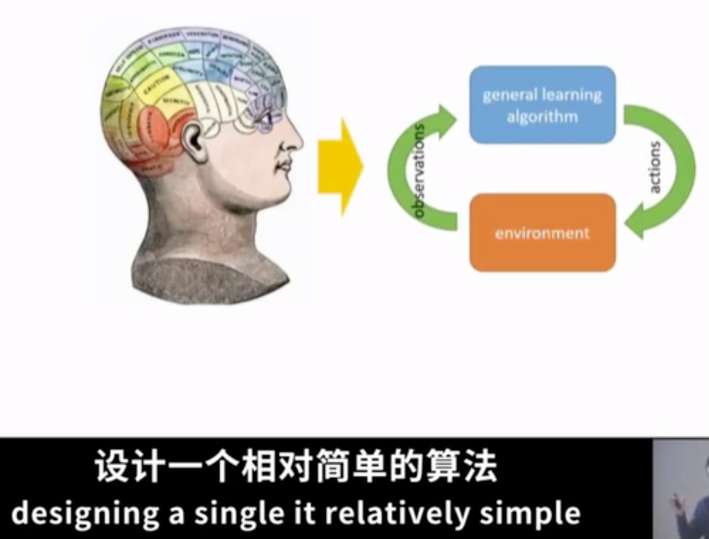

# Lecture 1: Introduction and Course Overview

传统增强学习方法需要手动设计特征与模型，非常繁琐，使用神经网络后可以简化建模过程  
深度增强学习方法使用端到端方法训练模型，控制系统和感知系统可以联合起来进行学习  
增强学习中做决策的称之为Action(动作)，根据结果反馈的机构称为Observation(观测)和Reward(反馈)

### 强化学习的应用

Reward

### 强化学习的方式

- 从示范中学习
  - 直接复制一个行为
  - 推断目标，然后试着用不同方式来完成他们的目标
- 从观察世界中学习
  - 用于预测
  - 无监督学习
- 从其他任务学习

### 如何构建智能机器

假设1：学习是智慧的的基础  
假设2：可以为大脑的每个部分设计一个单独的算法

手动构建算法非常复杂，深度学习可以处理复杂的输入，计算复杂的函数
强化学习可以选择复杂的动作，提供需要的数学形式体系

 

### 深度强化学习可以做什么

- 对简单规则的领域非常精通，如棋盘游戏、视频游戏等
- 可以通过大量感官输入来学习新技能，如机器人抓取东西
- 可以模仿人类专家的行为，如开车

### 深度强化学习的挑战

- 人类和动物可以快速学习，DRL非常慢
- 人类可以利用过去的经验，DRL中的迁移学习是个开放性问题
- 有时候不清楚reward是什么
- 不清楚预测的角色，基于模型的和无模型的DRL方法是否在完成类似的东西，