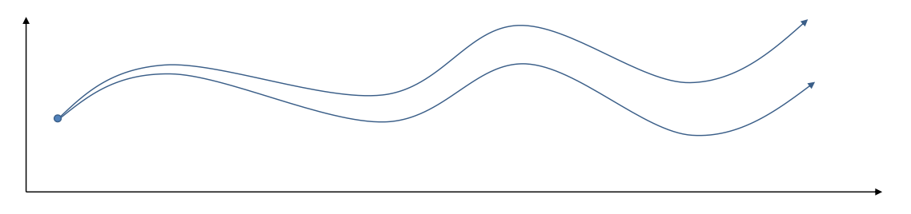
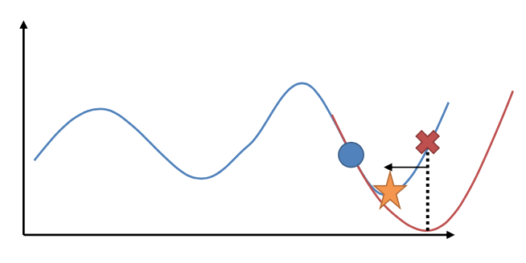

# Lecture10: Model-based Optimal Control and Planning

**课程内容**

1. Introduction to model-based reinforcement learning
2. What if we know the dynamics? How can we make decisions?
3. Stochastic optimization methods
4. Monte Carlo tree search (MCTS)
5. Trajectory optimization

**课程目标**

- Understand how we can perform planning with known dynamics models in discrete and continuous spaces

## 基于模型的增强学习方法

在之前的课程中介绍的强化学习方法都是无模型(model-free)的，它们假设初始分布和环境的转移动态机制（转移概率）是未知的，因为在一般的问题中，这些概率是非常难知道的；这些无模型方法可以很好地绕开这些不知道的东西，甚至不尝试去学习这些转移概率。而在本节课中，我们将会讨论如果**已知环境的转移动态机制（环境模型）**，是否可以得到更好的决策/规划结果。通常情况下是可以的。

Often we do know the dynamics:
1. Games (e.g., Atari games, chess, Go)
2. Easily modeled systems (e.g., navigating a car)
3. Simulated environments (e.g., simulated robots, video games)

Often we can learn the dynamics
1. System identification – fit unknown parameters of a known model
2. Learning – fit a general-purpose model to observed transition data

*注：本节课中的转移动态（transition dynamics，也叫转移概率）指的是下图中的$p(\mathbf{x}_{t+1}|\mathbf{x}_t,\mathbf{u}_t)$，在控制理论中，通常使用$\mathbf{x}$表示状态，$\mathbf{u}$表示动作。*

在这一篇中，我们将先介绍如果我们完全知道转移概率，如何进行行动决策（最优控制、轨迹优化）；之后，我们再去关注如何去学习未知的转移概率，以及如何通过诸如模仿最优控制的方法学习策略。

### 开环系统与闭环系统

在之前的无模型强化学习算法中，我们通常是通过做第一个决策来观察之后是什么样的随机情况这样的反馈机制，来继续做后面的决策，使得接下来的决策做得更好（即根据当前状态$\mathbf{s}$，来选择一个最优动作$\mathbf{a}$，然后来到状态$\mathbf{s'}$并再次进行最优动作选择）。这种每次只传递单次行动，并接受下一个状态作为反馈的机制被称为**闭环** (closed-loop) 系统，如下图所示。

而在本节中，我们希望只观察一次初始状态，便可以产生一个包含一系列动作的完整计划，类似于GPS中的导航路径规划一样，在设置好目的地后可以立即给出之后的路径规划。这种在一开始就把所有决策单向传递给环境而不接受反馈的机制被称为**开环** (open-loop) 系统，如下图所示。

对于一个闭环控制系统，我们通常需要一个策略$\pi(\mathbf{a}_t|\mathbf{s}_t)$来针对每次观测的不同状况给出不同的决策，在策略的加持下，我们的轨迹概率变为$p(\mathbf{s}_1,\mathbf{a}_1,\ldots,\mathbf{s}_T,\mathbf{a}_T)=p(\mathbf{s}_1)\prod_{t=1}^T\pi(\mathbf{a}_t|\mathbf{s}_t)p(\mathbf{s}_{t+1}|\mathbf{s}_t,\mathbf{a}_t)$；我们需要做的是得到一个最优的策略$\pi^*(\mathbf{a}_t|\mathbf{s}_t)$，使得期望收益最大：$\pi^*=\arg\max_\pi\mathbf{E}_{\tau\sim p(\tau)}\left[\sum_{t=1}^Tr(\mathbf{s}_t,\mathbf{a}_t)\right]$。关于这个策略簇，我们在之前提到的主要是用一个神经网络来确定，此外在这一篇中我们还将提到使用经典的轨迹优化 (trajectory optimization) 方法来训练一个（时变的）线性策略簇$\mathbf{K}_t\mathbf{s}_t+\mathbf{k}_t$，基本上就是主要执行$\mathbf{k}_t$，并使用当前给定状态做出一些线性修正。因此，根据我们限定的策略簇不同，策略的学习可以从非常简单到非常复杂。

对于一个开环控制系统，我们要做的更像是最优控制或者轨迹优化。

## 开环系统中的规划算法

开环系统中按转移状态的性质可以分为确定性开环系统与随机性开环系统。

对于**确定性开环系统**，其转移动态可以由一个函数$f$表示，给定状态$\mathbf{s}_t$和行动$\mathbf{a}_t$，有$\mathbf{s}_{t+1}=f(\mathbf{s}_t,\mathbf{a}_t)$。此时我们的问题的结构就变成了环境向智能体给出了初始状态$\mathbf{s}_1$，然后智能体做出一系列的行动决策：

$$\mathbf{a}_1,\ldots,\mathbf{a}_T=\arg\max_{\mathbf{a}_1,\ldots,\mathbf{a}_T}\sum_{t=1}^Tr(\mathbf{s}_t,\mathbf{a}_t)~\text{s.t.}~\mathbf{s}_{t+1}=f(\mathbf{s}_t,\mathbf{a}_t)$$

对于**随机性开环系统**，其转移状态是一个概率分布，轨迹条件概率为$p_\theta(\mathbf{s}_1,\ldots,\mathbf{s}_T|\mathbf{a}_1,\ldots,\mathbf{a}_T)=p(\mathbf{s}_1)\prod_{t=1}^Tp(\mathbf{s}_{t+1}|\mathbf{s}_t,\mathbf{a}_t)$，此时我们的问题表示为：

$$\mathbf{a}_1,\ldots,\mathbf{a}_T=\arg\max_{\mathbf{a}_1,\ldots,\mathbf{a}_T}\mathbf{E}\left[\sum_{t=1}^Tr(\mathbf{s}_t,\mathbf{a}_t) |\mathbf{a}_1,\ldots,\mathbf{a}_T\right]$$

### 随机优化方法

我们的第一类规划算法是随机优化，通常用于时长比较短的问题。让我们先将之前的控制问题进行一些抽象，如$\mathbf{a}_1,\ldots,\mathbf{a}_T=\arg\max_{\mathbf{a}_1,\ldots,\mathbf{a}_T}J(\mathbf{a}_1,\ldots,\mathbf{a}_T)$，其中$J(\mathbf{a}_1,\ldots,\mathbf{a}_T)$是某种函数，我们并不关心具体是什么，只是想把它最大化；再进一步把决策序列写成$\mathbf{A}=\arg\max_\mathbf{A}J(\mathbf{A})$。

#### **随机打靶法**

在上一篇讲Q学习的连续控制中，我们也提到了这类算法中最简单的是从某种分布（如均匀分布）中挑选若干个决策序列$\mathbf{A}_1,\ldots,\mathbf{A}_N$，然后选取$\arg\max_iJ(\mathbf{A}_i)$。这样的算法在低维问题中还是有一定效果的，有时候被称为**随机打靶法** (random shooting method)。

#### **交叉熵方法**

随机打靶法的一个改良版本称为**交叉熵方法** (Cross-entropy Method, CEM)，对30到50维这样的问题效果不错。在之前的随机打靶法中，我们需要从某种分布中选取决策序列，但是关键问题是，我们使用哪一种分布？在一开始，我们对于如何选择$\mathbf{A}_i$没有任何先验知识，所以采用某种均匀的先验分布$p(\mathbf{A})$。经过一把采样之后（如上图1的四个采样），我们发现有一些样本效果比较好，于是我们选出几个较好的样本，来拟合一个分布（如采用上图中的高斯分布），作为下一次采样的先验分布。通常认为这样的分布抽样效果会比之前的要好，但是对于很病态的问题我们也没什么太好的办法。第二次采样（上图2）进一步更新分布。对于连续值输入的交叉熵方法，算法可以描述成以下步骤的循环：

1. 从先验分布$p(\mathbf{A})$中抽样：$\mathbf{A}_1,\ldots,\mathbf{A}_N$。
2. 计算$J(\mathbf{A}_1),\ldots,J(\mathbf{A}_N)$。
3. 选取一个$M<N$（也可以选一个比例），挑选出J值最大的子集$\mathbf{A}_{i_1},\ldots,\mathbf{A}_{i_M}$。
4. 用$\mathbf{A}_{i_1},\ldots,\mathbf{A}_{i_M}$重新拟合先验分布$p(\mathbf{A})$。

我们拟合的分布通常使用多元高斯分布，在维度较高时甚至简化成协方差矩阵为对角阵的情况也不错。有一种叫做CMA-ES的方法，有点像是在CEM方法中加入动量以进行改进，每次不是重新去拟合高斯分布，而是去追随一个高斯分布跟随J值最大子集移动的方向。这类优化方法本质上并不是很好，只是因为做起来比较容易：如果都是使用神经网络的话，这些值求起来比较容易，也比较适合并行。所以这个方法的**优点**主要是，*一，非常简单，便于编程*；*二，步骤2可并行，并行求解起来非常快*。但是它也有很严重的**问题**，*第一点就是这种基于抽样的方法对维度有比较强的限制，即便我们的问题不是很病态，维度一大也会很容易错过表现好的抽样区域，一般维度不超过50*；*第二点我们这样抽样也使得我们只能处理开环系统中的规划问题*。

### 蒙特卡洛树搜索 (Monte Carlo Tree Search, MCTS)

**蒙特卡洛树搜索** (Monte Carlo Tree Search, MCTS) 是一种在连续的或离散的动作空间上都可用的的搜索当前状态下最佳动作的策略，但在离散的动作空间上使用更容易，MCTS是用于求解闭环控制的复杂问题的更先进的工具。它也在AlphaGo的早期版本中承担很重要的作用。

在上图中，我们假设初始状态$s_1$已知，每一步的行动有0和1两种。每次执行完毕一个操作$a_1$以后，就会进入一个新的状态$s_2$，然后继续往复。这样我们随着时间展开成一棵非常庞大的树，要想去对这棵树做一个彻底的搜索（哪怕展开的层数一多）显然是非常不切实际的。在之前我们采用了“树搜索”的思想，这个时候我们对其加一些“蒙特卡洛”。我们搜索到一定程度后，树就不再展开：把此时的叶子节点作为叶子来看待，使用一些启发式策略（也可以是随机策略）来评估这些叶子节点的好坏。即便这个策略并不好也没关系，我们只需要继续对每个叶子节点出发继续执行这个策略若干步来看最后结果怎样，来大概给这个叶子节点的效果打个分。注意，此时打分的复杂度不再是指数级别的，而是**叶子的个数**乘上**启发式策略运行长度**。这个方法的基本思想是，如果当前已经进入了一个优势很大的局面（或者已经赢了），那么一些比较菜的策略也应该能把优势保持到最后；如果我们已经进入了一个怎样都会输的不利局面，那很多人的选择也是乱玩把游戏结束了。因此不会对我们的启发式策略要求很高。因此，在实际中，大家做MCTS的时候通常选择的就是随机策略，选一个很好的策略通常是次要的。

在实际中，即便我们对深度进行了限制，这棵搜索树的节点扩展还是指数级别的。因此，我们不能指望搜索所有的路径。MCTS的最核心想法还是搜索最“有前途”的节点（**选择最大价值的节点**），然后加入一些小小的修正，来补偿那些访问比较少的部分（**也倾向于很少被访问到的节点**）。譬如说我们从一个节点出发走一步，行动0之后的节点打分为+10，行动1之后的节点打分为+15。当然，这些都不是这个行动真实价值：因为毕竟只是一些很糟糕的随机策略得出的评分而已，而且可能有一定随机性。但是这个值还是有一定意义的，可能认为+15的节点比+10的节点可能会稍微好上一点点：因此如果我们时间有限的话，更愿意在+15的节点上进行探索投资。

MCTS的一般结构为：

1. 假设当前决策的根状态节点为$s_1$，使用某种随机（或其他）策略$\text{TreePolicy}(s_1)$计算在$s_1$或某个子状态节点$s_t$处应该执行的动作$a_t$，并根据系统转移动态计算执行该动作会得到的叶子状态节点$s_{t+1}$。
2. 使用某种策略$\text{DefaultPolicy}(s_{t+1})$评估该叶子状态节点的得分Q。
3. 更新在$s_1$到$s_{t+1}$路径上的所有值。
4. 循环1-3若干次后，从根节点$s_1$的所有决策（动作）中找一个评分最高的作为搜索结果。

TreePolicy有很多，其中一个很流行的**UCT** (Upper Confidence Bounds for Trees) $\text{TreePolicy}(s_t)$为：
- 如果$s_t$没有完全被展开（也就是从状态$s_t$有行动没有被评估过），那么选择一个没有评估过的新行动$a_t$。
- 否则就根据$\text{Score}(s_{t+1})$选取一个得分最大的子节点$s_{t+1}$，$\text{Score}(s_{t+1})=\frac{Q(s_{t+1})}{N(s_{t+1})}+2C\sqrt{\frac{2\ln N(s_t)}{N(s_{t+1})}}$，其中$Q(s_t)$为该节点为根的子树的所有已经被展开过的节点的评分之和，$N(s_t)$为该节点为根的子树中已经被展开过的节点个数，因此第一项$\frac{Q(s_t)}{N(s_t)}$就是$s_t$的平均评分了，而第二项则是用来评估稀有性。

我们使用一个例子来解释该算法。

如上图所示，假设每个节点的行动都是2个。在一开始，我们只有一个节点$s_1$，没有被展开，根据$\text{UCT TreePolicy}(s_1)$策略，我们应该展开$s_1$的所有行动，得到新节点后进行评分。我们经过某种随机策略得到$a_1=0$下的新状态评分为10，因此Q值和N值分别更新为10和1；同样$a_1=1$下的新状态评分为12，由此得到图(1)。此时，节点$s_1$的所有行动都已经完全展开，因为两棵子树展开程度一致，通过Q/N的比值，我们决定展开右侧子树一步，得到(2)中的节点，根据随机策略评估得分为10（注：这个得分指的是选择这个行动后整个轨迹的总分为10，而非这一步之后的轨迹收益为10）。此时右侧的$s_2$的Q/N比值为11，仍高于左侧，但是差距不大，我们假设得分公式中第二项左侧明显占优势（因为右侧已经访问过了，左侧还没访问过），此时左侧$s_2$得到展开，得到图(3)，接着继续迭代两次得到图(4)。

**Additional reading**

1. Browne et al. (2012)的"A Survey of Monte Carlo Tree Search Methods"给了一个很好的研究综述。
2. Guo et al. (2014) 发表在NIPS上的"Deep Learning for Real-Time Atari Game Play Using Offline Monte-Carlo Tree Search Planning"一文提供了一种使用MCTS来提供Atari游戏样本，并使用监督学习（也就是之前所提到过的模仿学习）的方法来训练Atari游戏策略。他们使用DAgger算法来实现模仿学习，回忆DAgger算法的第一步是从数据集训练策略，第二步是用策略取得新样本，第三步是人工标注新样本，第四步是将新样本并入数据集。他们在第三步中**引入MCTS来对每个样本进行“应该选择哪个动作”的标注**。

之所以在MCTS之外还要训练一个游戏策略，一方面是因为在实时游戏中，MCTS通常效率很低，而且耗费很大计算量（注：这也是AlphaGo Lee版使用大量计算力，每一盘据说耗费电费数千美元的原因，而进入AlphaGo Master版认为神经网络已经效果不错了，那么MCTS的地位就下降了，决策更加轻量级：MCTS的引入是为了弥补神经网络不准确的缺陷）；另一方面，训练一个策略可能会有很多其他用途，比如做一些感知 (perception) 和泛化 (generalization) 到其他状态。

## 开环系统中使用导数的轨迹优化算法

在之前介绍的算法中，都没有用到微积分和导数来优化，主要因为有时导数是非常难得到的，比如在Atari游戏中并没有给出导数；但如果可以写出系统的物理规律，那么可以通过自动微分等方式得到导数，便可以通过导数来优化控制算法。在接下来将介绍一些使用导数的轨迹优化（最优控制规划）算法。

### 在轨迹优化算法中使用导数

在讨论关于导数之前，我们需要先**假设系统中的转移动态是确定性的**。在我们了解了确定性转移动态的思想之后，可以通过SSC算法让其对随机性转移动态也同样适用，即使是一个十分特殊的随机性分布。

对于一个确定性的系统，我们的最优控制问题可以表示如下，即找到一组动作$(\mathbf{u}_1,\ldots,\mathbf{u}_T)$令总开销最小（或者令总收益最大）：

$$\min_{\mathbf{u}_1,\ldots,\mathbf{u}_T}\sum_{t=1}^Tc(\mathbf{x}_t,\mathbf{u}_t)~\text{s.t.}~\mathbf{x}_t=f(\mathbf{x}_{t-1},\mathbf{u}_{t-1})$$

其中x代表状态s，u代表行动a，f代表状态转移（动态，dynamics）。通过替换$\mathbf{x}_t$，可以将这个有约束的问题转换为无约束问题：

$$\min_{\mathbf{u}_1,\ldots,\mathbf{u}_T}c(\mathbf{x}_1,\mathbf{u}_1)+c(f(\mathbf{x}_1,\mathbf{u}_1),\mathbf{u}_2)+\ldots+c(f(\ldots),\mathbf{u}_T)$$

由于非常复杂通常不会这么去写，但是这么写是无约束的所以一定程度上更方便使用一些基于梯度的优化算法。

在求解梯度时，我们通常需要的是以下几类梯度：$\frac{\mathrm{d}f}{\mathrm{d}\mathbf{x}_t},\frac{\mathrm{d}f}{\mathrm{d}\mathbf{u}_t},\frac{\mathrm{d}c}{\mathrm{d}\mathbf{x}_t},\frac{\mathrm{d}c}{\mathrm{d}\mathbf{u}_t}$，得到这些梯度后，使用类似于反向传播的链式法则，我们就能求出目标函数关于行动的梯度。不过在实践中，这样的一阶算法对复杂问题通常效果并不是很好，使用二阶微分信息通常是非常有帮助的：原因是，考虑到第一次行动$\mathbf{u}_1$，在整个式子里面出现了很多次，因此$\mathbf{u}_1$的值是非常敏感的，相对来说最后一次行动的影响则非常小，这样得到的梯度是非常病态 (ill-condition) 的，容易梯度爆炸或者梯度消失。因此使用一阶算法在实践中往往不太可行，但是好消息是这样的问题结构事实上容易得到一些非常有效的二阶算法。注意这些算法并不去训练一个神经网络，但对解决这一类的或者相关的强化学习问题很有帮助。

### Shooting methods vs collocation

上面的优化公式也被成为**射击法** (shooting method) ，这类方法只关注去优化每一个时刻的行动$\mathbf{u}_t$，而把状态$\mathbf{x}_t$看作是行动产生的结果。本质上是

$$\min_{\mathbf{u}_1,\ldots,\mathbf{u}_T}c(\mathbf{x}_1,\mathbf{u}_1)+c(f(\mathbf{x}_1,\mathbf{u}_1),\mathbf{u}_2)+\ldots+c(f(\ldots),\mathbf{u}_T)$$

之所以叫做射击法是因为如下图所示，动作稍稍一晃就会打出差别很大的轨迹来。像shooting方法相关的优化问题在一阶优化器的情况下（例如梯度下降）难以解决，他们常会因为条件太差而陷入困境。所以在shooting方法中，我们通常不做常规的梯度下降，而是引入一种类似于二阶牛顿法法的方式来优化，在牛顿法中构建一个Hessian矩阵对于高维情况的代价是非常大的，而在做最优控制时我们可以避免构建整个Hessian矩阵。

另一种优化方法叫做**搭配法** (collocation method)，它同时优化每个时刻的状态$\mathbf{x}_t$和行动$\mathbf{u}_t$，同时使用约束来将状态和行动维系起来（甚至有时候只优化状态，而把行动看成状态转移的手段）。本质上就是

$$\min_{\mathbf{u}_1,\ldots,\mathbf{u}_T,\mathbf{x}_1,\ldots,\mathbf{x}_T}\sum_{t=1}^Tc(\mathbf{x}_t,\mathbf{u}_t)~\text{s.t.}~\mathbf{x}_t=f(\mathbf{x}_{t-1},\mathbf{u}_{t-1})$$

搭配法有点像下图，一条轨迹上由很多钉子确定，然后可以通过移动钉子来改变这条轨迹。它相对射击法来说更加稳定，但是问题更难求解（需要引入约束条件）；如果我们不想引入约束，那么就会遇到如射击法一样稍微一晃差异很大的问题。

### 线性模型 -- LQR (Linear Quadratic Regulator)

在为非线性动态系统提供求解方法之前，我们先来研究一类**简单的线性模型的控制问题**，叫做**LQR (Linear Quadratic Regulator, 线性二次型调节器) 控制器**。这个问题与之前一样，试图最小化总开销，即

$$\min_{\mathbf{u}_1,\ldots,\mathbf{u}_T}c(\mathbf{x}_1,\mathbf{u}_1)+c(f(\mathbf{x}_1,\mathbf{u}_1),\mathbf{u}_2)+\ldots+c(f(\ldots),\mathbf{u}_T)$$

但其转移动态函数$f$被假设为一个关于$\mathbf{x}$和$\mathbf{u}$线性函数：

$$f(\mathbf{x}_t,\mathbf{u}_t)=\mathbf{F}_t\left[\begin{array}{l}\mathbf{x}_t\\\mathbf{u}_t\end{array}\right]+\mathbf{f}_t$$

同时我们也假设其代价函数为二次形式（我们在优化问题中就不关心常数项了），这也是为什么这个线性模型被称为线性二次型调节器：

$$c(\mathbf{x}_t,\mathbf{u}_t)=\frac{1}{2}\left[\begin{array}{l}\mathbf{x}_t\\\mathbf{u}_t\end{array}\right]^\top\mathbf{C}_t\left[\begin{array}{l}\mathbf{x}_t\\\mathbf{u}_t\end{array}\right]+\left[\begin{array}{l}\mathbf{x}_t\\\mathbf{u}_t\end{array}\right]^\top\mathbf{c}_t$$

这一类线性系统非常有局限性，但同时也特别好求解，而且可以在一定程度上泛化到非线性模型，因此我们先来研究如何求解这个问题。

#### **求解LQR**

LQR的主要想法是类似于动态规划的逆推算法。我们从递推边界$T$阶段开始研究，每次只找出最优动作${\mathbf{u}_1,\ldots,\mathbf{u}_T}$中的最后一项$\mathbf{u}_T$。因为动作$\mathbf{u}_T$在优化公式中只影响最后一项cost，所以找到最优的$\mathbf{u}_T$比找其他动作更简单。

现在假设我们现在$\mathbf{x}_1,\mathbf{u}_1,\ldots,\mathbf{x}_{T-1},\mathbf{u}_{T-1}$都已经确定了，先当它们是常数进行处理，那么我们的目标函数仅剩$\mathbf{x}_T,\mathbf{u}_T$，其中$\mathbf{x}_T$就是最后一项cost函数中的第一项，$\mathbf{x}_T=f(\ldots,\mathbf{u}_{T-1})$，我们用Q函数（在这里是未来代价，cost-to-go）表示最后一项cost函数，则有：

$$Q(\mathbf{x}_T,\mathbf{u}_T)=\text{const}+\frac{1}{2}\left[\begin{array}{l}\mathbf{x}_T\\\mathbf{u}_T\end{array}\right]^\top\mathbf{C}_T\left[\begin{array}{l}\mathbf{x}_T\\\mathbf{u}_T\end{array}\right]+\left[\begin{array}{l}\mathbf{x}_T\\\mathbf{u}_T\end{array}\right]^\top\mathbf{c}_T$$

其中$\mathbf{C}_T=\left[\begin{array}{l}\mathbf{C}_{\mathbf{x}_T,\mathbf{x}_T}&\mathbf{C}_{\mathbf{x}_T,\mathbf{u}_T}\\\mathbf{C}_{\mathbf{u}_T,\mathbf{x}_T}&\mathbf{C}_{\mathbf{u}_T,\mathbf{u}_T}\end{array}\right]$，$\mathbf{c}_T=\left[\begin{array}{l}\mathbf{c}_{\mathbf{x}_T}\\\mathbf{c}_{\mathbf{u}_T}\end{array}\right]$，这里的$\mathbf{x}_T,\mathbf{u}_T$只是代表矩阵中对应位置元素的脚标。

对$\mathbf{u}_T$求一阶梯度，得：

$$\nabla_{\mathbf{u}_T}Q(\mathbf{x}_T,\mathbf{u}_T)=\mathbf{C}_{\mathbf{u}_T,\mathbf{x}_T}\mathbf{x}_T+\mathbf{C}_{\mathbf{u}_T,\mathbf{u}_T}\mathbf{u}_T+\mathbf{c}_{\mathbf{u}_T}^\top=0$$

假设矩阵可逆，可解得最优的$\mathbf{u}_T$为：

$$\mathbf{u}_T=-\mathbf{C}_{\mathbf{u}_T,\mathbf{u}_T}^{-1}(\mathbf{C}_{\mathbf{u}_T,\mathbf{x}_T}\mathbf{x}_T+\mathbf{c}_{\mathbf{u}_T})$$

令$\mathbf{K}_T=-\mathbf{C}_{\mathbf{u}_T,\mathbf{u}_T}^{-1}\mathbf{C}_{\mathbf{u}_T,\mathbf{x}_T}$，$\mathbf{k}_T=-\mathbf{C}_{\mathbf{u}_T,\mathbf{u}_T}^{-1}\mathbf{c}_{\mathbf{u}_T}$，整理可得关于$\mathbf{x}_T$的线性函数：

$$\mathbf{u}_T=\mathbf{K}_T\mathbf{x}_T+\mathbf{k}_T$$

这某种意义上可以看作是最后一个阶段的策略函数：给定状态，最优决策是状态的线性函数。如此，我们就可以用能用$\mathbf{x}_T$替换掉$\mathbf{u}_T$，只使用最后一个阶段的状态$\mathbf{x}_T$就完全确定最后一个阶段的最优决策了，使用代入消元法，我们可以得到关于状态$\mathbf{x}_T$的cost函数$V(\mathbf{x}_T)$

用简化符合代替后，可以得到关于$\mathbf{x}_T$的二次形式：

$$V(\mathbf{x}_T)=\text{const}+\frac{1}{2}\mathbf{x}_T^\top\mathbf{V}_T\mathbf{x}_T+\mathbf{x}_T^\top\mathbf{v}_T$$

其中

 

现在让我们倒退到倒数第二个阶段，研究$Q(\mathbf{x}_{T-1},\mathbf{u}_{T-1})$。

由于转移动态函数$f(\mathbf{x}_{T-1},\mathbf{u}_{T-1})=\mathbf{x}_T=\mathbf{F}_{T-1}\left[\begin{array}{l}\mathbf{x}_{T-1}\\\mathbf{u}_{T-1}\end{array}\right]+\mathbf{f}_{T-1}$，有：

$$Q(\mathbf{x}_{T-1},\mathbf{u}_{T-1})=\text{const}+\frac{1}{2}\left[\begin{array}{l}\mathbf{x}_{T-1}\\\mathbf{u}_{T-1}\end{array}\right]^\top\mathbf{C}_{T-1}\left[\begin{array}{l}\mathbf{x}_{T-1}\\\mathbf{u}_{T-1}\end{array}\right]+\left[\begin{array}{l}\mathbf{x}_{T-1}\\\mathbf{u}_{T-1}\end{array}\right]^\top\mathbf{c}_{T-1}+V(f(\mathbf{x}_{T-1},\mathbf{u}_{T-1}))$$

里面的V函数我们在前面已经确定了是一个关于$\mathbf{x}_T$的二次型，而$f(\mathbf{x}_{T-1},\mathbf{u}_{T-1})$是一个线性函数，因此V关于$\mathbf{x}_{T-1},\mathbf{u}_{T-1}$是二次的，经整理后得到

其中导数部分跟之前$\mathbf{u}_T$的导数很像，只是将里面的$C$都换成了$Q$。然后我们可以以此类推，继续得到$V(\mathbf{x}_{T-1})$。

因此，LQR中，我们为了求出最优决策，通常会执行反向递归法，过程如下：

其中，$Q(\mathbf{x}_t,\mathbf{u}_t)$代表了我们从状态$\mathbf{x}_t$执行$\mathbf{u}_t$后直到最后的最小代价，$V(\mathbf{x}_t)=\min_{\mathbf{u}_t}Q(\mathbf{x}_t,\mathbf{u}_t)$是从状态$\mathbf{x}_t$出发直到最后的最小代价，有点像之前的Q函数和值函数的关系。求解完后，如果我们知道初始状态$\mathbf{x}_1$，就可以在每一步执行$\mathbf{u}_t=\mathbf{K}_t\mathbf{x}_t+\mathbf{k}_t$作为最优策略，过程如下：

#### **随机系统中的LQR**

LQR在随机系统中也能起到一定作用。在某些高斯随机过程中，如$\mathbf{x}_{t+1}\sim p(\mathbf{x}_{t+1}|\mathbf{x}_t,\mathbf{u}_t)=\mathcal{N}\left(\mathbf{F}_t\left[\begin{array}{l}\mathbf{x}_t\\\mathbf{u}_t\end{array}\right]+\mathbf{f}_t,\Sigma_t\right)$，相当于是在原来的确定性过程中加入了一些（单峰）高斯噪音，噪音协方差阵可以是时变的，这个在建模中还是比较普遍的。这样的系统中最优解依然是$\mathbf{u}_t=\mathbf{K}_t\mathbf{x}_t+\mathbf{k}_t$，也就是说在这个问题中，我们可以忽略高斯噪音的影响。其原因主要是高斯分布具有对称性（解析地看，高斯随机变量的二次型的期望有解析解）。但是，如果噪音和状态、行动有关，那么问题就变得非常复杂了。

### 非线性模型 -- 迭代LQR / DDP (Differential Dynamic Programming)

对于非线性模型的情况，我们可以扩展我们的线性模型LQR，得到一个**迭代LQR** (iterative LQR, iLQR) 算法，也被称为**差分动态规划** (Differential Dynamic Programming, DDP) 算法。

对于非线性模型，我们期望它能使用某种近似手段近似到LQR的结构中去。一个非常直接的做法是在函数局部性上做点文章，局部进行泰勒展开进行近似，为了在形式上保持一致，我们将动态函数f展开到一阶，把代价函数c展开到二阶，如下图所示：

为了简单起见，我们在每个展开点$(\hat{\mathbf{x}}_t,\hat{\mathbf{u}}_t)$，以它为原点建立坐标系，令$\delta\mathbf{x}_t=\mathbf{x}_t-\hat{\mathbf{x}}_t$，$\delta\mathbf{u}_t=\mathbf{u}_t-\hat{\mathbf{u}}_t$，可得：

这样我们就可以用这么一套新东西来运行LQR了。这个方法叫做**迭代LQR** (iterative LQR, iLQR)，一个简单版本迭代执行以下步骤直到收敛：

1. 令$\mathbf{F}_t=\nabla_{\mathbf{x}_t,\mathbf{u}_t}f(\hat{\mathbf{x}}_t,\hat{\mathbf{u}}_t)$，$\mathbf{C}_t=\nabla^2_{\mathbf{x}_t,\mathbf{u}_t}c(\hat{\mathbf{x}}_t,\hat{\mathbf{u}}_t)$，$\mathbf{c}_t=\nabla_{\mathbf{x}_t,\mathbf{u}_t}c(\hat{\mathbf{x}}_t,\hat{\mathbf{u}}_t)$。
2. 使用LQR逆推得到$\mathbf{K}_t,\mathbf{k}_t$，其中每一步代入$\delta\mathbf{x}_t=\mathbf{x}_t-\hat{\mathbf{x}}_t$，$\delta\mathbf{u}_t=\mathbf{u}_t-\hat{\mathbf{u}}_t$。
3. 根据上一步的结果，顺推得到所有的$\mathbf{x}_t,\mathbf{u}_t$，其中$\mathbf{x}_{t+1}=f(\mathbf{x}_t,\mathbf{u}_t)$，$\mathbf{u}_t=\mathbf{K}_t(\mathbf{x}_t-\hat{\mathbf{x}}_t)+\mathbf{k}_t+\hat{\mathbf{u}}_t$。
4. 使用第三步的结果更新$\hat{\mathbf{x}}_t,\hat{\mathbf{u}}_t$。

这个方法事实上是一种近似的牛顿法来求解，牛顿法求解的过程如下，：

而iLQR的想法也跟牛顿法一样，局部近似一个复杂的非线性函数，所以iLQR或者DDP实际上是对轨迹最优化的牛顿迭代法。但是iLQR并不等价于牛顿法，因为牛顿法会使用动态系统的二次导数，而iLQR使用一次导数。确切使用牛顿法需要将动态系统f展开到二阶：

$$f(\mathbf{x}_t,\mathbf{u}_t)\approx f(\hat{\mathbf{x}}_t,\hat{\mathbf{u}}_t)+\nabla_{\mathbf{x}_t,\mathbf{u}_t}f(\hat{\mathbf{x}}_t,\hat{\mathbf{u}}_t)\left[\begin{array}{l}\delta\mathbf{x}_t\\\delta\mathbf{u}_t\end{array}\right]+\frac{1}{2}\left(\nabla^2_{\mathbf{x}_t,\mathbf{u}_t}f(\hat{\mathbf{x}}_t,\hat{\mathbf{u}}_t)\cdot\left[\begin{array}{l}\delta\mathbf{x}_t\\\delta\mathbf{u}_t\end{array}\right]\right)\left[\begin{array}{l}\delta\mathbf{x}_t\\\delta\mathbf{u}_t\end{array}\right]$$

这样的方法也被称为**差分动态规划** (Differential Dynamic Programming, DDP)。在实际中我们通常不这样使用，因为f通常是一个向量值函数，做二阶微分以后会变成一个张量，会比较复杂。在实践中，一阶微分就效果不错了，虽然它需要更多步数才能收敛，但是考虑到计算二阶微分的成本，还是值得的（iLQR只是DDP方法去掉了f的二阶微分）。

在使用牛顿法来求解非常复杂的非线性函数时也有一些技巧。如，如果我们每一步都执行$\hat{\mathbf{x}}\leftarrow\arg\min_{\mathbf{x}}\frac{1}{2}(\mathbf{x}-\hat{\mathbf{x}})^\top\nabla^2_\mathbf{x}g(\hat{\mathbf{x}})(\mathbf{x}-\hat{\mathbf{x}})+\nabla_\mathbf{x}g(\hat{\mathbf{x}})^\top(\mathbf{x}-\hat{\mathbf{x}})$，不见得是好的。这是因为梯度和Hessian阵都是局部的，而实际函数并不是一个二次函数。如上图所示，实际函数是蓝色曲线，在蓝色点上近似展开到二阶，便“认为”该函数是红色的二次函数，然后尝试去找这个函数的最低点。然而，这个解可能在实际中并不好（在红叉位置，走得太远了），甚至比原来的解更大了，实际最优解在五角星位置。所以一个比较好的处理方法是做一些线搜索 (line search)，也就是把iLQR的第三步中，$\mathbf{u}_t=\mathbf{K}_t(\mathbf{x}_t-\hat{\mathbf{x}}_t)+\mathbf{k}_t+\hat{\mathbf{u}}_t$改为$\mathbf{u}_t=\mathbf{K}_t(\mathbf{x}_t-\hat{\mathbf{x}}_t)+\alpha\mathbf{k}_t+\hat{\mathbf{u}}_t$，其中$\alpha$是一个较小的系数。注意如果$\alpha$是0，那么在迭代中轨迹不会发生变化。因此$\alpha$决定了如何关于旧轨迹和新轨迹的插值比例系数。一个比较简单的方法是搜索$\alpha$，直到它提高了预期设定的一个比例。

#### **参考文献**

- Mayne, Jacobson. (1970). Differential dynamic programming. 最早提出了DDP算法。
- Tassa, Erez, Todorov. (2012). Synthesis and Stabilization of Complex Behaviors through Online Trajectory Optimization. 给出了做iLQR的实践指导意见。
- Levine, Abbeel. (2014). Learning Neural Network Policies with Guided Policy Search under Unknown Dynamics. 给出了不用线搜索的另一种信赖域方法。

Tassa et al. (2012) 使用iLQR做模型预测控制 (Model-Predictive Control) 来控制模拟机器人。这并不是与深度增强学习紧密相关的，只是使用了iLQR方法。他们的控制架构是在每一步中，

1. 观察状态$\mathbf{x}_t$；
2. 使用iLQR来计划$\mathbf{u}_t,\ldots,\mathbf{u}_{t+T}$，来最小化$\sum_{t'=t}^{t+T}c(\mathbf{x}_{t'},\mathbf{u}_{t'})$；
3. 执行$\mathbf{u}_t$，抛弃$\mathbf{u}_{t+1},\ldots,\mathbf{u}_{t+T}$。

也就是说，在每一步中先使用iLQR对未来若干步进行计划，然后只采用第一步的策略，然后下一次重新进行多步规划。本质上它不是一个“学习”过程，所有执行内容都是在线计划的，因此能够非常好地抗新加入的外力干扰（如何在外力干扰下让机器人保持直立，如何在模型错误也就是质量错误的情况下还能保持直立），稳定性非常好。（注：非常建议大家自己去看一下这个[视频](http://homes.cs.washington.edu/~todorov/media/TassaIROS12.mp4)）这个主要意义是，如果我们能有模型的话，即便我们不做学习也能够使用最优化算法做很多事情。