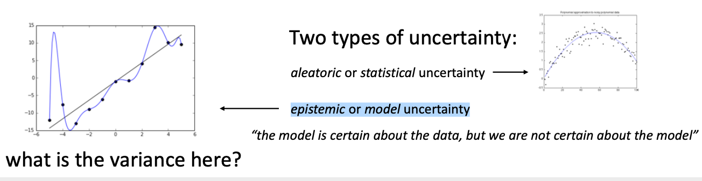

# Lecture11: Model-based Reinforcement Learning

**课程内容**

1. Basics of model-based RL: learn a model, use model for control
   - Why does naïve approach not work?
   - The effect of distributional shift in model-based RL
2. Uncertainty in model-based RL
3. Model-based RL with complex observations
4. Next time: policy learning with model-based RL

**课程目标**

- Understand how to build model-based RL algorithms
- Understand the important considerations for model-based RL
- Understand the tradeoffs between different model class choices

## 基于模型的强化学习框架

在上一篇中，我们在假设模型动态$f(\mathbf{s}_t,\mathbf{a}_t)$已知的情况下，发现可以利用模型动态做很多事情。在连续控制中，我们提到了使用iLQR/DDP的轨迹优化方法，这些方法主要要用到模型动态的一阶微分$\frac{\mathrm{d}f}{\mathrm{d}\mathbf{x}_t},\frac{\mathrm{d}f}{\mathrm{d}\mathbf{u}_t}$；我们甚至了解到，Tassa et al. (2012) 使用iLQR做模型预测控制，在我们知道模型是什么的情况下可以不通过学习步骤制定出非常鲁棒的控制（使用MPC，哪怕模型是错的，也有很强的鲁棒性）。如果我们不知道模型的话，要利用这个方法，就得去学习这个模型，然后对其进行微分。在离散问题中，我们也提到了蒙特卡洛树搜索 (MCTS) 方法。在MCTS方法中，我们要去模拟状态的转移，就要知道模型系统的动态，这样我们才能返回到祖先节点进行其他行动的搜索。因此，如果我们知道模型动态$f(\mathbf{s}_t,\mathbf{a}_t)=\mathbf{s}_{t+1}$，或者随机的分布$p(\mathbf{s}_{t+1}|\mathbf{s}_t,\mathbf{a}_t)$，那么我们就可以使用上一篇的方法。因此我们考虑去从数据中学习$f(\mathbf{s}_t,\mathbf{a}_t)$，然后根据它来进行之后的计划。这样的方法被统称为**基于模型的强化学习** (model-based reinforcement learning)。

一个最简单版本的**基于模型的增强学习算法 v0.5**，执行以下三步：

1. 运行某种基本策略$\pi_0(\mathbf{a}_t|\mathbf{s}_t)$（如随机策略）来收集样本数据$\mathcal{D}=\{(\mathbf{s},\mathbf{a},\mathbf{s}')_i\}$。
2. 通过最小化$\sum_i\Vert f(\mathbf{s}_i,\mathbf{a}_i)-\mathbf{s}_i'\Vert^2$的方法来学习模型动态$f(\mathbf{s},\mathbf{a})$。
3. 根据$f(\mathbf{s},\mathbf{a})$来计划未来行动。（如使用iLQR）

这个版本的问题主要就是如我们之前在模仿学习一篇中讲到的**分布不匹配** (distribution mismatch) 问题：我们的训练数据分布和实际遇到的情况不匹配。在这里，我们通过分布$p_{\pi_0}(\mathbf{x}_t)$来收集数据，但是实际用于规划行动时，我们不再执行$\pi_0$下的分布，我们遇到的是$p_{\pi_f}(\mathbf{x}_t)$分布，与之前遇到的分布是不同的。即便我们训练了一个在分布$p_{\pi_0}(\mathbf{x}_t)$下很好的模型，它在$p_{\pi_f}(\mathbf{x}_t)$分布下的表现也可能会非常差（即会发生过拟合）。值得一提的是，这样的分布不匹配问题在使用越具表达力的模型簇时越严重。因为如果像我们跟前面所说的一样只缺少几个待定参数，而模型具体形式已经知道了，那么其实对数据要求还是不高的；而使用如深度神经网络这样具有高表达力的模型，则会把已有的数据拟合得相当好（过拟合），然后尝试去遵循这个模型就会在实际情况中表现很差。因此，越具有表达能力的模型事实上能越好地拟合$p_{\pi_0}(\mathbf{x}_t)$分布下的数据，而这并不代表我们更加了解实际面对的分布$p_{\pi_f}(\mathbf{x}_t)$。

为了解决这个问题，我们跟之前模仿学习相似，收集更多我们更关心的“实际分布”下的数据，以使得$p_{\pi_0}(\mathbf{x}_t)=p_{\pi_f}(\mathbf{x}_t)$。因此我们的**基于模型的增强学习算法 v1.0**版本如下：

1. 运行某种基本策略$\pi_0(\mathbf{a}_t|\mathbf{s}_t)$（如随机策略）来收集样本数据$\mathcal{D}=\{(\mathbf{s},\mathbf{a},\mathbf{s}')_i\}$。
2. 通过最小化$\sum_i\Vert f(\mathbf{s}_i,\mathbf{a}_i)-\mathbf{s}_i'\Vert^2$的方法来学习模型动态$f(\mathbf{s},\mathbf{a})$。
3. 根据$f(\mathbf{s},\mathbf{a})$来计划未来行动。（如使用iLQR）
4. **执行这些行动，并得到一系列结果数据$\{(\mathbf{s},\mathbf{a},\mathbf{s}')_j\}$加入到$\mathcal{D}$中。反复执行2-4步。**

前三步与v0.5版无异，而v1.0版增加了第4步，收集新数据加入样本中并重新学习模型动态，希望藉此消除分布不匹配的问题。这个算法和DAgger不同，因为DAgger是为了适应策略的改进，而这里只是一些独立的强化学习步骤。

v1.0版的问题在于，它与v0.5版一样，都是根据模型动态$f(\mathbf{s},\mathbf{a})$来获得一个包含一系列动作的规划 (planning)，然后依据规划执行动作，这个规划的终点要么是达到了我们的最优化目标，要么是任务失败而提前结束。事实上，由于我们拟合的模型动态不够好，或者由于模型中存在误差，依据它做出的规划通常不能得到很好的结果。

所以**基于模型的增强学习v1.5版**跟上一篇中的稳健算法类似，进行一些MPC。如果我们发现根据我们的规划走，车却向左偏了（本应向正前方行走），当误差到一定程度时，我们就可以重新进行规划，希望这个重新规划的方法可以补偿之前规划的误差。框架如下：

1. 运行某种基本策略$\pi_0(\mathbf{a}_t|\mathbf{s}_t)$（如随机策略）来收集样本数据$\mathcal{D}=\{(\mathbf{s},\mathbf{a},\mathbf{s}')_i\}$。
2. 通过最小化$\sum_i\Vert f(\mathbf{s}_i,\mathbf{a}_i)-\mathbf{s}_i'\Vert^2$的方法来学习模型动态$f(\mathbf{s},\mathbf{a})$。
3. 根据$f(\mathbf{s},\mathbf{a})$来计划未来行动。（如使用iLQR）
4. **基于MPC的思想，仅执行计划中的第一步行动，观察到新的状态$\mathbf{s}'$。**
5. **将这一组新的$(\mathbf{s},\mathbf{a},\mathbf{s}')$加入到$\mathcal{D}$中。反复执行若干次3-5步之后，回到第2步重新学习模型。**

也就是说，每次我们仅执行整个计划序列中的第1步，然后走一步后对整个问题进行重新规划。重新规划路径有助于解决模型误差问题。第3步规划做得越频繁，每一次规划需要达到的精度就可以越低，也就可以容忍更差的模型和更糟糕的规划方法。由于这个算法的主要计算都花费在第3步，所以通常我们需要在计算成本和规划算法的精度之间找到一个平衡。相对更简单的规划方法在这里也可以起到作用，如可以接受更短的时长（也就是更加短视地规划问题），甚至一些随机采样的方法经常也可以做得很好。Tassa et al. (2012) 的演示中就说明了即便模型很离谱，MPC也在倾向于做一些正确的事情。

## 基于模型的强化学习的不确定性

上图是 Nagabandi et al. 2018 [Neural Network Dynamics for Model-Based Deep Reinforcement Learning with Model-Free Fine-Tuning](https://arxiv.org/pdf/1708.02596.pdf) 论文中的图片，左边棕色部分是用纯model-based方法得到的收益结果，而右边是使用model-free方法得到的结果，可以发现使用纯model-based方法得到的收益很低。

出现上述现象的原因之一是，当数据有误差或数据很少时，模型会出现过拟合（也就是数据分布有差异时模型无法很好地泛化），且过拟合会导致模型在判断reward时不准确，如上图所示，数据是由线性函数加一些高斯噪声生成的，蓝色曲线是拟合的模型，它对已有数据拟合地非常好，但是却错误的在左侧出现了一个高峰，这会让模型在生成动作时做出错误的判断。这种现象在高维度数据时尤其明显，且维度越高，出错的地方越多。正是因为过拟合导致的错误很多，我们往往需要运行更长时间才能收集足够的数据以对这些异常值进行改正。

### 不确定性评估

为了解决过拟合，我们希望模型可以估计出不确定性，上图是用高斯过程进行函数逼近的例子，它提供了不确定性估计。图中打点红线是真是函数，大红圆圈是观测到的数据，蓝色区域是模型预测出的95%置信区间，认为数据大概率会出现在蓝色区域。如果可以很好的估计不确定性，那么基于模型的规划器 (model-based planner) 就可以避免去做那些可能导致不良结果的事情，并且会逐渐提高奖励分数。这种高方差预测的预期收益仍然很低，即使均值相同。

在基于模型的强化学习方法 v1.5版引入不确定性主要是更改第三步，步骤如下：

1. 运行某种基本策略$\pi_0(\mathbf{a}_t|\mathbf{s}_t)$（如随机策略）来收集样本数据$\mathcal{D}=\{(\mathbf{s},\mathbf{a},\mathbf{s}')_i\}$。
2. 通过最小化$\sum_i\Vert f(\mathbf{s}_i,\mathbf{a}_i)-\mathbf{s}_i'\Vert^2$的方法来学习模型动态$f(\mathbf{s},\mathbf{a})$。
3. **根据不确定性模型$f(\mathbf{s},\mathbf{a})$来计划未来行动（如使用iLQR），在规划中我们只选用有很高回报且位于置信度内的动作。**
4. **基于MPC的思想，仅执行计划中的第一步行动，观察到新的状态$\mathbf{s}'$。**
5. **将这一组新的$(\mathbf{s},\mathbf{a},\mathbf{s}')$加入到$\mathcal{D}$中。反复执行若干次3-5步之后，回到第2步重新学习模型。**

使用不确定性模型可以避免利用模型的错误信息，如果我们有一个正确的不确定模型，那么我们将所有情况进行整合，在期望上就可以获得更合理的行动，这样该模型可以获得更多的数据。

### 获取不确定性模型

方法1是使用模型输出的熵 (entropy)，对于离散的动作区间，可以用softmax的结果来表示每个动作的概率，对于连续的动作区间，可以输出动作方差。但这个方法并不好，因为这并不是获得模型不确定性的方法。

不确定性有两种类型：一种是**统计不确定性** (aleatoric or statistical uncertainty)，也叫数据不确定性，一种是**模型不确定性** (epistemic or model uncertainty)。如上图所示，右图中的模型方差很大，但因为数据本身就有噪声，即有很高的统计不确定性，所以这个模型反而是最佳的。而左边的模型虽然误差很低，但模型本身却是非常不确定的，换句话说，模型对于数据是非常确定的，然而我们却对模型不确定。

对于方法1，如果是上图左边的情形，模型发生过拟合，那么会导致模型对于采样数据输出的熵很低，而对于上图右边的情形，输出的熵反而很高。所以方法1是不好的。

方法2是估计模型的不确定性。通常我们认为$\argmax_{\theta}\log p(\theta|\mathcal{D})=\argmax_{\theta}\log p(\mathcal{D}|\theta)$，所以我们可以通过估计$\argmax_{\theta}\log p(\theta|\mathcal{D})$的方式来估计模型的不确定性，然后根据$\int p(\mathbf{s}_{t+1}|\mathbf{s}_t,\mathbf{a}_t,\theta)p(\theta|\mathcal{D})\mathrm{d}\theta$来确定状态转移。但求积分运算在数学中很容易，在实际工程中却很难实现。

例如我们在实践中可以使用贝叶斯神经网络，如下图所示，它的权重代表的是权重的分布，不过如果用权重分布来对权重进行估计也很难计算，所以通常在深度学习中，我们使用一种均值场近似 (mean field approximation)：它估计参数在边际上的分布作为独立分布的乘积。

除了贝叶斯神经网络，我们也可以使用模型集成的方式来代替。通过训练几个不同分布的数据集上的模型，并将其整合，增加模型的鲁棒性。近似方式如下图所示。

