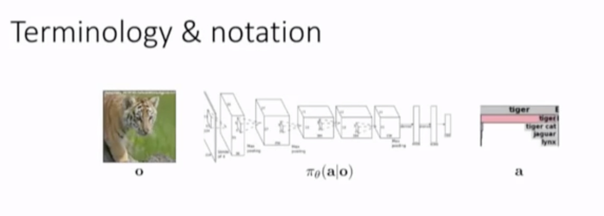
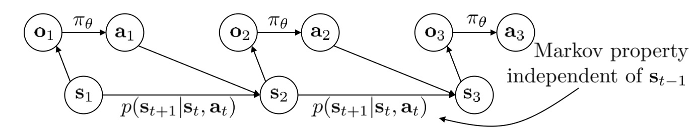
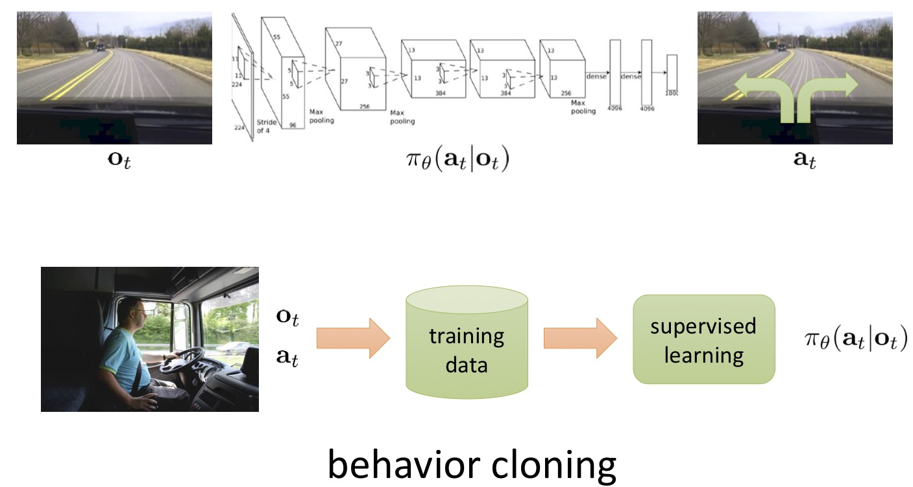
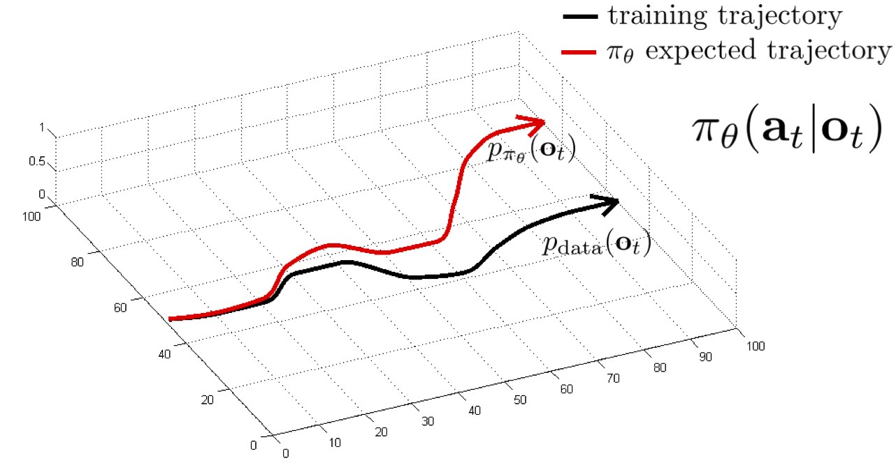
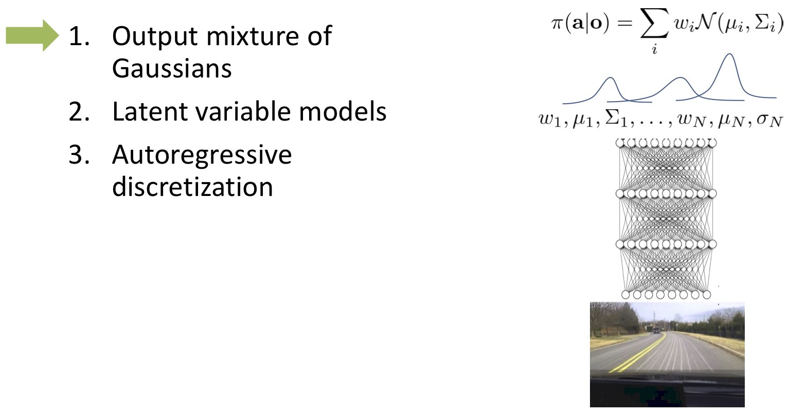
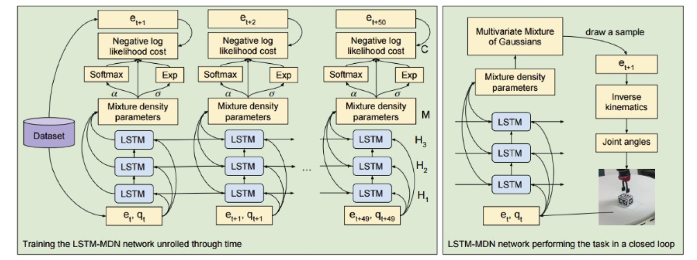
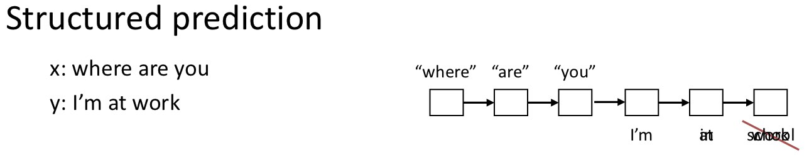
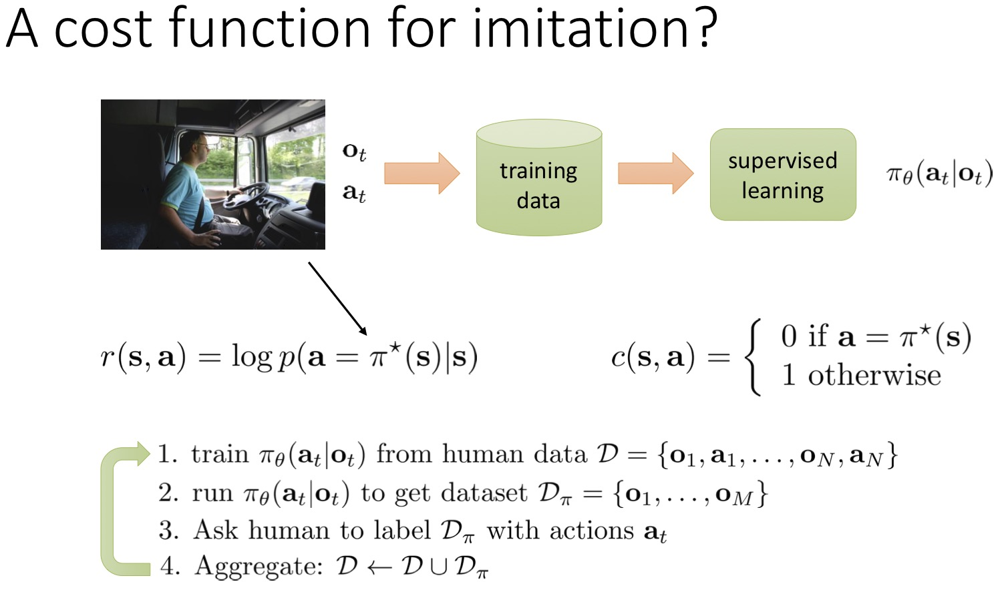
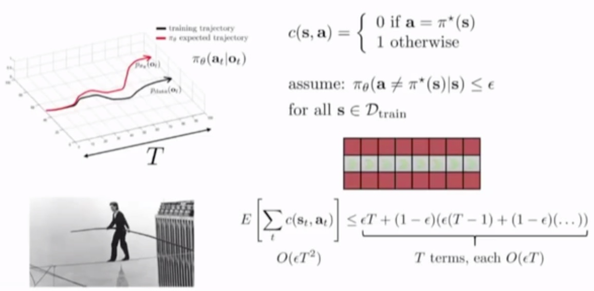
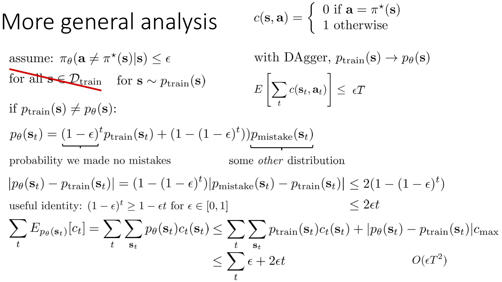

# Lecture 2: Supervised Learning and Imitation

## 术语和符号

输入记为，代表Observation，观测到的信息。  
输出记为，代表Action，行为，在上图中是一个随机的分类值，它可以取一个1到n的值。  
状态记为，是一种隐藏在观察之后的东西，同意也拥有时序。  
和的区别在于，
需要去观察得到，
而是世界背后隐藏的状态，观察是算法对图片像素的理解，而状态是图片中各个物体的位置、关系等。
状态是关于正在发生的事情的充分概括，可以用来预测未来，而观察是状态相关的一个序列（可能是有损序列）。  
我们要学习的分布记为，
是一个在上的条件分布，
它的分布有一些参数，记为。  

这里有个动态贝叶斯网络。  
下一个状态取决于前一个状态，如果已知当前状态S[t]，则过去的附加信息S[t-1]对预测未来信息S[t+1]没有任何帮助，
这种依赖关系的属性叫具有马尔科夫性质。  
但是给定当前状态，下一条观察并不取决于上一条观察。例如观察了o[2]和o[1]比只观察了o[2]可以更好地选择a[2]。  
所以如果能直接观察状态，那么知道当前状态就足够了；如果在获得观察，那么之前的观察结果可能提供额外信息。  

*本次课讲的模仿学习算法，适合于部分观察问题*

## 模仿学习

通过摄像头的图片和司机方向盘的运动，训练模型来模仿人类开车。但如果精确的按照上述方式去做，一般情况下是不可行的。
因为1）训练数据太少，在实际中可能会看到训练时没看过的景象；2）人也会犯错，即训练数据有问题。  

如何解决？对于自动驾驶，可以通过左右两侧相机的照片来告诉它如何修正自己，或者通过引入噪声生成分布，这样有时能解决问题。  

我们将训练数据集的分布记为，它是人类正常开车时观察生成的数据集。
在策略下观察得到的分布记为。
但由于的变化会引入误差，因此两个观察并不相等。  

要让，解决方案之一是可以改变算法，
不过与其让算法完美无缺，不如改变数据集，消除数据集与算法分布的不一致。这就是Gration算法或DAgger算法。  

### DAgger: Dataset Aggregation

目标：将从收集数据变成从$)中收集。  

how? 运行$)策略并采样，然后每次跑完策略后人工给采样得到的数据打标签。  

步骤：
1. 第一步跟行为克隆类似，收集专家的最初行为数据，专家数据集，
利用这个数据集训练最初的.  
2. 运行，得到一个新数据集，
我们只记录算法的观察值，不记录它的动作。  
3. 让专家去看策略控制看到的图像，即，要求他为每张图片打上标签.  
4. 聚合数据：.  
然后重复这个过程。  

重复增加策略下数据和专家最优控制标签，然后加入旧数据，让我们的网络一直这么进行。只要跑的时间足够长，
我们的数据样本就是这个策略下的采样，就意味着分布不匹配的问题已经解决了。  

DAgger的缺点：1. 需要很多人为其打标签，即非常依赖步骤3 2. 人有时候不能仅通过观察就给出正确的动作  

**不增加许多数据也能表现的很好吗？**  

- DAgger想解决的问题的是分布偏移，如下图所示  
    
- 如果有一个完美的模型，它不会偏移，也可以解决这个问题。在实践中只要模型的误差可以小到让行为克隆工作能有效运行就可以了  
- 这需要模仿的动作非常精确  
- 且不能过拟合  

**为什么会在拟合专家数据时失败？** 
 
1. 非马尔科夫行为，即使在马尔科夫规则足以应对时，人类仍会选择以非马尔科夫的形式来运作（利用以前的知识）
2. 多模型行为，人会因为各种因素做出决策而非仅通过当前画面

对于1，可以使你的决策也不仅取决于现在，还取决于过去。如果不希望观察到两次相同的图像时做出相同的决策，可以训练一个依赖于所有先前观察数据的网络，
$)，可以使用RNN网络训练这样的模型。  

对于2，当我们要驾驶无人机躲避一棵树的时候，我们可能会向左绕或者向右绕，但如果将这些决策进行平均的话就变成向前飞然后撞上去了。
如果我们采用离散的概率分布（对于离散行为决策，其实问题不大：如果离散成(向左飞，向前飞，向右飞)，那么肯定向左向右有一个很大的概率而向前飞概率很低。
而如果我们使用连续的概率分布（对于连续行为决策），或者我们将它离散化得非常细，那么概率分布将会一团糟。如果我们使用高斯分布这样的单峰分布，显然是不合理的。
这只是一个比较简单的例子，是这类问题的冰山一角，实际中经常发生。那么我们怎么去解决这类问题呢？  

对这种问题，可以使用以下几种方法解决：  
1. 选择输出混合高斯分布而非单个高斯分布，它需要让模型输出不是一个均值和方差，而是输出N个均值和N个方差，以及对所有选项都需要一个权重，
且权重和为1（所以在这里需要一个softmax函数），然后均值和方差在你的网络中就会起相应的作用，这样你就有一个很大的神经网络，且它将输出混合高斯分布模型的参数，
这个方法称为混合密度网络。这种方法在低维度决策时非常奏效，但如果决策维度非常高，那么N个选择的机制会变得很脆弱。  

2. 使用隐变量模型。它也是一个用于学习多模型分布的广泛应用的方法。它的输出仍是单高斯分布模型的简单形式，
它给神经网络在底部接入额外的输入（一些可能从高斯或均匀分布中采样的随机数），这样我们可以尝试用这些随机性来训练我们的网络，以改变输出的分布。
可以理解为如果面对向左向右的问题，网络将会在噪声进入的时候进行学习，如果是一维噪声，那么如果是负噪声，网络就输出向左，如果是正噪声就向右。  

3. 使用自动回归离散化。自动回归离散化的思想是：对于离散的动作决策，使用softmax即可；对于连续的动作决策，它通过一次只离散化一个维度来实现，
首先处理行为决策的第一个维度，对其进行离散化并使用softmax，然后从它的分布中取样，就得到了行为决策的第一个维度的结果，然后我们把这个离散化的采样输入到另一个神经网络中，
让它使用第一个维度的所有采样和第二个维度的条件来预测一个离散化的结果，然后重复这个过程，从第二个维度采样，并得到具体数值，之后把第一和第二维度的数据给到另一个神经网络，
用于离散化第三个维度。重复这个过程直到所有维度都完成了采样。在训练过程中这很容易，因为训练时我们知道所有动作决策的数值，所以不必在训练过程中采样，
在训练时只需要给他们softmax和真实的行为决策的数值，但在测试时，需要一次在一个维度上采样，然后将他们的数值输入到神经网络。不过在离散化每一个维度时都会带来一些离散化的误差，
但这不会随维数增加而带来指数级爆炸。但这个方法不易实现。  

### 总结

1. 通常模仿学习都会存在不足
    - 可能会有分布不匹配的问题
2. 有时它很奏效
    - 因为突破了一些难关（例如增加左、右摄像机会增加稳定性）
    - 一些方法能采样到一个稳定的行进路线分布
    - 可以增加更多数据，例如使用DAgger
    - 设计更好的模型来正确地拟合数据

## Case study

### 1. Trail following as classification

来自论文 [A Machine Learning Approach to Visual Perception of Forest Trails for Mobile Robots]()  

- 无人机自动跟随森林小径
- 他们也得解决分布不匹配的问题，他们仅使用了一个单目RGB相机
- 他们要面对复杂图像的挑战
- 动作决策是离散化的，向左、向右和向前，他们不必面对多模型问题（仅有三个标签的输出）

### 2. Imitation with LSTMs

来自论文 [Learning real manipulation tasks from visual demonstrations with LSTM]()

这是个机器人控制的工作，他们使用RNN来应对示范数据中非马尔科夫性质的本质，也使用额外的密度神经网络，用这些混合高斯模型来应付多模型问题。  
  

## 模仿学习的其他应用

- **结构化预测问题（类似于机器翻译这种输出是保持某种结构的问题）**  
  需要把这类问题看成顺序决策问题，然后DAgger这类算法就能帮助你更好地解决结构化预测的问题(如下图中的对话预测问题)  
    
- **逆增强学习**  
  策略学习的目标：通过训练数据学到，在输入某个观测值的时候怎样输出正确的行为（action）
  但也可以做其它事情，例如通过人的示范来学到他的目标是什么，这就是逆强化学习，即不仅仅通过示范找出目标，还会用其它算法来学习如何达到这个目标
  
## 模仿学习的问题

- 人们需要给模仿学习提供训练数据，这种数据是有限的
  - 深度学习在数据非常充足时效果是最好的
- 人在一些任务上不擅长提供示范
  - 比如人很擅长走山路、操作无人机等任务，但一些偏底层的东西就不擅长，比如告诉电机要转多快
- 人可以自动学习，我们希望机器也可以
  - 可以通过自身经验获得无限的数据
  - 可以持续的自我提升

## 奖励/代价函数 

在模仿学习中，你只需要复制人类的示范，但如果是自主学习，目标就不一样了。例如在遇到老虎时不会模仿朋友的做法，而是最小化被吃掉的概率。  
所以在自主学习中需要构建一个成本函数或奖励函数来描述你想要的目标。  

我们使用$)表示成本函数，cost function  
使用$)表示奖励函数，reward function  
我们希望最小化成本函数，即~s.t.~\textbf{s}_t=f(\textbf{s}_{t-1},\textbf{a}_{t-1})$$)  

在模仿学习的例子中，可以设置奖励函数为符合专家行为的对数概率，也可以定义成0-1损失函数的样子，比如当犯错时成本为1，如果符合专家行为则成本为0。
DAgger此时可以设置用于最小化这样的损失函数，步骤如下图所示。  

**分析如何表示损失?**  

我们假设在训练集中的某个状态下，犯错的可能性小于epsilon，则对于长度为T的一个轨迹，其总损失如上图所示，复杂度是$)。  

但一般不会使用上面这种假设，把概率上限设置为epsilon只对于在训练集中出现的状态成立，这是非常弱的假设。
我们知道只要提供足够的训练数据，那么就能泛化到其它来自同一分布的数据，所以可以做一个更强的假设。
假设对于和训练集同分布的数据（状态）犯错概率的上限为epsilon。若DAgger能给做到让训练数据集的分布与在给定策略下的分布相同，
此时总损失的上界就变成了，如下图所示。

但对于\neq{p}_\theta(s)$)的情况，我们会得到一个非常不好的损失上限，以下是分析过程：  

首先有公式=(1-\epsilon)^tp_{train}(s_t)+(1-\(1-\epsilon\)^t)p_{mistake}(s_t)$)，
表示在第t步时，有^t$)的概率不会犯错，即与训练集的分布依旧相同，
有^t$)的概率犯错，得到一个跟公式完全不同的分布，甚至可能是非常复杂的分布。  

然后对其进行整理，转换成total variation divergence形式，有公式-p_{train}(s_t)\right|=(1-\(1-\epsilon\)^t)\left|p_{mistake}(s_t)-p_{train}(s_t)\right|$)，
其中绝对值中的差值是所有状态下差值的和。最终推导出对于概率分布的一般情况，限制依旧是，
说明在一般情况下如果不匹配分布仍会得到二次成本