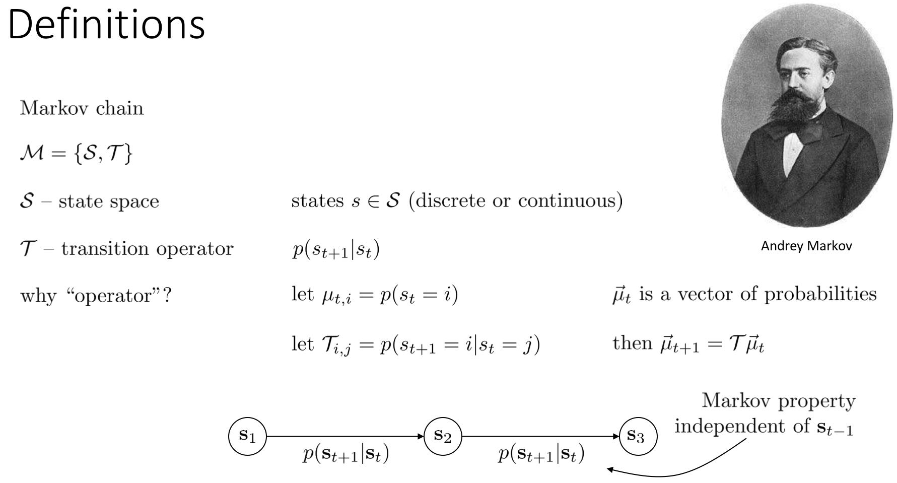
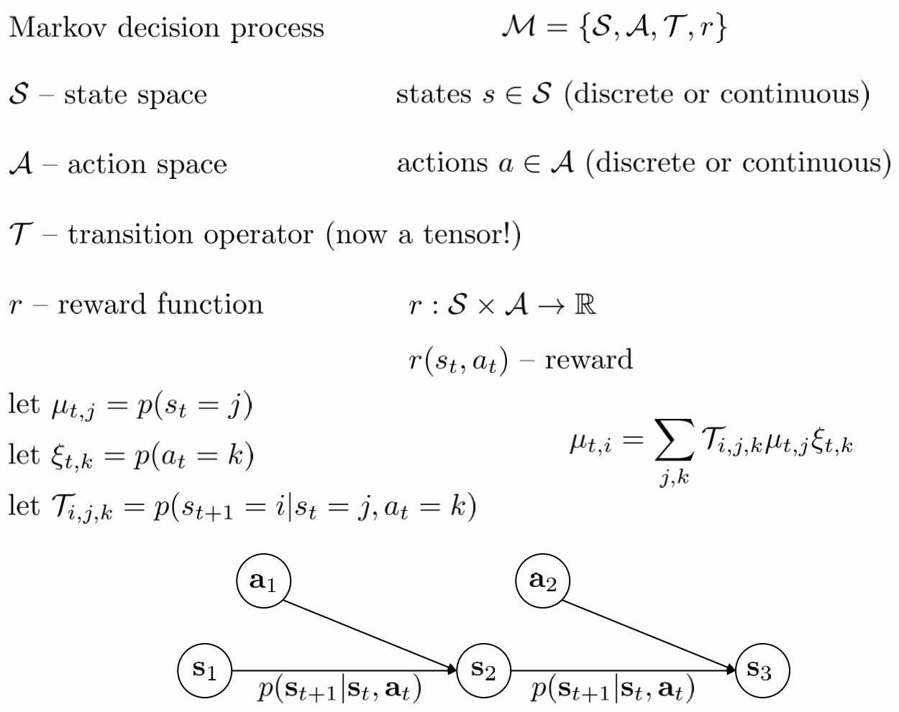
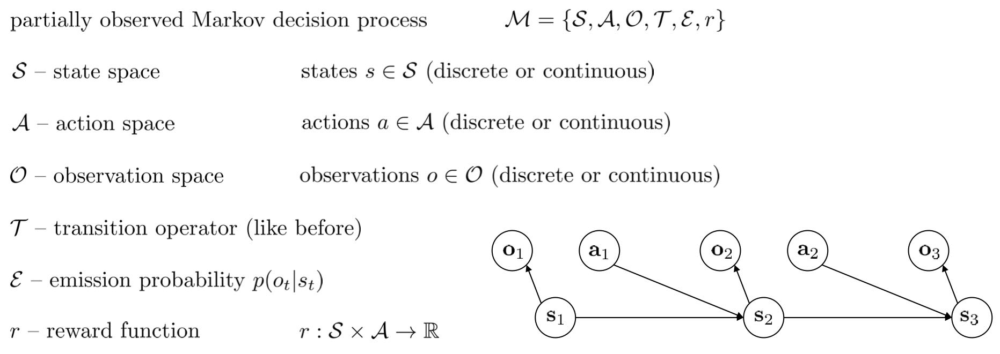
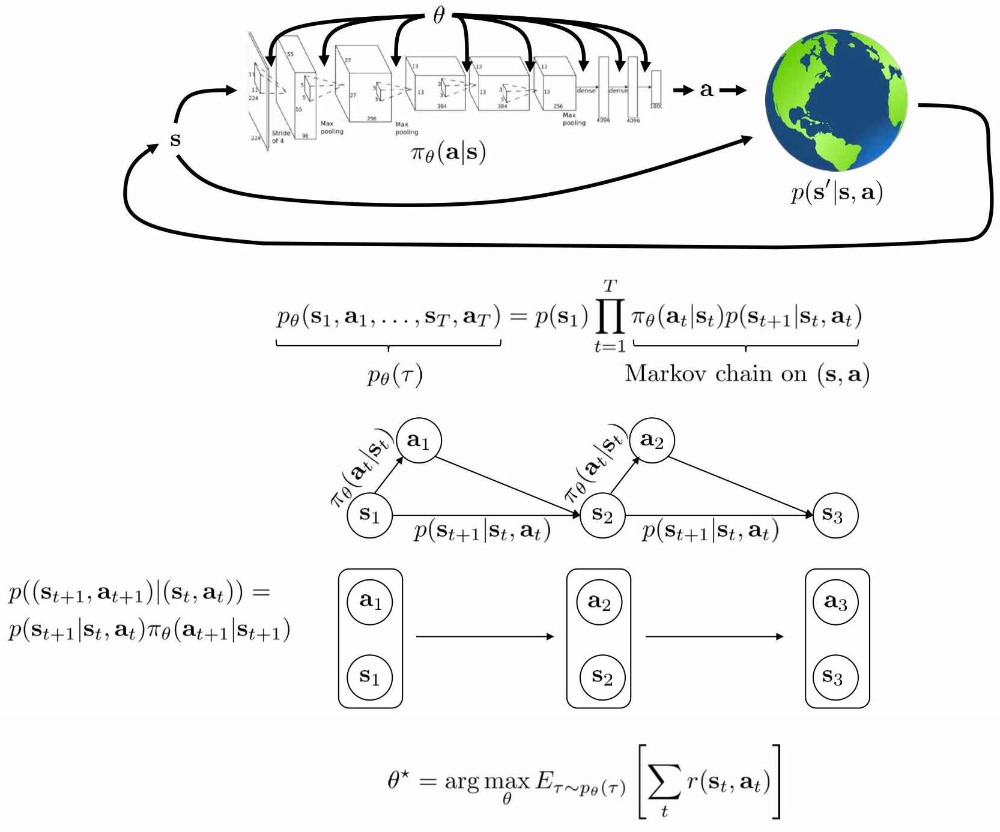
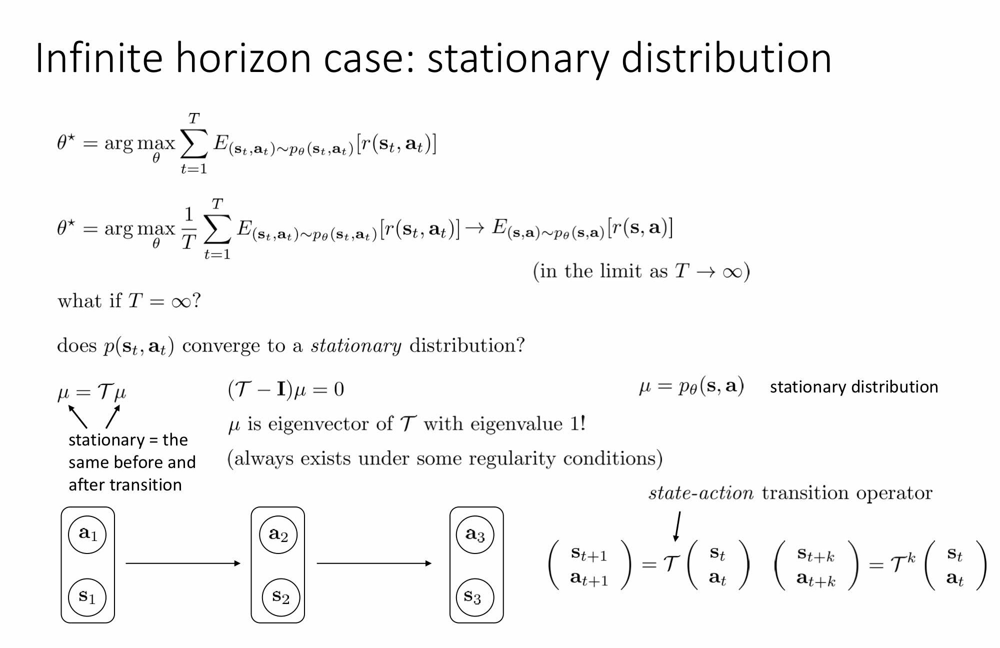
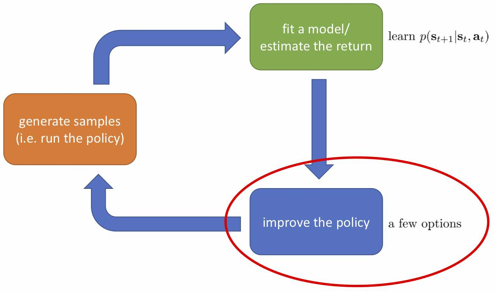
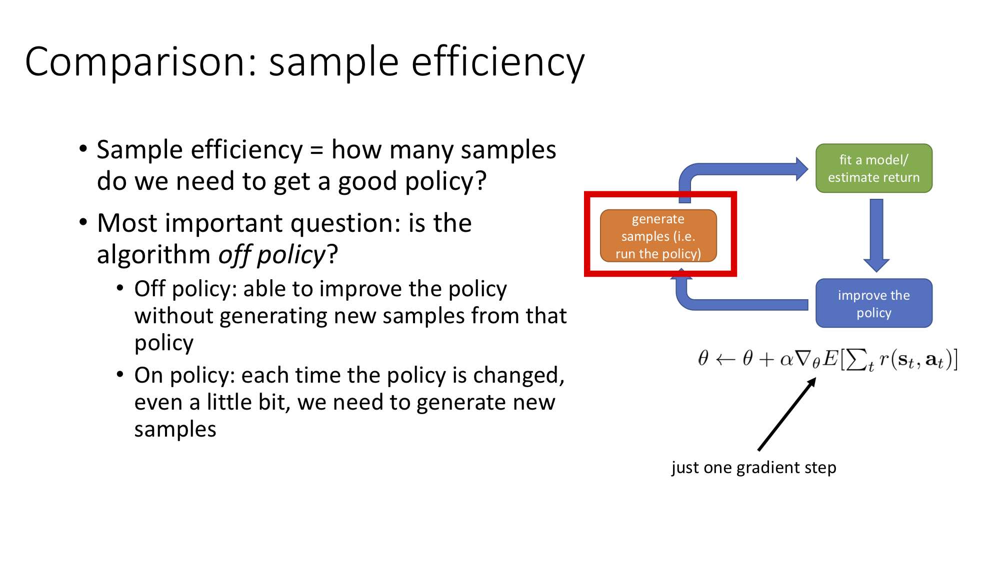
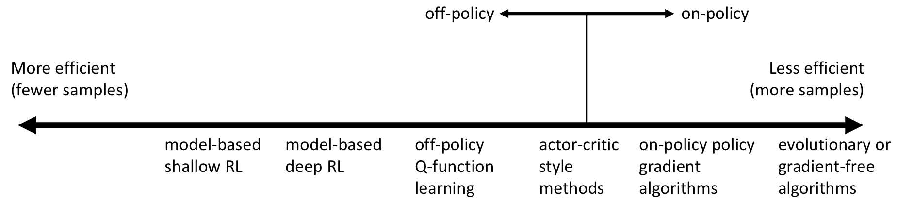

# Lecture 4: Reinforcement Learning Introduction

**课程内容**  

1. 马尔科夫决策过程的定义
2. 强化学习问题的定义（强化学习本质是一个优化问题）
3. 典型强化学习算法的内部结构（所有强化学习算法都能分解成三部分）
4. 简单介绍不同种类的RL算法

**课程目标**  

- 理解定义和符号
- 理解RL算法的目标，即RL算法在优化什么
- 对这些算法有一个总结性认识

## 定义

在「模仿学习」课上讲过，一个顺序决策问题由observations、actions、policy组成，其中policy是给定observation的actions的分布，
可以是一个完全/部分观察的情况，这取决于能否直接观察到state。state和observation的区别是state满足马尔科夫随机过程的性质，而observation不满足。
完全/部分观察对某些算法来说非常重要，有些算法是假定在完全观察的基础上的，有些算法对部分观察也适用。  

「模仿学习」需要专家数据，在没有专家数据时，可通过奖励函数学习到有效的策略，一般来说奖励函数是states和actions的函数，我们要最大化整个过程的奖励而非当前奖励。

所有的这些state、action、reward、transition probability定义了**马尔科夫决策过程**，而马尔科夫决策过程定义了RL的基本世界观，
它包括、、
$)和$)

**马尔科夫链**

在马尔科夫链中只需要定义一个状态空间和转移概率，，
如下图所示

**马尔科夫决策过程(MDP)**

马尔科夫决策过程在马尔科夫链的基础上加入了行动空间和奖励函数，其中奖励函数对应所有的状态和行动的组合都有一个标量。如下图所示

**部分观察的马尔科夫决策过程(POMDP)**

一般情况下的强化学习你会得到observation，如果你的策略是在这些观察的基础上做出的而不知道状态，那么我们称其为部分观察的马尔科夫决策过程。
它是马尔科夫决策过程的泛化，它给了我们关于强化学习的最一般的形式。

在POMDP中需要添加一个观察空间和一个输出概率(Emission probability)，如下图所示

## 强化学习的目标

输入状态，通过转移算子，输出行动，这样的状态和行动组合会影响环境从而到达下一个状态。图示和概率分布及我们的目标如下图所示

在很多强化学习问题中，我们可能不知道转移概率，所以公式中的结果并不总能得到，但我们可以通过其他方法估计。

通常一个MDP用图表示包括状态、行动和转移概率，我们可以将其等价的转化成另一个马尔科夫链，其中s_t和a_t在一起，转移概率如图中所示，是乘积形式。

我们的目标是找到一组参数，能使所有轨迹的激励总和的期望最大，公式如上图所示。

**无限序列情况下的状态-行动边界**

对于无限序列，若要状态变化后到达一个特定分布，需要将概率向量和转移算子相乘后得到的概率向量和之前一样。到达稳态不是说状态不变了，
而是说平均而言概率分布保持不变。利用这个性质可以解出概率向量是转移算子的特征值为1的特征向量，如图中所示。

对于无限序列下的目标，我们需要求其平均激励期望时，由于最终会收敛到稳态，所以平均激励期望就是在马尔科夫链的稳态分布条件下的激励期望值，
这个马尔科夫链是通过将MDP中的state和action组合成新的state得来的。

注：很多MDP研究中都会假设稳态存在，但在现实中很多时候这个假设不成立。

**在强化学习中，我们总是关心期望和**

在增强学习中，我们几乎只关心期望，而不是个别的值，这是因为这给予了我们很好的数学性质。譬如说在盘山公路上开一辆车，如果正在运行那么收益函数为+1，
如果掉下山崖则收益函数为-1。此时，我们的收益函数是不光滑的。假如说我们从非常复杂的系统中提取出了一个概率，
作为掉下的概率，此时如果我们关注期望的话，平稳分布下的收益函数的期望，
\sim{p}_\psi({s},{a})}r({s},{a}))则是关于光滑的！
这一点非常重要，允许我们使用诸如基于梯度的算法来优化非光滑的目标（可能是非光滑的转移，或者非光滑的收益函数等等导致）。

即使激励函数和分布是不光滑的，在计算期望时也总可以通过优化操作，使期望变成光滑的函数。在汽车坠崖的例子中，我们希望掉落的概率为0，
所以期望函数等于掉落概率乘以掉落奖励加上不掉落概率乘以不掉落奖励，是线性的。

## 强化学习算法的结构

强化学习算法可以被分解为三部分：

1. 产生样本。我们在现实世界（或者模拟器）中运行我们的策略，来收集轨迹样本。有的时候，这个轨迹可以只是一个转移，这样就是一个很短的轨迹；也可以是完整的有始有终的一条。
2. 拟合模型/估计回报。对于策略学习算法，则这个部分就是策略评估 (policy evaluation)；对于基于模型 (model-based) 的增强学习算法，那么就是模型拟合，等等。
这个步骤中并不改变我们的行为，但我们想通过研究我们在第一步中得到的样本来看发生了什么，当前的策略有多好，或者尝试去分析物理环境等等。
3. 改进策略 。根据之前的研究结果，使用一些方法去得到一个更好的策略，再投入到第一步的运行中去。

不同算法在不同步骤要做的事情也差异很大。

在绿色方块的第二步，策略梯度法只需要计算一个求和来得到收益，诸如；
基于值函数的方法诸如演员-评论家算法和Q学习算法则需要去拟合一个用深度神经网络代表的函数)；
基于模型的方法则需要去估计转移概率)。

在蓝色方块的第三步，策略梯度法需要对神经网络的参数进行一个梯度步的调整，诸如)；
Q学习法则需要找到一个使得Q函数最大的行动=\arg\max{Q}_\phi(s,a))；
基于模型的方法则需要用诸如反向传播梯度的方法去优化策略函数)。

## 优化函数

如何处理随机系统呢？因为我们考虑的目标主要还是关于期望，因此条件期望成为一个非常有力的工具。我们想描述一个期望\sim{p}_\theta({s}_t,{a}_t)}r({s}_t,{a}_t))，
而这个期望则可以由一系列嵌套的条件期望所描述：  
}[E_{a_1\sim\pi(a_1\|s_1)}[r(s_1,a_1)+E_{s_2\sim{p}(s_2|s_1,a_1)}[E_{a_2\sim\pi(a_2|s_2)}[r(s_2,a_2)+\ldots|s_2]|s_1,a_1]|s_1]])  
其中第一个状态是服从于初始分布，在第一个期望内，我们要对第一个行动取期望，是服从于我们的策略的。第二个状态是以第一个状态和第一个行动为条件的，依次类推。

**Q函数(Q-function)**

把上式中间的递归部分抽离出来，令=r(s_1,a_1)+\mathbf{E}_{s_2\sim{p}(s_2|s_1,a_1)}[\mathbf{E}_{a_2\sim\pi(a_2|s_2)}[r(s_2,a_2)+\ldots|s_2]|s_1,a_1])，
如果我们知道这样一个函数，那么原来的问题就可以被简写为 }[\mathbf{E}_{a_1\sim\pi(a_1|s_1)}[Q(s_1,a_1)|s_1]])，
我们对的选择的事实上就不依赖于其他的东西了。我们把这样的函数称为**Q函数**(Q-function)，
表现为在状态下，选择行动所能带来的收益函数的条件期望。

Q函数的定义为：=\sum_{t'=t}^{T}E_{\pi_\theta}[r(s_{t'},a_{t'})\|s_t,a_t]$)，
表示从t时刻状态为起，执行行动，之后根据给定策略决策，未来总收益的条件期望。

**值函数(Value function)**

=\sum_{t'=t}^{T}E_{\pi_\theta}[r(s_{t'},a_{t'})\|s_t]$)

=E_{a_t\sim\pi(a_t\|s_t)}[\textit{Q}^{\pi}(s_t,a_t)]$)

值函数只是状态版本的Q函数，表示从t时刻状态为起，根据给定策略决策，未来总收益的条件期望。

的值函数的期望是强化学习的目标，即公式}[\textit{V}^{\pi}(s_1)]$)

**优化函数的使用方式**

1. 我们有一个策略，并且我们知道这个策略的Q函数，我们希望策略中使Q最大化的动作概率为1。
那么我们可以创建一个新策略让任何使Q最大的动作的概率为1，其它动作概率为0。
这本质上是种策略迭代，它不关心策略是什么。

2. 使用Q来得到梯度，以便改善策略。如果有一个动作a，它的状态si的Q值比V在s时的值要好，那么这个动作比平均动作要好，然后我们可以更改策略，
增加Q值大的动作的概率

## 强化学习算法种类

}[\sum_{t}r(s_t,a_t)]$)

- **策略梯度方法**：直接对目标函数关于参数求梯度。本质是一阶最优化算法，求解无约束优化问题的通用方法。但真正的完全期望通常难以估计，所以策略收益集合将会基于样本进行近似，然后计算梯度。
- **值函数方法**：这类方法尝试去近似估计**最优策略下的**值函数或Q函数，而并不揣测策略函数是什么。注意此时策略并需要不显式表达出来，只需要选择使得Q函数最大的行动即可（或者值函数类似于动态规划中的手段）。这种估计通常通过神经网络来表示。
- **演员-评论家 (actor-critic)方法**：演员-评论家算法是前两者的结合这类方法尝试去近似估计**当前策略下的**值函数或Q函数，并用这个信息求一个策略的梯度，改进当前的策略。
- **基于模型的RL方法**：首先估计模型，然后可以用它直接做计划（不需要显式策略），或用它来提升策略。

**基于模型的RL算法**

在绿色框中学到一些模型，有许多选择可以用来搭建模型，在橘色框中收集到的信息要用来拟合绿色框的模型

**为什么需要不同的强化学习算法？**

在强化学习中，没有一个单纯的算法在所有情形下都表现得很好。

- 因此算法之间需要有很多权衡点：
  - **样本效率** (sample efficiency)，就是要有一个不错的策略效果需要橙色方块收集多少数据；
  - **稳定性和易用性**，主要体现在选择超参数和学习率等调参的难度，在不同的算法中这个难度可以差别很大。
- 不同的算法也有不同的前提假设：
  - 有些算法假设系统动态和策略是随机的，有些是确定性的；
  - 有些连续有些离散；有些有限期 (episodic) 有些无限期。
- 还有一个很现实的问题是，在不同的问题下，要去表示一个东西的难度是不一样的，譬如有些问题去表示一个策略是比较容易的，而有些问题去拟合模型更容易：
因此方法的选择对于特定问题很有关系。

**关于样本效率**

在橙色方块中，我们主要关心样本效率。样本效率意味着我们要得到一个好的策略，需要收集的样本数量：这决定了我们需要在模拟器或者真实世界运行我们的策略多久才能让它到一个稳定状态。
最重要的一点是，我们的算法是否是**离线** (off-policy) 的。

- 离线的意义是我们可以在不用现在的策略去生成新样本的情况下，就能改进我们的策略。其实就是能够使用其他策略生成过的历史遗留数据来使得现在的策略更优。
- 在线 (on-policy) 算法指的是每次策略被更改，即便只改动了一点点，我们也需要去生成新的样本。在线算法用于梯度法通常会有一些问题，因为梯度算法经常会走梯度步，些许调整策略就得生成大量样本。

上图是一个算法间的样本效率比较图（是非常粗糙的，具体效果如何其实非常依赖于特定的问题）。以竖线为分界点，离线算法有较高的样本效率，在线算法则较低。

**关于稳定性和易用性**

在监督学习中，我们采用的基本上都是某种意义上的梯度下降法，而这样的算法分析起来是相对简单的，大家对它比较了解，也有很好的让它收敛的办法。

而增强学习通常不使用梯度下降法，譬如Q学习法本质上是一个不动点迭代的过程，在一定条件下收敛；基于模型的增强学习，当我们在优化转移模型时，它并不优化期望收益函数；
策略梯度法是梯度方法，比较好用，但它的样本效率比前两者都要低。这些都是权衡，更聪明的算法可能更难用。

对于值函数拟合方法
- 一般来说我们优化的是它对期望收益函数拟合得多好，但是把这个函数拟合得好并不意味着有一个很好的策略，减少预测误差不见得最大化期望收益；
- 在更坏的情况下，它什么都不优化，事实上，很多流行的值函数拟合方法在非线性的问题中并不能保证收敛性。

对于基于模型的增强学习方法
- 立足于减少模型预测误差，这是一个监督学习问题，一般会收敛；
- 但这不意味着一个更好的模型能得到一个更好的策略。

策略梯度法
- 仅有的关于目标函数使用梯度上升方法的，但也有一些缺点。

**关于假设**

1. 完全的可见性。常常被值函数拟合类方法所假设，可以通过加入RNN的方法来缓解；
2. 有限期。被纯策略梯度法和一些基于模型的增强学习算法假设，这些方法不用去训练值函数，对于有些机器人问题中确实是如此的（机器人拼乐高的例子）；
3. 连续性和光滑性。是一些连续的值函数学习法和一些基于模型的增强学习算法（如浅层学习）所假设的，如果知道连续性，那么可以有一些技巧可做。

要看问题具体满足什么样的假设，然后选取合适的算法。

## 具体算法举例

- 值函数拟合方法
  - Q学习（深度Q网络DQN）
  - 时间差分学习
  - 拟合值迭代等
- 策略梯度法
  - REINFORCE
  - 自然策略梯度 (Natural Policy Gradient)
  - 信赖域策略优化 (Trust Region Policy Optimization, TRPO)等
- 演员-评论家算法
  - Asynchronous advantage actor-critic (A3C)
  - Soft actor-critic (SAC)
- 基于模型的增强学习算法
  - Dyna
  - 引导策略搜索 (Guided Policy Search)等

**实例**

1. 基于值函数方法的一个最经典的例子是使用DQN来打Atari游戏 (Mnih et al., 2013)，使用卷积神经网络来估计Q函数，学习的不是策略而是Q函数来预测未来的收益，并由此得到策略。
2. Levine et al. (2016) 使用引导策略搜索 (GPS) 这样的基于模型的增强学习方法来做基于像素图像的机器人控制，拟合局部模型。
3. Schulman et al. (2016) 使用加入值函数近似的策略梯度法 (TRPO) 来训练小人模拟行走，走的时间逐渐变长。
