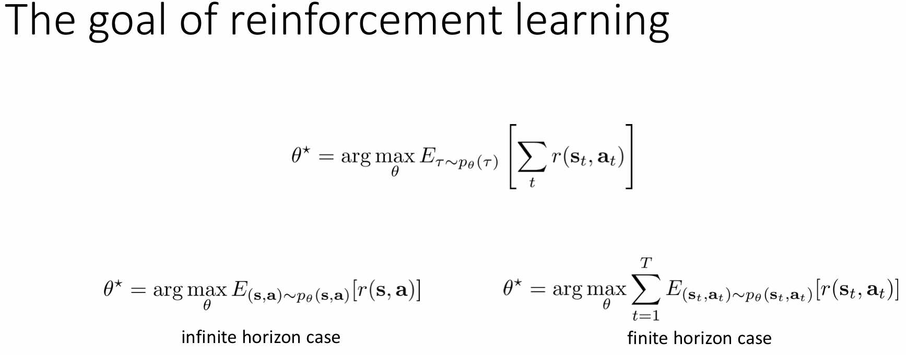
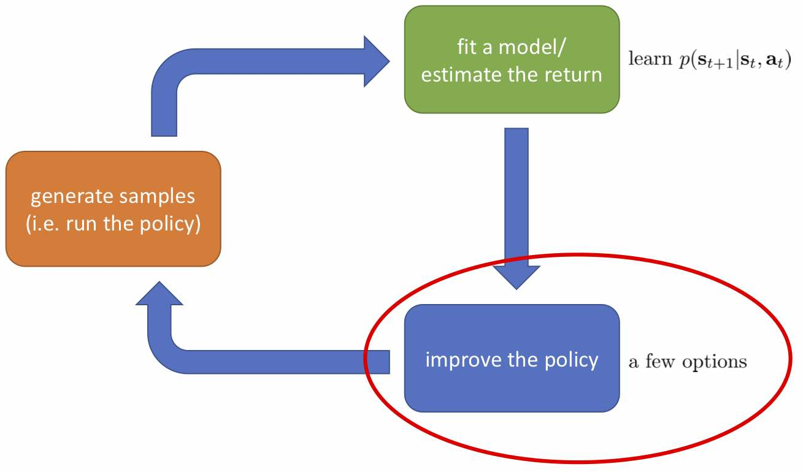
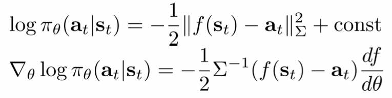
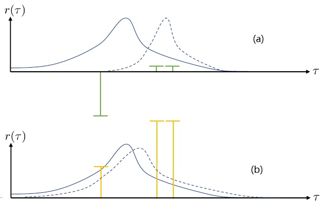
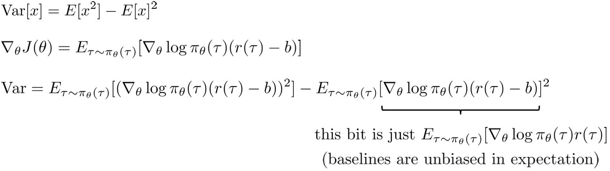
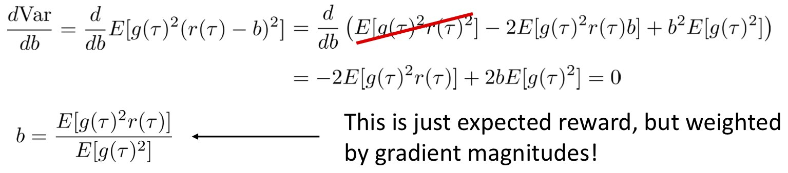
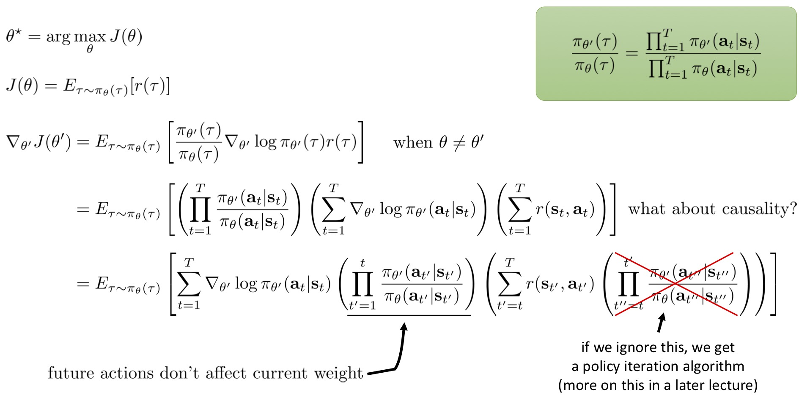
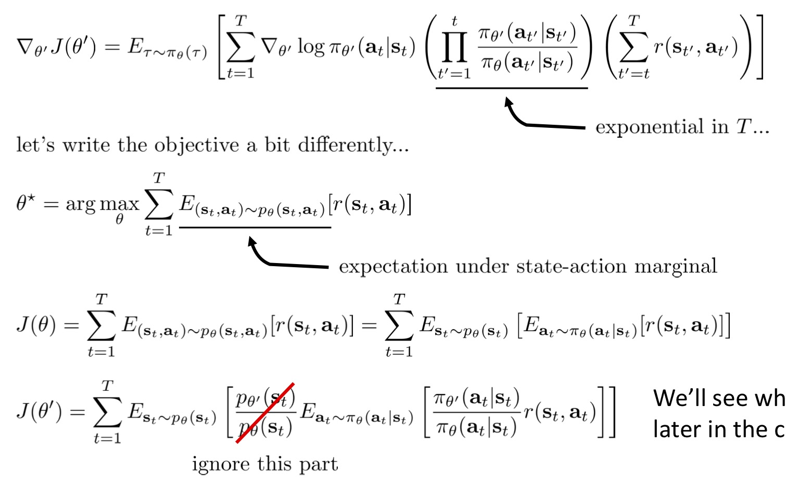
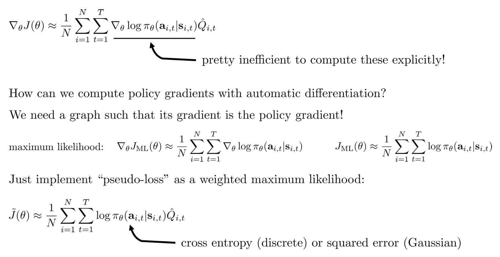
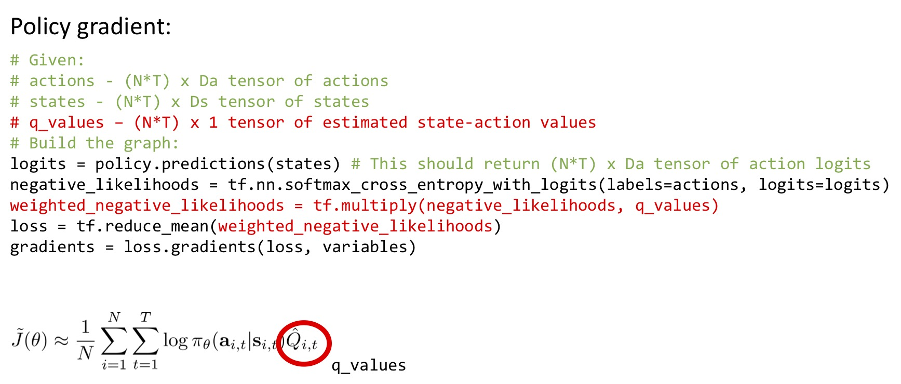

# Lecture 5: Policy Gradients

这节课介绍一个model-free的强化学习算法

**课程内容**

1. 策略梯度算法。推导数学公式，讨论它的基本公式形式，并解释原理。讨论他们之间的利弊和实际操作时会遇到的各种情况。
2. 策略梯度算法的用途
3. 方差缩减的技巧：因果结果
4. 方差缩减的技巧：基准线随机序列等
5. 策略梯度算法的例子

**课程目标**

- 理解策略梯度RL算法
- 理解如何根据实际情况设计策略梯度，主要是减小方差

**强化学习目标**

强化学习是要解决一个优化问题，为了解决优化问题首先需要定义优化问题的目标，RL中优化的目标是：**最大化奖励函数**

公式如下图所示，其中无限范围形式可以看做马尔科夫链中的静态分布，由dynamics和策略p共同影响。

本节课只介绍有限范围的形式。

## 策略梯度算法

### 1. 评估优化目标

(公式中的$\pi_\theta$与${p}_\theta$等价，都代表策略)

$$\theta^*=\arg\max{E}_{\tau\sim{p}_\theta(\tau)}[\sum_{t}r(s_t,a_t)]$$

将中间部分简写，令$\textit{J}(\theta)=E_{\tau\sim{p}_\theta(\tau)}[\sum_{t}r(s_t,a_t)]$

因为状态空间和行动空间组合之后形成的奖励空间维度太高，不可能直接求解，所以我们要求其近似解。而求解近似值的方式就是从分布中采样，将同样的T步操作重复若干次，然后取平均，就可以得到样本期望的无偏估计。即

$$\textit{J}(\theta)\approx{1}/{N}\sum_i\sum_{t}r(s_{i,t},a_{i,t})$$

### 2. 评估策略梯度

现在考虑怎么去改进策略，在连续优化中最常见的方法是计算其梯度，然后让参数走一个梯度步。现在看怎么在这个目标中实现这个步骤。将求和项简写，然后根据期望的定义，有$\textit{J}(\theta)=E_{\tau\sim{p}_\theta(\tau)}[r(\tau)]=\int{p}_\theta(\tau)r(\tau)\,d\tau$，它的梯度为$\nabla_\theta{J}(\theta)=\int\nabla_\theta{p}_\theta(\tau)r(\tau)\,d\tau$

由对数的梯度公式${p}_\theta(\tau)\nabla_\theta\log{p}_\theta(\tau)={p}_\theta(\tau)\frac{\nabla_\theta{p}_\theta(\tau)}{{p}_\theta(\tau)}=\nabla_\theta{p}_\theta(\tau)$，得到$\nabla_\theta{J}(\theta)=\int{p}_\theta(\tau)\nabla_\theta\log{p}_\theta(\tau)r(\tau)\,{d}\tau$，因为式子中又再度出现了${p}_\theta(\tau)$这个概率，它本质上又变回了一个期望：

$$\nabla_\theta{J}(\theta)=\mathbf{E}_{\tau\sim{p}_\theta(\tau)}[\nabla_\theta\log{p}_\theta(\tau)r(\tau)]$$

回想我们的概率表达形式$p_\theta(\tau)=p(\mathbf{s}_1)\prod_{t=1}^T\pi_\theta(\mathbf{a}_t|\mathbf{s}_t)p(\mathbf{s}_{t+1}|\mathbf{s}_t,\mathbf{a}_t)$，将两边取对数，得到$\log{p}_\theta(\tau)=\log{p}(\mathbf{s}_1)+\sum_{t=1}^T[\log\pi_\theta(\mathbf{a}_t|\mathbf{s}_t)+\log{p}(\mathbf{s}_{t+1}|\mathbf{s}_t,\mathbf{a}_t)]$。  

在原式子中，我们需要的是这个东西关于$\theta$的梯度，而事实上初始分布和转移概率本身都与参数$\theta$并不相关。因此形式上只有$\nabla_\theta\log{p}_\theta(\tau)=\sum_{t=1}^T\nabla_\theta\log\pi_\theta(\mathbf{a}_t|\mathbf{s}_t)$。

带入原式后，得到$\nabla_\theta{J}(\theta)=\mathbf{E}_{\tau\sim{p}_\theta(\tau)}[(\sum_{t=1}^T\nabla_\theta\log\pi_\theta({a}_t|{s}_t))(\sum_{t=1}^{T}r({s}_t,{a}_t))]$。

求解这个梯度的解析解非常困难，所以我们使用其估计值

$$\nabla_\theta{J}(\theta)\approx\frac{1}{N}\sum_{i=1}^N[(\sum_{t=1}^T\nabla_\theta\log\pi_\theta(\mathbf{a}_{i,t}|\mathbf{s}_{i,t}))(\sum_{t=1}^Tr(\mathbf{s}_{i,t},\mathbf{a}_{i,t}))]$$

得到梯度后，使用梯度上升法走一个的梯度步$\theta\leftarrow\theta+\alpha\nabla_\theta{J}(\theta)$。

在强化学习的三个步骤中，第一步橙色方块是生成很多样本，用于求解我们的期望表达式估计目标函数和梯度；第二步绿色方块是模型评估，求解奖励函数的二重求和，用来估计收益，判断我们的策略有多好；第三步蓝色方块需要我们求出梯度，然后使用梯度下降来更新和改进我们的策略。

这样，我们就得到了一个最简单的策略梯度法REINFORCE (Williams, 1992)：  
1. 运行策略$\pi_\theta(\mathbf{a}|\mathbf{s})$，抽取样本$\{\tau^i\}$；
2. 将离散采样点带入公式，估计梯度$\nabla_\theta{J}(\theta)\approx\frac{1}{N}\sum_{i=1}^N[(\sum_{t=1}^T\nabla_\theta\log\pi_\theta(\mathbf{a}_{i,t}|\mathbf{s}_{i,t})) (\sum_{t=1}^Tr(\mathbf{s}_{i,t},\mathbf{a}_{i,t}))]$；
3. 运用梯度来优化我们的策略，$\theta\leftarrow\theta+\alpha\nabla_\theta{J}(\theta)$。

### 3. 理解策略梯度

***策略梯度法基本上把试错学习形式化了***

接下来要搞清楚$\nabla_\theta\log\pi_\theta(\mathbf{a}_t|\mathbf{s}_t)$是什么。$\pi$是我们的策略，比如在监督学习中，输入图片，输出它属于每个标签的概率大小。在监督学习中求的是最大似然估计，而策略梯度和它非常像，只是多乘了一项奖励函数和，相当于对所有采样值进行加权。

接下来是举例。比如在连续动作的例子中，我们选择用高斯分布来表示这个策略采取某种行动的概率，即$\pi_\theta(\mathbf{a}_t|\mathbf{s}_t)=\mathcal{N}(f_{NN}(\mathbf{s}_t);\Sigma)$，其均值由神经网络构成的状态函数给出，方差可能只是一个常数，所以可以先不考虑方差。然后对这个策略公式取对数，和计算梯度，公式如下图所示  

在实践中，$\frac{df}{d\theta}$是对神经网络取梯度，需要一次反向传播。而训练神经网络我们也是走一个梯度步，因此我们只需要在走梯度步的时候乘上权重$-\frac{1}{2}\Sigma^{-1}(f(\mathbf{s}_t)-\mathbf{a}_t)(\sum_tr(\mathbf{s}_t,\mathbf{a}_t))$就行。

### 4. 对于部分观测的情况

我们在推导梯度策略的时候，没有使用任何马尔科夫性，这意味着如果你想对观测(而非状态)使用策略梯度时，只需要将原式中的$(a_t|s_t)$换成$(a_t|o_t)$，所以常规的策略梯度可以被用于部分观测，不用修改。(之后介绍的其他算法不一定满足这一点)

### 5. 策略梯度法存在的问题

策略梯度的问题在形式上其实是方差问题。如果想通过有限的样本估计梯度，需要重复计算许多次梯度，每次计算都会得到不同的梯度估值，这些估值会有很大差异(即这些梯度估值的方差很大)，而每次更新都是延梯度方向，所以如果产生了一个很大的估值，那么会使算法收敛到一个较差的位置(对于非凸问题)，或者算法会收敛很慢，或者需要使用超级小的step size。

为什么会有很大方差？如下图所示，将变量投射到一维平面上，对于存在一个很大的负激励和两个小的正激励的情况，最终会使概率分布聚集在正激励的地方。而将奖励函数增加一个常量后(收益之间的相对差不变)，对于存在三个正激励的情况，最终的分布只会平移一些距离而不会对概率产生较大改变。增加的常量并不依赖于参数theta，也不会使最优参数发生改变，但却会影响梯度计算。这一点被称为“**高方差**”问题。

## 削减方差

有两种非常简单的技巧。

### 1. 因果关系 (Causality)

"因果关系"用于解决高方差问题。

回顾我们的梯度为

$$\nabla_\theta{J}(\theta)\approx\frac{1}{N}\sum_{i=1}^N[(\sum_{t=1}^T\nabla_\theta\log\pi_\theta(\mathbf{a}_{i,t}|\mathbf{s}_{i,t}))(\sum_{t=1}^Tr(\mathbf{s}_{i,t},\mathbf{a}_{i,t}))]$$

因果关系指的是，当t < t'时，在时间点t'的策略不能影响时间点t的收益。事实上我们可以用这个关系得到更好的估计量。

我们把后面的求和项作为系数放到前面的求和项中，然后根据因果关系，时间t时策略的改变不会改变之前时间序列的奖励，所以可以将其改写成$\nabla_\theta{J}(\theta)\approx\frac{1}{N}\sum_{i=1}^N\sum_{t=1}^T[\nabla_\theta\log\pi_\theta(\mathbf{a}_{i,t}|\mathbf{s}_{i,t})(\sum_{t'=t}^Tr(\mathbf{s}_{i,t'},\mathbf{a}_{i,t'}))]$，我们将$\hat{Q}_{i,t}=\sum_{t'=t}^Tr(\mathbf{s}_{i,t'},\mathbf{a}_{i,t'})$记作今后收益(reward-to-go)。这样做的一大好处就是，减少了求和数值的数量后，方差也会因为整体数值变小而变小。  

### 2. 基准线 (Baseline)

"基准线"用于解决常数问题。

理想中的梯度下降策略是，让策略梯度拿到好动作的概率提升，拿到坏动作的概率下降，但现实是如果奖励都是正的，那所有概率都会试图升高。所以我们希望在梯度计算公式中，让奖励求和项中减去平均奖励，这样就可以让好的轨迹的收益函数是正的，而差的轨迹是负的。

即$\nabla_\theta{J}(\theta)=\mathbf{E}_{\tau\sim{p}_\theta(\tau)}[\nabla_\theta\log{p}_\theta(\tau)(r(\tau)-b)]$，其中$b=\frac{1}{N}\sum_{i=1}^Nr(\tau_i)$，且可以验证无论b取任何常数，其都是无偏的(乘以梯度后均值都为0)。

事实上，平均奖励基准线不是最好的基准线，但在实验中使用平均奖励是非常有效的。

**最佳基准线**

首先分析方差，根据方差公式和梯度公式，可以得到下图结果

然后我们将方差求导取一阶最优性条件，希望方差Var关于基准线b的一阶导数为0，所以可以推出如下公式

即最优解$b^*=\frac{\mathbf{E}[g(\tau)^{2}r(\tau)]}{\mathbf{E}[g(\tau)^2]}$

本质上来说，它是一个关于概率梯度的加权平均，不同样本的权重不同是因为概率的梯度不同。而我们前面说的简单平均只是它的一个粗糙简化版本而已，也是有一些理论根据的。在实践中也没有发现很大的效果差异。

## 离线的策略梯度法

策略梯度是一个**在线策略**(on-policy)算法，意思是每次改进策略后会生成新样本，并且丢弃旧样本。这是因为策略梯度求期望的时候必须是从当前的分布上采样才能有无偏性，而这就要求每次梯度更新之后就根据新分布全部重新采样：如果策略是一个非常复杂的神经网络，每次迭代可能只更新一点点，但也要求把之前的样本全都扔了然后重新采样，对数据的利用率非常低，所以在线策略是非常低效的。

接下来要提出一个基于**重要性抽样**(importance sampling)的离线策略的策略梯度算法。

*重要性抽样的原理是* $\mathbf{E}_{x\sim p(x)}[f(x)]=\int{p}(x)f(x)\mathrm{d}x=\int{q}(x)\frac{p(x)}{q(x)}f(x)\mathrm{d}x=\mathbf{E}_{x\sim{q}(x)}[\frac{p(x)}{q(x)}f(x)]$
  
如果我们没有从最新的$p_\theta(\tau)$中得到的样本，而是有一堆从分布$\hat{p}(\tau)$中抽取出来的数据，我们就可以使用重要性抽样的方法。将其换到目标函数上，则$J(\theta)=\mathbf{E}_{\tau\sim\bar{p}(\tau)}[\frac{p_\theta(\tau)}{\bar{p}(\tau)}r(\tau)]$。

由于

$$\frac{p_\theta(\tau)}{\bar{p}(\tau)}=\frac{p(\mathbf{s}_1)\prod_{t=1}^T\pi_\theta(\mathbf{a}_t|\mathbf{s}_t)p(\mathbf{s}_{t+1}|\mathbf{s}_t,\mathbf{a}_t)}{p(\mathbf{s}_1)\prod_{t=1}^T\bar{\pi}(\mathbf{a}_t|\mathbf{s}_t)p(\mathbf{s}_{t+1}|\mathbf{s}_t,\mathbf{a}_t)}=\frac{\prod_{t=1}^T\pi_\theta(\mathbf{a}_t|\mathbf{s}_t)}{\prod_{t=1}^T\bar{\pi}(\mathbf{a}_t|\mathbf{s}_t)}$$

同样最难处理的初始分布和转移概率也被消掉了：我们依然保持了无需知道这些繁琐内容的性质。在实践上可能会有一些问题，但是至少在理论上还是无偏的：只要给定足够多的样本就行。

现在我们要求出目标函数的梯度了。使用重要性抽样的技术，$J(\theta')=\mathbf{E}_{\tau\sim p_\theta(\tau)}[\frac{p_{\theta'}(\tau)}{p_{\theta}(\tau)}r(\tau)]$，可以发现与$\theta'$有关的部分仅仅是$p_{\theta'}(\tau)$，因此将目标函数求梯度得

$$\nabla_{\theta'}J(\theta')=\mathbf{E}_{\tau\sim p_\theta(\tau)}[\frac{\nabla_{\theta'}p_{\theta'}(\tau)}{p_{\theta}(\tau)}r(\tau)]=\mathbf{E}_{\tau\sim p_\theta(\tau)}[\frac{p_{\theta'}(\tau)}{p_{\theta}(\tau)}\nabla_{\theta'}\log p_{\theta'}(\tau)r(\tau)]$$

这跟之前的策略梯度相比，只是多了重要性权重以及求的是在旧参数下的期望。而如果$\theta=\theta'$，它就跟之前的策略梯度公式一样了。

我们将梯度公式展开，忽略掉一项连乘后，得到如下图所示公式。

不难看出中间这块连乘部分的数值，是关于T指数增长的，如果每个数都略小于1，而时间轴非常长，这个乘积最终将非常接近于0，这样梯度效果就会很差了。

我们把目标函数重写成一个边际分布下的期望求和的形式，然后我们在两个层面上做重要性抽样，如下图所示

这样就不再有指数乘积问题，但是同时又带来了一个新的需要知道$p_{\theta'}(\mathbf{s}_t)$这样给定策略下某个时刻在某个状态的概率这样的大难题。一个近似的处理方式是我们可以把$\frac{p_{\theta'}(\mathbf{s}_t)}{p_{\theta}(\mathbf{s}_t)}$这块弄掉，当然这样做的话理论上就不再无偏了，但是事实上当两个策略足够接近的话，可以说明这个比值是不重要的。

## 自动微分的策略梯度

我们现在想找到一个比较简单的方法去实现策略梯度法，以利用上TensorFlow或者PyTorch等自动微分器。回顾梯度$\nabla_\theta{J}(\theta)\approx\frac{1}{N}\sum_{i=1}^N\sum_{t=1}^T[\nabla_\theta\log\pi_\theta(\mathbf{a}_{i,t}|\mathbf{s}_{i,t})\hat{Q}_{i,t}]$，其前半部分与极大似然估计的目标函数相同，所以我们所希望做一个虚拟的损失函数(加权损失函数)，将$\hat{Q}_{i,t}$作为权重，如下图所示。然后就用自动差分器求梯度就行了。当然，在线方法要求我们每一个梯度步重新采样，所以我们不能使用SGD。

其TensorFlow代码如下图所示

## 实践中的策略梯度

- 需要记住梯度的方差是非常大的
  - 处理监督学习的方法不见得在这里适用
  - 而且噪音非常大
- 比较实际的解决方法是使用很大的批量数据来降低方差
- 调整学习率是很有挑战性的，而且可能会需要很多时间来做这件事情
  - 使用自适应的步长如ADAM等方法通常还可以
  - 在之后的课程中会讲一些针对策略梯度法的步长调整方法

## 策略梯度相关文献

- Classic papers  
  - Williams (1992). Simple statistical gradient-following algorithms for connectionist reinforcement learning: introduces REINFORCE algorithm  
  - Baxter & Bartlett (2001). Infinite-horizon policy-gradient estimation: temporally decomposed policy gradient (not the first paper on this! see actor-critic section later)  
  - Peters & Schaal (2008). Reinforcement learning of motor skills with policy gradients: very accessible overview of optimal baselines and natural gradient  
- Deep reinforcement learning policy gradient papers  
  - Levine & Koltun (2013). Guided policy search: deep RL with importance sampled policy gradient (unrelated to later discussion of guided policy search)  
  - Schulman, L., Moritz, Jordan, Abbeel (2015). Trust region policy optimization: deep RL with natural policy gradient and adaptive step size  
  - Schulman, Wolski, Dhariwal, Radford, Klimov (2017). Proximal policy optimization algorithms: deep RL with importance sampled policy gradient  