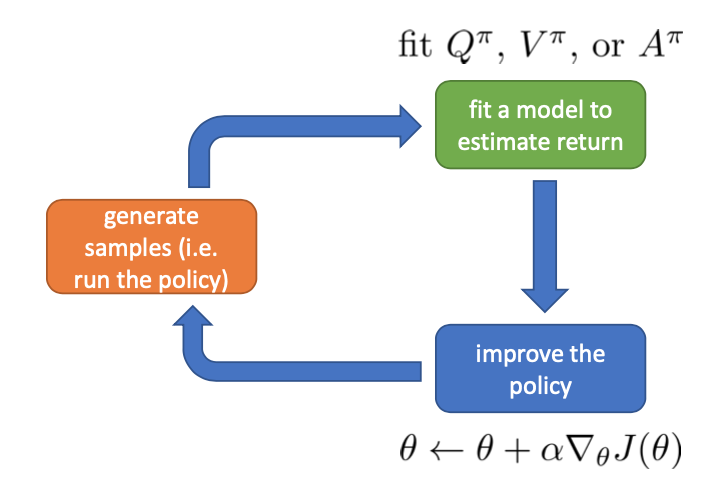
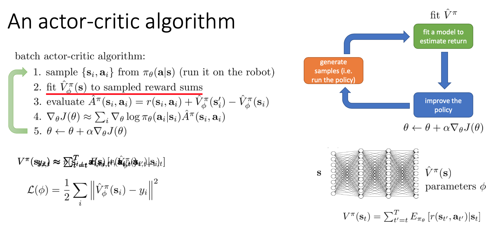
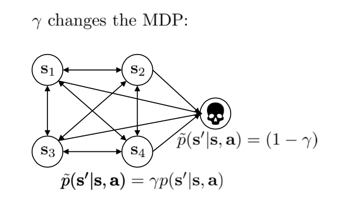
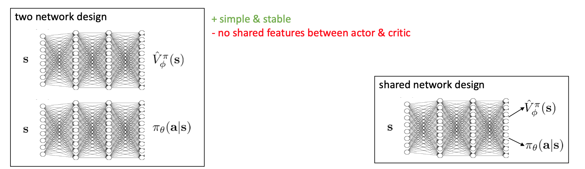
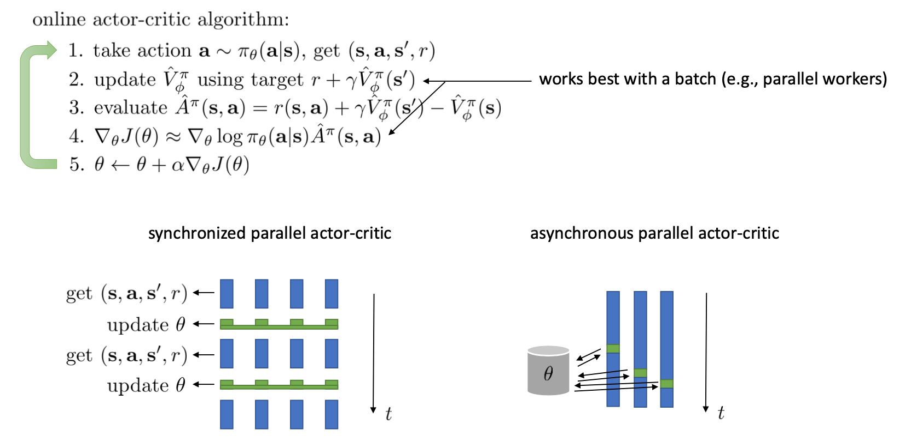
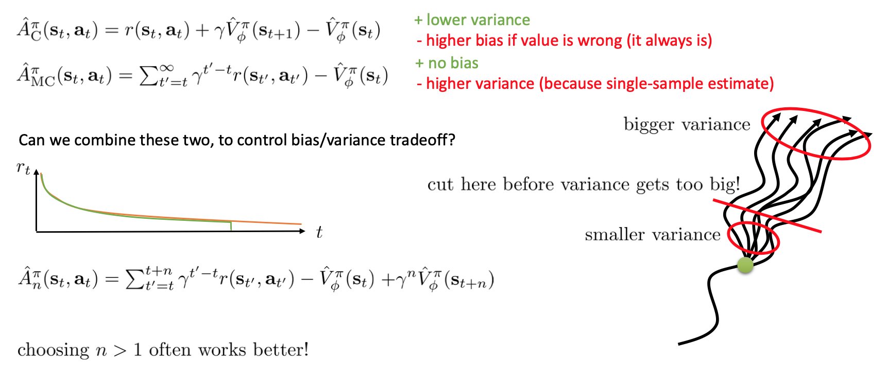

# Lecture 6: Actor-Critic Algorithms

**课程内容**

1. 通过引入评论家(critic)来改进策略梯度
2. 描述什么是评论家模型，讨论策略评估问题(如何拟合一个评判模型到一个策略上)
3. 介绍几种折现因子(discount factor)，用于处理无限期任务
4. 将这些整合到演员-评论家算法，包括批处理模式演员-评论家算法和在线学习演员-评论家算法

**课程目标**

- 理解策略评估是怎么拟合策略梯度的
- 理解演员-评论家算法如何工作

## 提升策略梯度法

我们通常将策略梯度写成$\nabla_\theta{J}(\theta)\approx\frac{1}{N}\sum_{i=1}^N\sum_{t=1}^T[\nabla_\theta\log\pi_\theta(\mathbf{a}_{i,t}|\mathbf{s}_{i,t})\hat{Q}_{i,t}$，使用$\hat{Q}_{i,t}$表示今后收益 (reward-to-go)。在之前的课程中，$\hat{Q}_{i,t}=\sum_{t'=t}^Tr(\mathbf{s}_{i,t'},\mathbf{a}_{i,t'})$，而今天我们要讨论其它估计$\hat{Q}_{i,t}$的方法。

$\hat{Q}_{i,t}$其实是在状态$\mathbf{s}_{i,t}$下选取行动$\mathbf{a}_{i,t}$之后的期望收益的估计量。但对于同一起始状态和动作，由于策略的随机性，会产生许多不同的轨迹，得到不同的结果，所以我们只能让$\hat{Q}_{i,t}$去逼近所有可能的随机事件的期望，即$\hat{Q}_{i,t}\approx\sum_{t'=t}^T\mathbf{E}_{\pi_\theta}[r(\mathbf{s}_{t'},\mathbf{a}_{t'})|\mathbf{s}_t,\mathbf{a}_t]$，不过使用样本估计会产生较高的方差。

如果知道真正的期望今后收益，Q函数，即$Q(\mathbf{s}_t,\mathbf{a}_t)=\sum_{t'=t}^T\mathbf{E}_{\pi_\theta}[r(\mathbf{s}_{t'},\mathbf{a}_{t'})|\mathbf{s}_t,\mathbf{a}_t]$，并用它来替代$\hat{Q}_{i,t}$，就可以得到一个更好的估计量。如果得到正确的Q函数，并把它带入到公式中，将会得到一个低方差的策略梯度算法(因为使用了真实单样本期望作为估算)。解决高方差这一瓶颈问题，我们就倾向于认为可以收敛到一个更好的解，或者使用较大的学习率（也就是增加单步步长），从而收敛得更快。

同样，我们可以引入基准线(baseline)技术(提高比平均值高的行为的概率，降低比平均值差的行为的概率)。我们选择的一个比较好的baseline是值函数$V^\pi(\mathbf{s}_t)=\mathbf{E}_{\mathbf{a}_t\sim\pi_\theta(\mathbf{a}_t|\mathbf{s}_t)}[Q^\pi(\mathbf{s}_t,\mathbf{a}_t)]$，也就是在给定策略下Q函数的期望。之所以采用值函数，是因为这和我们在上一篇中所提到的平均情况不谋而合：之前认为一个不错的baseline是$b_t=\frac{1}{N}\sum_iQ^\pi(\mathbf{s}_{i,t},\mathbf{a}_{i,t})$，而这里也正好是对应的期望。此时我们的估计量就变成了

$$\nabla_\theta J(\theta)\approx\frac{1}{N}\sum_{i=1}^N\sum_{t=1}^T[\nabla_\theta\log\pi_\theta(\mathbf{a}_{i,t}|\mathbf{s}_{i,t})A^\pi(\mathbf{s}_t,\mathbf{a}_t)]$$

**优势函数** (advantage function) $A^\pi(\mathbf{s}_t,\mathbf{a}_t)=Q^\pi(\mathbf{s}_t,\mathbf{a}_t)-V^\pi(\mathbf{s}_t)$，表现了给定策略，在状态$\mathbf{s}_t$下，采用了行动$\mathbf{a}_t$能比该策略的平均情况期望今后收益多出多少。上标$\pi$表示这些函数都是在策略$\pi$下得到的。

即有

$$Q^\pi(\mathbf{s}_{t}, \mathbf{a}_{t})=\sum_{t'=t}^T\mathbf{E}_{\pi_\theta}[r(\mathbf{s}_{t'},\mathbf{a}_{t'})|\mathbf{s}_t,\mathbf{a}_t]$$

$$V^\pi(\mathbf{s}_{t}) = \mathbf{E}_{\mathbf{a}_{t}\sim\pi_\theta(\mathbf{a}_{t}|\mathbf{s}_{t})}[Q^\pi(\mathbf{s}_{t}, \mathbf{a}_{t})]$$

$$A^\pi(\mathbf{s}_t, \mathbf{a}_t) = Q^\pi(\mathbf{s}_t, \mathbf{a}_t) - V^\pi(\mathbf{s}_t)$$

不过实际上我们不会直接得到真实的$Q^\pi$或$V^\pi$，我们不得不用各种方法近似他们，更精确的对Q函数和V函数的估计会得到更优的优势函数，也就会得到更优的策略梯度。

回顾我们之前的$\hat{Q}_{i,t}=\sum_{t'=t}^Tr(\mathbf{s}_{i,t'},\mathbf{a}_{i,t'})$是一个无偏估计，但是它的方差相当大，因为我们在用一系列蒙特卡洛采样来估计Q值。所以我们希望改变策略梯度算法，以便我们仍然可以收集样本，依旧使用策略梯度来改进策略。

## 演员-评论家算法

回到我们的一般步骤中，我们来看它与策略梯度法在第一步生成样本和第三步策略改进上并没有显著区别，主要区别在于第二步：我们现在尝试去做的是去拟合一个值函数：$Q^\pi, V^\pi, A^\pi$三者之一，以期能得到一个更好的梯度估计。我们真正从“估计收益”变为了“拟合模型”。

$Q^\pi, V^\pi, A^\pi$三者都是紧密相关的，那么我们到底去拟合哪个呢？一个非常自然的想法是去拟合$A^\pi$，因为这是我们在梯度表达式中直接要用到的东西。我们可以生成一些数据，然后使用监督学习方法。这里有一个小技巧：我们发现Q函数取决于状态和行动两个维度，因此输入是对应两个空间的笛卡尔积。但是维度越大，同样的样本数估计的方差越大。根据Q函数和值函数的关系，因为在我们的问题结构中，给定当前的状态和行动，当前的收益就是确定的了，如下式1，因此可以把当前的收益提出来，后边那块求和项其实就是值函数的期望，如下式2。如果我们愿意做一点近似，用轨迹样本来估计这个期望——此时不是使用整条轨迹，而仅仅是看一步以后的状态，那么我们的Q函数可以使用下式3来近似。与此同时，优势函数也可以被近似，如下式4。

$$Q^\pi(\mathbf{s}_{t}, \mathbf{a}_{t}) = r(\mathbf{s}_{t},\mathbf{a}_{t}) + \sum_{t'=t+1}^T\mathbf{E}_{\pi_\theta}[r(\mathbf{s}_{t'},\mathbf{a}_{t'})|\mathbf{s}_t,\mathbf{a}_t]$$
$$ = r(\mathbf{s}_{t},\mathbf{a}_{t}) + \mathbf{E}_{\mathbf{s}_{t+1} \sim p(\mathbf{s}_{t+1}|\mathbf{s}_{t}, \mathbf{a}_{t})}[V^\pi(\mathbf{s}_{t+1})]$$
$$ \approx r(\mathbf{s}_{t},\mathbf{a}_{t}) + V^\pi(\mathbf{s}_{t+1})$$

$$A^\pi(\mathbf{s}_t, \mathbf{a}_t) \approx r(\mathbf{s}_{t},\mathbf{a}_{t}) + V^\pi(\mathbf{s}_{t+1}, \mathbf{a}_t) - V^\pi(\mathbf{s}_t)$$

通过上述变换，使用$V^\pi(\mathbf{s}_{t+1})$代替$\mathbf{E}_{\mathbf{s}_{t+1} \sim p(\mathbf{s}_{t+1}|\mathbf{s}_{t}, \mathbf{a}_{t})}[V^\pi(\mathbf{s}_{t+1})]$虽然会引入一些方差，但却是非常方便的，并且此时$A^\pi(\mathbf{s}_t, \mathbf{a}_t)$便可以变成只包含$V^\pi$的方程，其他的都可以被近似表示，这样拟合神经网络的维度的输入空间就只需要是与$\mathbf{s}_{t}, \mathbf{s}_{t+1}$相关的状态空间了。正是因为这个原因，大多数演员-评论家算法都直接**拟合值函数**，即$V^\pi$。

现在我们只考虑估计值函数。我们可以使用神经网络或者其它函数来估计值函数，记为$\hat{V}^\pi(s)$，^表示它是对$V^\pi$的估计而不是真实的值函数。一般来说$\hat{V}^\pi$的估计可能与策略函数无关，即如果策略函数的参数是$\theta$，那么值函数的参数可能是$\phi$。

### 策略评估方法

对于一个给定的策略$\pi$，去拟合这样一个神经网络的过程我们称为**策略评估** (Policy Evaluation)，即上图中的绿色框。这个步骤不尝试去改进策略，它只是想从任意给定的状态出发，评估这个策略有多好。

强化学习的目标函数$J(\theta)=\mathbf{E}_{\mathbf{s}_1\sim p(\mathbf{s}_1)}[V^\pi(\mathbf{s}_1)]$是所有时间步中期望奖励的和，值函数表达式为$V^\pi(\mathbf{s}_t)=\sum_{t'=t}^T\mathbf{E}_{\pi_\theta}[r(\mathbf{s}_{t'},\mathbf{a}_{t'})|\mathbf{s}_{t'}]$，这意味着如果可以拟合值函数，那强化学习的目标函数就刚好是值函数在初始状态下的期望，所以拟合值函数V可以同时为我们评估/改进策略和提供强化学习目标函数的值。

#### **策略梯度中的蒙特卡洛评估**

具体怎么做策略评估呢？与策略梯度法相似，我们依然使用蒙特卡洛方法：进行一次轨迹采样以后使用$V^\pi(\mathbf{s}_t) \approx \sum_{t'=t}^Tr(\mathbf{s}_{t'},\mathbf{a}_{t'})$来近似表示值函数V。当然如果我们可以多次运行模拟器的话，最好能做多次轨迹采样，然后使用$V^\pi(\mathbf{s}_t)\approx\frac{1}{N}\sum_{i=1}^N\sum_{t'=t}^Tr(\mathbf{s}_{t'},\mathbf{a}_{t'})$来近似表示值函数。但其实前一种方法也还是不错的。

#### **值函数中的蒙特卡洛评估**

得到值函数数据后，我们使用拟合函数(神经网络)对其进行拟合，最终得到对值函数的估计$\hat{V}_\phi^\pi$。训练神经网络的方式非常传统：

1. 首先收集一些训练数据$\{(\mathbf{s}_{i,t},y_{i,t}:=\sum_{t'=t}^T r(\mathbf{s}_{i,t'},\mathbf{a}_{i,t'}))\}$
2. 然后最小化诸如最小二乘的损失函数$\mathcal{L}(\phi)=\frac{1}{2}\sum_i\left\Vert\hat{V}_\phi^\pi(\mathbf{s}_i)-y_i\right\Vert^2$。这是一个非常通常的损失函数，在最优控制中这个损失函数有一些概率解释；当然也可以用Huber损失函数，效果也是很好的。

使用神经网络会有一些偏差。因为在现实中我们从比较接近的两个状态出发做出的两条轨迹，结果上可能会有很大的差距；而对于神经网络来说，相似的输入基本上也就对应了相似的输出。毕竟神经网络只是一个函数的逼近器而已，对于确定性模型，它的输出是良定的 (well-defined)，意味着对于同一个输入对应同一个输出。神经网络拟合很多样本，将其综合起来得到一个低方差的估计：从相似的出发点，一条轨迹极好，另一条极不好，神经网络会认为这是不合理的，并将其平均处理。如果样本越多，函数将近似得越好，结果就越好。但是如果在两个相似状态之间存在一个断崖，那么答案就会出现问题，但是不管怎么说估计的方差总是小的。

#### **引导估计**

用神经网络去拟合值函数的效果很好，的确可以降低方差，但还可以做得更好，即进一步降低方差。

在理想化的完美情况下，我们回归算法的目标是

$$y_{i,t}=\sum_{t'=t}^T\mathbf{E}_{\pi_\theta}[r(\mathbf{s}_{t'},\mathbf{a}_{t'})|\mathbf{s}_{i,t}]\approx r(\mathbf{s}_{i,t},\mathbf{a}_{i,t})+V^\pi(\mathbf{s}_{i,t+1})\approx r(\mathbf{s}_{i,t},\mathbf{a}_{i,t})+\hat{V}_\phi^\pi(\mathbf{s}_{i,t+1})$$

使用蒙特卡洛评估时，我们回归算法的目标是

$$y_{i,t}=\sum_{t'=t}^T r(\mathbf{s}_{i,t'},\mathbf{a}_{i,t'})$$

其中第一个约等号和前面Q函数时候的技巧一致，用一步轨迹做近似；第二个约等号是将值函数V用之前拟合的神经网络做近似，如果用这个值来代替蒙特卡洛评估中的回归目标，此时我们的训练数据就变成了$\{(\mathbf{s}_{i,t}, y_{i,t}:=r(\mathbf{s}_{i,t},\mathbf{a}_{i,t})+\hat{V}_\phi^\pi(\mathbf{s}_{i,t+1}))\}$。如果神经网络相对于直接将轨迹的后半段加和的效果更好，那么就应该这样做；虽然这样近似使得估计有偏，但是我们期待函数估计的方差更小，这也被称为**引导估计** (bootstrap estimate)，即你只使用了前一个值函数去截断剩余的奖励。

看起来好像这样训练神经网络就是从里面拿出数据再放回去，其实不然，我们给它加入了些许知识，降低了其方差。进一步将这个一步估计泛化，我们可以做两步、甚至多步的估计，本质上是两者的折中版本。Levine教授也提到了，训练神经网络的初值会影响训练行为，如Q学习中设置一部分初始的值函数非常大，来使得初始的更希望去试探这块区域。在演员评论家算法中，初值通常设置得比较小，这是为稳定性着想。

### 策略评估的例子

策略评估的两个游戏相关例子。Tesauro (1992) 使用增强学习在西洋双陆棋上取得了成功，做了一个TD-Gammon软件：当然事实上它只是一个值函数方法而不是演员-评论家算法。它的收益函数是游戏结果，值函数是给定局面状态，输出期望游戏结果。Silver et al. (2016) 给出了举世闻名的AlphaGo，使用了蒙特卡洛树搜索 (MCTS)、值函数拟合和策略梯度等方法，事实上收益函数和值函数的想法和前者还是接近的，不过用了一些卷积神经网络。在这些例子中，策略评估的解释是相当直观的。

## 批量演员-评论家算法

通过结合策略评估方法和策略梯度算法，可以得到完整的演员-评论家算法。这里给出一个比较简单的演员-评论家算法，称为**批量演员-评论家算法** (batch actor-critic algorithm)，与策略梯度法的结构非常相近：

1. 从环境中采样，根据策略$\pi_\theta(\mathbf{a}|\mathbf{s})$得到一些样本$\{\mathbf{s}_i,\mathbf{a}_i\}$，包括所处状态、行动和收益。
2. 使用样本收益之和来拟合$\hat{V}^\pi_\phi(\mathbf{s})$。这一步可以使用蒙特卡洛方法(把每个样本轨迹中的所有奖励加起来)，也可以使用bootstrap(使用当前奖励加上下一个状态的值函数的值)；拟合可以用最小二乘的目标函数。
3. 评估优势函数$\hat{A}^\pi(\mathbf{s}_i,\mathbf{a}_i)=r(\mathbf{s}_i,\mathbf{a}_i)+\hat{V}^\pi_\phi(\mathbf{s}_i')-\hat{V}^\pi_\phi(\mathbf{s}_i)$。
4. 放入策略梯度函数$\nabla_\theta J(\theta)\approx\sum_i \nabla_\theta\log \pi_\theta(\mathbf{a}_i|\mathbf{s}_i)\hat{A}^\pi(\mathbf{s}_i,\mathbf{a}_i)$。
5. 走一个梯度步$\theta\leftarrow \theta+\alpha\nabla_\theta J(\theta)$。

## 带折扣因子的演员-评论家算法

### 折扣因子

如果说机器人拼乐高的问题是有终点的 (episodic)，而训练小人行走，我们通常希望它能一直走下去 (continuous / cyclical)。这种无限期的问题会使得目标函数值越来越大。在上面我们使用了$y_{i,t}\approx r(\mathbf{s}_{i,t},\mathbf{a}_{i,t})+\hat{V}_\phi^\pi(\mathbf{s}_{i,t+1})$作为估计，然后用$y_i$去训练$\hat{V}^\pi_\phi(\mathbf{s}_i)$。那么对于无限期的问题，$\hat{V}^\pi_\phi$可能会在训练中逐渐增加（减少），在很多例子中都能达到无穷，这样的情况就很麻烦了。为了解决这个问题，接下来我们要引入**折扣因子** (discount factor) 的概念，这个概念在金融、经济等领域相当常见：一般认为一笔钱在眼前的价值会比未来的价值要高，也可以与金钱的通货膨胀联系起来。因此，在建立模型时，我们也希望收益发生时间更接近眼前。我们的方法是，加入一个小小的折扣因子$\gamma\in(0,1)$，然后修改$y_{i,t}\approx r(\mathbf{s}_{i,t},\mathbf{a}_{i,t})+\gamma\hat{V}_\phi^\pi(\mathbf{s}_{i,t+1})$。在实际应用中折扣因子设置成0.99效果不错。

实际上，引入$\gamma$了并不影响整个MDP框架，只是稍许改变了转移概率函数。我们可以将这个折扣因子放进MDP的架构进行解释。以离散问题为例，如下图所示，如原来的转移概率为$p(\mathbf{s}'|\mathbf{s},\mathbf{a})$，我们在状态集合中新增一个死亡状态 (death state)，本质上是一个吸收状态，且此后收益一直为0（或者理解为游戏立即结束）。我们构建新的转移概率，$\tilde{p}(\mathbf{s}'|\mathbf{s},\mathbf{a})=\gamma p(\mathbf{s}'|\mathbf{s},\mathbf{a})$，且$\tilde{p}(\text{death}|\mathbf{s},\mathbf{a})=1-\gamma$。这也就是说在任意情况下，都有的$(1-\gamma)$概率游戏结束，此后不收集任何收益。

### 折扣因子的选择

抛开演员-评论家算法，现在我们讨论如何将折扣因子引入到策略梯度法中，稍稍有些复杂。对于蒙特卡洛策略梯度，我们有以下两种选项。这两者其实都可以有演员-评论家算法版本，但首先先写成策略梯度法形式。

第一种选择是我们直接利用因果关系后的式子，对后半部分进行折扣得到
$$\nabla_\theta J(\theta)\approx\frac{1}{N}\sum_{i=1}^N\sum_{t=1}^T\nabla_\theta\log\pi_\theta(\mathbf{a}_{i,t}|\mathbf{s}_{i,t})\left(\sum_{t'=t}^T\gamma^{t'-t}r(\mathbf{s}_{i,t'},\mathbf{a}_{i,t'})\right)$$
如果我们式子中加入了评论家的话就变成了
$$\nabla_\theta J(\theta)\approx\frac{1}{N}\sum_{i=1}^N\sum_{t=1}^T\nabla_\theta\log\pi_\theta(\mathbf{a}_{i,t}|\mathbf{s}_{i,t})\left(r(\mathbf{s}_{i,t},\mathbf{a}_{i,t})+\gamma\hat{V}^\pi_\phi(\mathbf{s}_{i,t+1})-\hat{V}^\pi_\phi(\mathbf{s}_{i,t})\right)$$

第二种选择是我们回到一开始的策略梯度式子，进行折扣

$$\nabla_\theta J(\theta)\approx\frac{1}{N}\sum_{i=1}^N\left[\left(\sum_{t=1}^T\nabla_\theta\log \pi_\theta(\mathbf{a}_{i,t}|\mathbf{s}_{i,t})\right)\left(\sum_{t=1}^T\gamma^{t-1}r(\mathbf{s}_{i,t},\mathbf{a}_{i,t})\right)\right]$$

$$\nabla_\theta J(\theta)\approx\frac{1}{N}\sum_{i=1}^N\sum_{t=1}^T \nabla_\theta\log\pi_\theta(\mathbf{a}_{i,t}|\mathbf{s}_{i,t})\left(\sum_{t'=t}^T\gamma^{t'-1}r(\mathbf{s}_{i,t'},\mathbf{a}_{i,t'})\right)$$

$$\nabla_\theta J(\theta)\approx\frac{1}{N}\sum_{i=1}^N\sum_{t=1}^T \gamma^{t-1}\nabla_\theta\log\pi_\theta(\mathbf{a}_{i,t}|\mathbf{s}_{i,t})\left(\sum_{t'=t}^T\gamma^{t'-t}r(\mathbf{s}_{i,t'},\mathbf{a}_{i,t'})\right)$$

这两者其实是不相等的，可以发现将第二种选择进行重组后出了一项对梯度进行折扣的系数$\gamma^{t-1}$。主要的区别是，第二种选择的做法使得越往后的步骤影响力越小。其实第二种方法更符合上图中引入折扣因子的MDP的情景，如果你进入到死亡状态，后面的步骤根本不重要，所以要确保你一开始就做了对的事；而第一种方法是我们更常用的方法。

虽然看起来很奇怪，我们一开始使用正确的策略梯度法，但是如果使用第二种选择进行折扣的话，梯度也被折扣了。事实上，如果你想从初始时间点1开始进行折扣，第二种选择的表达式是正确的；但是一般来说没人想这么做，我们一般还是采用第一种选择。原因是，譬如我们想运行一个小机器人无限长时间，我们一般不关注它在第一个时间点是不是速度很快，而是在每一个时间点是否很快。我们**采用第一种选择，是想去近似一个无限时间长的平均收益，且使用折扣因子**，而且因为未来的奖励的方差是非常大的，折扣因子也可以起到减小方差的作用。这样就可以对无限期问题有一个总和的界。关于这个理论是比较复杂的，可以参考Thomas (2014) 发表在ICML上的文章。

### 带折扣因子的在线演员-评论家算法

现在我们把折扣因子加入到演员-评论家算法。在之前的批量演员-评论家算法中，只需要把第三步从$\hat{A}^\pi(\mathbf{s}_i,\mathbf{a}_i)=r(\mathbf{s}_i,\mathbf{a}_i)+\hat{V}^\pi_\phi(\mathbf{s}_i')-\hat{V}^\pi_\phi(\mathbf{s}_i)$变为$\hat{A}^\pi(\mathbf{s}_i,\mathbf{a}_i)=r(\mathbf{s}_i,\mathbf{a}_i)+\gamma\hat{V}^\pi_\phi(\mathbf{s}_i')-\hat{V}^\pi_\phi(\mathbf{s}_i)$就可以了。注意折扣因子使得对于无限长问题也有一个上界。

我们在这里同样给出一个**在线演员-评论家算法** (online actor-critic algorithm)：前者与策略梯度法相似，是根据策略生成一大堆轨迹，然后做一个很大的计算更新，再重新生成策略。在线算法可以在每一步收集样本之后，就立即更新评论家$\hat{V}^\pi_\phi$和策略$\pi$。

1. 在线运行机器人，根据策略执行行动$\mathbf{a}\sim\pi_\theta(\mathbf{a}|\mathbf{s})$，得到一个状态转移样本$(\mathbf{s},\mathbf{a},\mathbf{s}',r)$，即从一个状态出发执行某行动到哪个新的状态，单步收益多少。
2. 使用评论家的结果$r+\gamma\hat{V}^\pi_\phi(\mathbf{s}')$来更新$\hat{V}^\pi_\phi(\mathbf{s})$。
3. 评估优势函数$\hat{A}^\pi(\mathbf{s},\mathbf{a})=r(\mathbf{s},\mathbf{a})+\gamma\hat{V}^\pi_\phi(\mathbf{s}')-\hat{V}^\pi_\phi(\mathbf{s})$。
4. 放入策略梯度函数$\nabla_\theta J(\theta)\approx\nabla_\theta\log \pi_\theta(\mathbf{a}|\mathbf{s})\hat{A}^\pi(\mathbf{s},\mathbf{a})$。
5. 走一个梯度步$\theta \leftarrow \theta+\alpha\nabla_\theta J(\theta)$。

可以发现，第二步我们只用一个例子去更新。我们这么急迫的原因是，如果我们没有评论家，我们就不知道这个结果到底应该是什么。如果我们有了好的评论家，那么我们就可以做这样的bootstrap了。第三步只需要算一个值就行了，第四步也是单样本的梯度。但在实践中，在线算法不是一个很好的方法，因为它只是在一个单点上执行梯度步，而在深度学习或高维参数的机器学习中，我们通常更倾向于使用batch大于1的数据来更新，如果设置batch为1将会变得不稳定。

## 演员-评论家算法的实现细节

现在我们来研究批量和在线的演员-评论家算法的实现细节。首先第一点是算法中的神经网络结构设计。相对于之前的模型我们只有一个从状态$\mathbf{s}$映射到演员策略$\pi_\theta(\mathbf{a}|\mathbf{s})$的神经网络，在这里我们还需要去近似评论家函数，因此会有一个从$\mathbf{s}$映射到$\hat{V}^\pi_\phi(\mathbf{s})$的神经网络。一个非常直观的做法是，我们可以将两个网络分别训练，成为两个独立的网络。这样做法的主要好处是简单而稳定，也是在一开始上手的时候非常建议使用的。但是一个很大的不足是，在演员和评论家之间并没有建立起共享的特征，譬如如果特征是非常高维的图像，那么如果在图像的低级别特征（也就是经过多层卷积）进行共享还是有意义的。因此一个替代的解决方案是使用同一个输入，构建一个同时输出演员策略和评论家函数的输出。这在网络特别大的时候更有效，但是缺点在于训练起来可能会比较难，因为会有两个不同的梯度（策略梯度和回归梯度）往不同的方向推动共享的参数，数据类型也不太一样，因此让这个网络稳定下来需要很多技巧，如初始化数值和学习率的选择。Levine教授的建议是，如果模拟器（如Atari模拟器和MuJoCo）很快的话，不妨使用双网络结构，这样比较容易。

在上一节的末尾我们提到了在线演员-评论家算法，其中第四步只用一个样本去估计梯度，第二步也只用一个样本去更新评论家函数。这样做多少是有点困难的，因为方差会相当高。问题主要出在它依然是一个**在线策略** (on-policy) 算法，在线策略意味着在第五步更新$\theta$之后，所有的样本需要推倒重来。如果我们能做出一个批量的样本，那么效果可能会明显变好。一个方法是我们尽量少去更新策略，将这个算法弄成**拟在线** (quasi-online) 的形式，执行多步之后再去更新策略。如果我们可以假设样本可以由多个智能体（多辆汽车，多个机器人等）来收集的话，一个更好的方法是并行训练，如下图。第一种是采用左边图形的**同步法** (synchronized)，多个智能体各走一步得到训练数据，用样本数据去计算梯度，先完成的需要等待（因此是一个同步点）；然后用多个智能体的梯度加总起来更新演员策略参数网络，大家再去根据新网络执行下一步。每次可以是不同的状态，不同的行动，然后到不同的下一个状态，但这都是不相干的：每次采样完毕后可以继续运行，可以重启，也可以其他操作。一种更先进的方法是**异步法**  (asynchronous)，基本上就是移除这些同步点，每个智能体完成操作以后就去用自己的梯度去更新中央服务器参数，中央服务器积累了一定的步数，就把更新信息发送回所有的智能体。有点像闭着眼走路，但是实际上运行得不错。移除同步点后通常实现简单，更快，基本上哪儿都好；但希望模拟本身要非常快。

## 演员-评论家算法中的baseline方法

### 评论家作为与状态相关的baseline

我们进一步想看baseline方法如何更好地应用于演员-评论家方法。

对于演员-评论家算法，我们的策略梯度估计为

$$\nabla_\theta J(\theta)\approx\frac{1}{N}\sum_{i=1}^N\sum_{t=1}^T\nabla_\theta\log\pi_\theta(\mathbf{a}_{i,t}|\mathbf{s}_{i,t})\left(r(\mathbf{s}_{i,t},\mathbf{a}_{i,t})+\gamma\hat{V}^\pi_\phi(\mathbf{s}_{i,t+1})-\hat{V}^\pi_\phi(\mathbf{s}_{i,t})\right)$$

对于策略梯度算法，由于使用完全的蒙特卡洛抽样，其策略梯度估计为

$$\nabla_\theta J(\theta)\approx\frac{1}{N}\sum_{i=1}^N\sum_{t=1}^T\nabla_\theta\log\pi_\theta(\mathbf{a}_{i,t}|\mathbf{s}_{i,t})\left(\left(\sum_{t'=t}^T\gamma^{t'-t}r(\mathbf{s}_{i,t'},\mathbf{a}_{i,t'})\right)-b\right)$$

Actor-Critic方法的主要优点是我们采用了评论家函数，由于它不是使用单一样本的奖励累计，而是预测出值函数的期望，所以它有一个**低方差**；然而这个估计并**不是无偏的**，因为评论家函数通常不会完美预测值函数，尤其在刚开始训练的时候，因此不管方差有多小都会因为评论家函数的无意义而导致得到一个不好的值。

Policy Gradient中的$b$是任意常数，在之前的章节我们已经证明了的**策略梯度是无偏的**，也提到了主要缺点是针对单一样本估计的**高方差**使得本身并不怎么有意义。

评论家函数的另一种正确用法是，将评论家函数$\hat{V}_\phi^\pi$作为baseline，从而得到一个无偏估计

$$\nabla_\theta J(\theta)\approx\frac{1}{N}\sum_{i=1}^N\sum_{t=1}^T\nabla_\theta\log\pi_\theta(\mathbf{a}_{i,t}|\mathbf{s}_{i,t})\left(\left(\sum_{t'=t}^T\gamma^{t'-t}r(\mathbf{s}_{i,t'},\mathbf{a}_{i,t'})\right)-\hat{V}^\pi_\phi(\mathbf{s}_{i,t})\right)$$

与之前的常数不同，这个baseline是依赖于状态的；但是这样做依然是无偏的（类似之前的推导展开），而且事实上改为任何只与$\mathbf{s}_{i,t}$相关的函数都是无偏的。因为无偏性得到了保留，而且由于baseline接近真实收益，所以方差会比使用常数baseline时低，但依旧达不到原始演员-评论家算法的低方差。依赖于状态的baseline能更敏感地解决问题。

### 控制方差强化学习：评论家作为与动作相关的baseline

*与动作相关的baseline要比与状态相关的baseline效果更好，但并不是无偏的。与动作和状态相关的baseline又被称为控制方差强化学习，这与统计学中的控制变量的概念相似。*

回顾：Q函数，值函数和优势函数的表达式如下

$$Q^\pi(\mathbf{s}_{t}, \mathbf{a}_{t})=\sum_{t'=t}^T\mathbf{E}_{\pi_\theta}[r(\mathbf{s}_{t'},\mathbf{a}_{t'})|\mathbf{s}_t,\mathbf{a}_t]$$

$$V^\pi(\mathbf{s}_{t}) = \mathbf{E}_{\mathbf{a}_{t}\sim\pi_\theta(\mathbf{a}_{t}|\mathbf{s}_{t})}[Q^\pi(\mathbf{s}_{t}, \mathbf{a}_{t})]$$

$$A^\pi(\mathbf{s}_t, \mathbf{a}_t) = Q^\pi(\mathbf{s}_t, \mathbf{a}_t) - V^\pi(\mathbf{s}_t)$$

如上式所示，如果使用与动作和状态相关的baseline，那么看起来更像是Q函数而不是值函数。

考虑优势函数，它的一种估计是：

$\hat{A}^\pi(\mathbf{s}_t,\mathbf{a}_t)=\sum_{t'=t}^\infty \gamma^{t'-t}r(\mathbf{s}_{t'},\mathbf{a}_{t'})-V^\pi_\phi(\mathbf{s}_t)$

显然它是**无偏的**，但是因为这是单样本估计所以有**高方差**的问题。然而如果我们使用

$\hat{A}^\pi(\mathbf{s}_t,\mathbf{a}_t)=\sum_{t'=t}^\infty \gamma^{t'-t}r(\mathbf{s}_{t'},\mathbf{a}_{t'})-Q^\pi_\phi(\mathbf{s}_t,\mathbf{a}_t)$

如果评论家函数是正确的那么它的**期望将达到0**，因为接近于0的数有更小的方差，所以这是非常好的一个特性，但是这个估计对于优势函数来说是**不正确**的。

所以如果想用上面的式子，就需要修正引入的偏差：

$$\nabla_\theta J(\theta)\approx\frac{1}{N}\sum_{i=1}^N\sum_{t=1}^T\nabla_\theta\log\pi_\theta(\mathbf{a}_{i,t}|\mathbf{s}_{i,t})\left(\hat{Q}_{i,t}-Q^\pi_\phi(\mathbf{s}_{i,t},\mathbf{a}_{i,t})\right)+\frac{1}{N}\sum_{i=1}^N\sum_{t=1}^T\nabla_\theta\mathbf{E}_{\mathbf{a}\sim\pi_\theta(\mathbf{a}_t|\mathbf{s}_{i,t})}[Q^\pi_\phi(\mathbf{s}_{i,t},\mathbf{a}_t)]$$

在策略梯度的估计中可以使用任何与$\hat{Q}_{i,t}$相关的奖励函数（在上一节中我们使用优势函数作为奖励函数），比如奖励函数可以设置为上式中的$\hat{Q}_{i,t}-Q^\pi_\phi(\mathbf{s}_{i,t},\mathbf{a}_{i,t})$，只是如果$Q^\pi_\phi(\mathbf{s}_{i,t},\mathbf{a}_{i,t})$计算精确，那么这个奖励函数的期望会变成0，这会使梯度的计算变得不正确，所以我们在后面加入了一个修正项使得其无偏，如上式所示，第二项$Q^\pi_\phi(\mathbf{s}_{i,t},\mathbf{a}_{i,t})$代表对Q函数的估计，这样写成两项的好处是，$Q^\pi_\phi(\mathbf{s}_{i,t},\mathbf{a}_{i,t})$可能会存在可以直接积分的解析解（如策略是高斯的，Q函数是二次的，那么这个结构就是可以在没有样本的情况下得到评估的），这样就不用使用采样结果计算期望了。这样就可以得到一个更好的梯度计算，因为第一项会变为0，而第二项会矫正偏差，且如果第二项有解析解，那么会比采样结果更准确。

这样的用Q函数作为评论家的相关内容 (Q-Prop, Gu et al., 2016) 会在后续课程中更多提到。因此，我们得到的启发是，基于状态的baseline是无偏的，基于行动的baseline是有偏的，但是偏差有可能可以通过一个校正项补救回来。

## Eligibility traces & n-step returns

在之前我们使用的演员-评论家算法的估计都是一步的，即$\hat{A}_\text{C}^\pi(\mathbf{s}_t,\mathbf{a}_t)=r(\mathbf{s}_t,\mathbf{a}_t)+\gamma\hat{V}^\pi_\phi(\mathbf{s}_{t+1})-\hat{V}^\pi_\phi(\mathbf{s}_t)$，下标C的意思指的是评论家Critic。这个估计的优点主要在于**方差较低**，但是缺点也很明显，如果值函数是错的的话，那么就**会引起很大的偏差**（当然肯定总是错的）。另一个极端就是纯粹的蒙特卡洛而不使用评论家，$\hat{A}_\text{MC}^\pi(\mathbf{s}_t,\mathbf{a}_t)=\sum_{t'=t}^\infty \gamma^{t'-t}r(\mathbf{s}_{t'},\mathbf{a}_{t'})-\hat{V}^\pi_\phi(\mathbf{s}_t)$。我们也知道了它是一个**无偏估计**，但这样的单样本估计的**方差比较高**。现在我们考虑一个方法，中和两者的优缺点，得到一个折中方案。

在上图，从一个状态出发，不同的轨迹的效果随着时间后移而渐行渐远，因此是一个从小方差到大方差的过程，贡献逐渐下降而方差逐渐上升。单个样本很容易被淹没于未来轨迹的汪洋大海之中，遥远的未来的可能性如此之多，如果我们看50年以后会怎么样基本上是做白日梦。我们要做的是在轨迹上在方差变得太大前切一条线，因为后面的步骤可能性太多，效用实在太低；而我们用评论家函数V去替代后面的部分，作为一个平均情况：

$$\hat{A}_n^\pi(\mathbf{s}_t,\mathbf{a}_t)=\sum_{t'=t}^{t+n}\gamma_{t'-t}r(\mathbf{s}_{t'},\mathbf{a}_{t'})+\gamma^n\hat{V}^\pi_\phi(\mathbf{s}_{t+n})-\hat{V}^\pi_\phi(\mathbf{s}_t)$$

这样的表达式允许我们通过调整$n$来控制偏差方差的权衡，通常选择一个大于1的值如4、5会运行得较好。这也称为$n$步收益 (n-step returns)。

Schulman et al. (2016) 提出了广义优势估计 (Generalized Advantage Estimation, GAE)。本质上是$n$步收益的推广。这种方法不再选择一个单一的步数，而是对所有的步数进行一个加权平均，$\hat{A}_\text{GAE}^\pi(\mathbf{s}_t,\mathbf{a}_t)=\sum_{n=1}^\infty w_n\hat{A}_n^\pi(\mathbf{s}_t,\mathbf{a}_t)$。其中$\hat{A}_\text{GAE}^\pi(\mathbf{s}_t,\mathbf{a}_t)=\sum_{n=1}^\infty w_n\hat{A}_n^\pi(\mathbf{s}_t,\mathbf{a}_t)$是权重。一个重要问题是如何选择权重。我们希望降低方差，因此一种比较合理的方法是让权重也指数下降，即$w_n\propto\lambda^{n-1}$，其中$\lambda\in(0,1)$ 是一个底数参数，权重加和为1。代入之后经过整理，我们可以得到$\hat{A}_\text{GAE}^\pi(\mathbf{s}_t,\mathbf{a}_t)=\sum_{t'=t}^\infty (\gamma\lambda)^{t'-t}\delta_{t'}$，其中$\delta_{t'}=r(\mathbf{s}_{t'},\mathbf{a}_{t'})+\gamma\hat{V}_\phi^\pi(\mathbf{s}_{t'+1})-\hat{V}_\phi^\pi(\mathbf{s}_{t'})$是一个类似演员-评论家的东西。这个方法说明了折扣因子在里面扮演的新角色，和之前非常不同。$\lambda$非常像一个折扣因子，如果它比较小，那么我们将在很早期就切断，偏差较大方差较小；反之则较后切断，偏差较小方差较大。因此从另一种意义上解读，折扣因子意味着方差降低。

## 总结

- Actor-critic algorithms: 
  - Actor: the policy
  - Critic: the value function
  - Reduce variance of policy gradient

- Policy evaluation
  - Fitting value function to policy

- Discount factors
  - Carpe diem Mr. Robot
  - ...but also a variance reduction trick

- Actor-critic algorithm design
  - One network (with two heads) or two networks
  - Batch-mode, or online (+ parallel)

- State-dependent baselines
  - Another way to use the critic
  - Can combine: n-step returns or GAE

## Actor-Critic 例子

1. GAE: High dimensional continuous control with generalized advantage estimation (Schulman, Moritz, L., Jordan, Abbeel ‘16)
   - 这篇论文里的一个例子是让小人一直前行而不会倒
   - 它是一个Batch-mode的演员-评论家算法
   - 它混合了Monte Carlo和基于估计的Critic算法

2. A3C: Asynchronous methods for deep reinforcement learning (Mnih, Badia, Mirza, Graves, Lillicrap, Harley, Silver, Kavukcuoglu ‘16)
   - 这篇论文里的例子是第一视角走迷宫
   - 它是一个在线的A-C算法，使用很多并行的workers构成一个batch
   - 它每秒预测一次下次的动作，以每4帧图片作为输入(N-step returns with N = 4)
   - 使用RNN在迷宫中做导航以及定位一些目标，且actor和critic共用同一个网络

## Actor-Critic 相关文献

- Classic papers
  - Sutton, McAllester, Singh, Mansour (1999). Policy gradient methods for reinforcement learning with function approximation: actor-critic algorithms with value function approximation
- Deep reinforcement learning actor-critic papers
  - Mnih, Badia, Mirza, Graves, Lillicrap, Harley, Silver, Kavukcuoglu (2016). Asynchronous methods for deep reinforcement learning: A3C -- parallel online actor-critic
  - Schulman, Moritz, L., Jordan, Abbeel (2016). High-dimensional continuous control using generalized advantage estimation: batch-mode actor-critic with blended Monte Carlo and function approximator returns
  - Gu, Lillicrap, Ghahramani, Turner, L. (2017). Q-Prop: sample-efficient policy- gradient with an off-policy critic: policy gradient with Q-function control variate