# Lecture7: Value Functions Methods

**课程内容**

1. 只使用评论家，不使用演员是否可行?
2. 从价值函数中提取一个策略
3. Q-learning算法
4. 扩展: 对连续动作使用Q-learning，一些改进算法

**课程目标**

- 理解如何从价值函数中提取一个策略
- 理解Q-learning算法
- 理解Q-learning算法背后的理论和实际考量

## 回顾：演员-评论家算法

**批量演员-评论家算法**

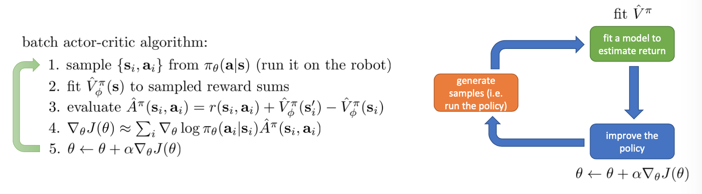

演员-评论家算法是策略梯度迭代的方法之一，在策略梯度迭代方法中，我们需要训练一个价值函数的拟合函数，然后用这个价值拟合函数进行更精确的策略梯度迭代。在演员-评论家算法中：

1. 通过现有策略$\pi_\theta(\mathbf{a}|\mathbf{s})$与环境互动得到采样数据$\{\mathbf{s}_i,\mathbf{a}_i\}$
2. 通过几种不同的方法拟合一个价值函数（评论家）$\hat{V}^\pi_\phi(\mathbf{s})$，如蒙特卡洛法、bootstrap估计法、n-step returns方法等，从而可以在每个时间步长中评估每种方法的优劣
3. 评估优势函数，量化动作$a_i$的评分，$\hat{A}^\pi(\mathbf{s}_i,\mathbf{a}_i)=r(\mathbf{s}_i,\mathbf{a}_i)+\hat{V}^\pi_\phi(\mathbf{s}_i')-\hat{V}^\pi_\phi(\mathbf{s}_i)$
4. 应用优势函数，直接将结果叠加到策略梯度迭代评价结果中，$\nabla_\theta J(\theta)\approx\sum_i \nabla_\theta\log \pi_\theta(\mathbf{a}_i|\mathbf{s}_i)\hat{A}^\pi(\mathbf{s}_i,\mathbf{a}_i)$
5. 使用策略迭代值来改进策略，$\theta \leftarrow \theta+\alpha\nabla_\theta J(\theta)$

我们在之前的两篇中分别介绍了策略梯度法和演员-评论家算法，它们的特点本质上都是寻找策略梯度，而只是演员-评论家算法使用某种值函数来试图给出策略梯度的更好估计。而策略梯度迭代的主要问题是会产生较大的方差，所以才需要用n-step返回值估计法来拟合Critic。为了得到更加高效、稳定的算法，我们需要降低策略梯度的方差。如果我们可以只使用拟合出的值函数获得某种隐式策略，就可以避免在策略参数确定时进行梯度迭代。

## 值函数方法

### 省略策略梯度的迭代过程

根据优势函数$A^\pi(\mathbf{s}_t,\mathbf{a}_t)=Q^\pi(\mathbf{s}_t,\mathbf{a}_t)-V^\pi(\mathbf{s}_t)$的定义：在给定策略$\pi$下，动作$\mathbf{a}_t$比平均动作好多少的度量。如果我们对$A^\pi(\mathbf{s}_t, \mathbf{a}_t)$有较好的估计，就可以知道给定一个动作$\mathbf{a}_t$，它比所有动作的平均值好多少。如果我们在状态$\mathbf{s}_t$下执行$\argmax_{\mathbf{a}_t} A^\pi(\mathbf{s}_t, \mathbf{a}_t)$，也就是取所有动作中使优势函数最大的动作，就可以直接获得状态$\mathbf{s}_t$下的最优动作（当然我们得坚持之后还是完全按照策略$\pi$来，因为优势函数、Q函数、值函数都是在特定策略$\pi$下预测的)。根据定义，这个动作$a_t$必然是在期望意义下最优的：换句话说，至少会与在策略采样$\pi(\mathbf{a}_t|\mathbf{s}_t)$中得到的动作一样好。实际上除非策略$\pi$已经足够好，一般都会得到更好的结果。

我们现在要做的工作就是估计优势函数，然后应用$\argmax$得到正确的策略。而且如果我们在所有时间都应用$\argmax$，我们只会得到更好的结果，而不会变差。所以我们可以定义一个这样的策略：

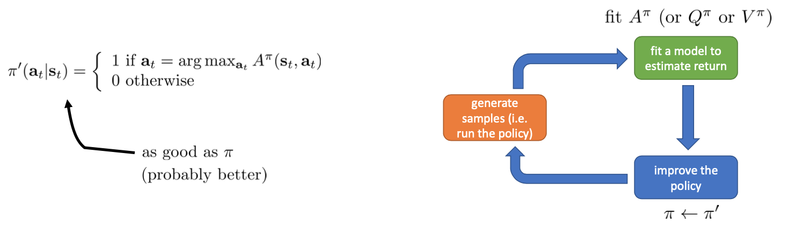

这个策略没有任何参数，只是将概率1赋给$\argmax_{\mathbf{a}_t} A^\pi(\mathbf{s}_t, \mathbf{a}_t)$的动作，并将概率0赋给其它动作。

这给出了一直新的强化学习算法的设计方法（也称为**近似动态规划方法**、**值函数方法**等）：

1. 运行策略$\pi$，产生样本
2. 使用拟合的函数评估回报$A^\pi$（或$Q^\pi, V^\pi$）
3. 提升策略，令$\pi \leftarrow \pi'$

## 策略迭代算法

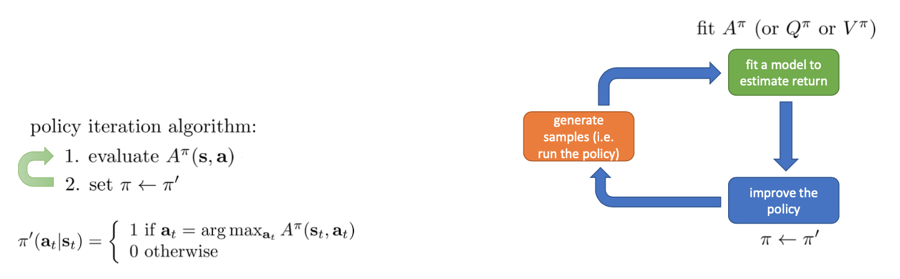

**策略迭代算法**(Policy Iteration)，即对应上图中绿色框和蓝色框的部分：

1. 策略评估 (Policy Evaluation)：评估现有策略下所有的$A^\pi(\mathbf{s}, \mathbf{a})$
2. 策略改进 (Policy Improvement)：令$\pi \leftarrow \pi'$，其中$\pi'(\mathbf{a}_t|\mathbf{s}_t)=I(\mathbf{a}_t=\arg\max_{\mathbf{a}_t}A^\pi(\mathbf{s}_t,\mathbf{a}_t))$

即第一步先弄清楚哪些动作更好，第二步采纳最好的这些动作。称为策略迭代算法是因为在评估策略和改进策略两步直接进行迭代。

要执行这个过程，最大的问题就是如何计算$A^\pi(\mathbf{s},\mathbf{a})$。在之前我们提到的是，$A^\pi(\mathbf{s},\mathbf{a})=r(\mathbf{s},\mathbf{a})+\gamma\mathbf{E}[V^\pi(\mathbf{s}')]-V^\pi(\mathbf{s})$，如果我们知道值函数$V^\pi(\mathbf{s})$就能知道优势函数$A^\pi(\mathbf{s},\mathbf{a})$，所以让我们从估计$V^\pi(\mathbf{s})$开始。

### 动态规划

在上节中将问题转化为获取当前policy下的value function，而动态规划算法就是在环境动态的情况下（即知道在某个state采取某个action后next state的分布情况），**求得值函数**的方法。

**首先我们做一些假设：**

1. **假设已知状态间的转移概率为$p(\mathbf{s}'|\mathbf{s},\mathbf{a})$，正常情况下我们是不知道的**
2. **假设动作$\mathbf{a}$是离散的且个数很少，即动作空间很小，使得V、Q、A函数都能用一个表格来记录下来**
3. **假设状态$\mathbf{s}$的个数很少，即状态空间很小，使得V、Q、A函数都能用一个表格来记录下来**

这样对于一个16个状态，4个动作的情况，可以将$V^\pi(\mathbf{s})$用一个表格记录下来，且转换运算符有$16\times4\times16$个数字。

在算法课程中可以知道，利用DP求解问题，最重要的就是要得到状态转移方程。这个对于MDP问题，其实就是贝尔曼方程(bellman equation)，回顾之前的bootstrap更新方法：

$$V^\pi(\mathbf{s}) \leftarrow \mathbf{E}_{\mathbf{a}\sim\pi(\mathbf{a}|\mathbf{s})}[r(\mathbf{s},\mathbf{a})+\gamma\mathbf{E}_{\mathbf{s}'\sim p(\mathbf{s}'|\mathbf{s},\mathbf{a})}[V^\pi(\mathbf{s}')]]$$

在bootstrap更新方法中，所有表达式都写成了期望的形式，在这里没有任何采样操作。如果我们不知道$V^\pi(\mathbf{s}')$的值，可以用当前的估计值进行一步步迭代，直到最后达到收敛，这样我们就能得到一个价值函数。

而且由于上一节策略迭代算法中，我们一直取的都是$\argmax$得到的策略，也就说明这是一个确定的策略，所以我们可以将这样的单点确定性策略的表达式写作$\pi(\mathbf{s})=\mathbf{a}$。于是，之前的公式就可以被进一步简写为：

$$V^\pi(\mathbf{s}) \leftarrow r(\mathbf{s},\pi(\mathbf{s}))+\gamma\mathbf{E}_{\mathbf{s}'\sim p(\mathbf{s}'|\mathbf{s},\pi(\mathbf{s}))}[V^\pi(\mathbf{s}')]$$

这也是当你知道系统转移策略时，动态规划获得$V^\pi$的最基本方法。

上式也成为了我们策略评估步骤的公式，我们用值函数V去替代优势函数A。需要注意的是，标准的策略迭代法的第一步需要关于我们的当前策略解出比较精确的$V^\pi$，本质上是一个不动点问题：一种方法是之前的公式进行反复迭代直到收敛；另一种方法是求解一个比较大的线性系统（之前的公式是线性的）。

一个问题是，如果放弃随机策略而使用确定性策略，得到的结果一定是最优的吗？可以证明，对于任何全显性MDP，存在一个策略，它既是最优的也是唯一的（决定性的），当然也会存在对于两个随机动作对应相同Q值的情况，但总会存在一个策略，它既是决定性的又是最优的，不过这个结论对于部分观测的MDP是不适用的。

### 使用动态规划的策略迭代算法

将使用动态规划和确定性策略得到的值函数更新公式带入到策略迭代算法中的策略评估步骤，即可得到一个**基于值函数的的策略迭代算法**：

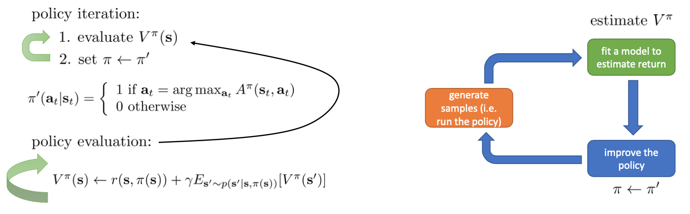

## 值函数迭代算法

### 更简单的动态规划过程

已知策略更新方法

$$\pi'(\mathbf{a}_t|\mathbf{s}_t)=I(\mathbf{a}_t=\arg\max_{\mathbf{a}_t}A^\pi(\mathbf{s}_t,\mathbf{a}_t))$$

其中优势函数$A^\pi(\mathbf{s},\mathbf{a})=r(\mathbf{s},\mathbf{a})+\gamma\mathbf{E}[V^\pi(\mathbf{s}')]-V^\pi(\mathbf{s})$

由于优势函数与Q函数只相差一个$V^\pi(\mathbf{s})$，且值函数V只与状态相关，与动作无关，所以

$$\arg\max_{\mathbf{a}_t}A^\pi(\mathbf{s}_t,\mathbf{a}_t)=\arg\max_{\mathbf{a}_t}Q^\pi(\mathbf{s}_t,\mathbf{a}_t)$$

而$Q(\mathbf{s},\mathbf{a})=r(\mathbf{s},\mathbf{a})+\gamma\mathbf{E}[V(\mathbf{s}')]$，比优势函数表达式减少一项，所以会更简单一点。

如果要使用$\arg\max_{\mathbf{a}_t}Q^\pi(\mathbf{s}_t,\mathbf{a}_t)$，我们可以建立一个大Q表，如下图所示，每一格表示一个state-action组合，数字表示目前的估计值$Q(\mathbf{s},\mathbf{a})$，我们只需要输出每一行最大数字对应的action，就可以生成策略。当然这个表格中的Q值可能不准确，因为需要迭代多次。

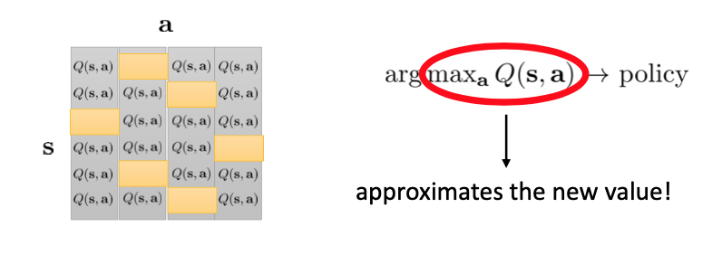

### 值函数迭代算法

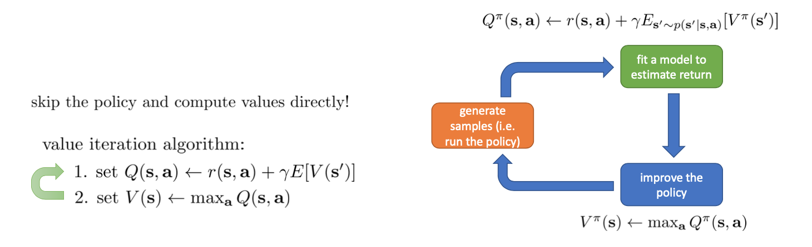

**值函数迭代算法**(Value Iteration)表示如下，反复执行以下两步，直到收敛（其中第一步属于绿色方块，第二步属于蓝色方块）：

1. 更新Q函数：$Q(\mathbf{s},\mathbf{a}) \leftarrow r(\mathbf{s},\mathbf{a})+\gamma\mathbf{E}[V(\mathbf{s}')]$
2. 更新值函数：$V(\mathbf{s}) \leftarrow \max_\mathbf{a}Q(\mathbf{s},\mathbf{a})$

值函数迭代算法本质上整体跳过了具体策略的表征，仅在表格中建立的不同Q值之间转换，然后将值函数V设置成每一行的最大值。

**注：值函数迭代算法与使用动态规划的策略迭代算法的假设条件相同。**

## 拟合值函数迭代算法

在对经典的两大动态规划算法进行完简单的介绍后，我们考虑的是如何把这样的方法搬运到深度增强学习中来。在相对比较复杂的问题中，我们知道状态个数是非常之大的，很难用一个很大的表来保存所有状态的V值或者Q值。譬如在一个彩色的赛车游戏中，分辨率是200 * 200，那么根据屏幕中的图像而设定的状态总数可以达到$|\mathcal{S}|=(255^3)^{200\times200}$，这个数字大得超乎想象。这种在动态规划中需要存储的入口个数随着维度的增长而呈指数型增长的问题，通常称为维度灾难 (curse of dimensionality)。

引入到深度增强学习中，当不能用一个大表格表征一些复杂函数时，一个非常直接的想法就是使用一个巨大的神经网络来代替这个大表格，如弄一个参数为$\phi$的深度神经网络来拟合值函数，输入状态，输出对应的值函数，即$V_\phi: \mathcal{S}\rightarrow\mathbb{R}$。我们使用和之前演员-评论家算法中相似的操作，通过监督学习的方式训练这个神经网络，使用一个平方损失函数来做这样的回归问题：

$$\mathcal{L}(\phi)=\frac{1}{2}\left\Vert V_\phi(\mathbf{s})-\max_\mathbf{a}Q^\pi(\mathbf{s},\mathbf{a})\right\Vert^2$$

从而，之前的值函数迭代算法可以被改写为以下的**拟合值函数迭代算法** (Fitted Value Iteration)，：

1. 假设我们依然可以遍历所有状态，那么首先计算它们的Q值，然后对所有动作取最大Q值，并把这个Q值当做训练拟合值函数$V_\phi$的标签$\mathbf{y}$：$\mathbf{y}_i \leftarrow \max_{\mathbf{a}_i}(r(\mathbf{s}_i,\mathbf{a}_i)+\gamma\mathbf{E}[V_\phi(\mathbf{s}_i')])$
2. 进行监督学习，将$V_\phi$回归到$\mathbf{y}$：$\phi \leftarrow \arg\min_\phi\frac{1}{2}\sum_i\left\Vert V_\phi(\mathbf{s}_i)-\mathbf{y}_i\right\Vert^2$

**注：在这里依然要假设我们知道所有的状态转移概率$p(\mathbf{s}'|\mathbf{s},\mathbf{a})$，即使用动态规划的策略迭代算法中的假设1和2，但不再需要假设3。**

这一版本的拟合值函数迭代算法依然是不需要采样的，所以现在的任务只需要实现这样一个算法，这个算法可以不需要枚举所有状态，只使用采样得到的状态样本。因为在深度强化学习中，由于我们的状态太多以至于无法枚举，我们更愿意利用经验样本。

为了摆脱枚举所有状态的需求，我们可以进行采样，因为上面的公式中并不需要我们列举所有状态，所有我们只需要状态的一些样本。

## 拟合Q函数迭代算法

### 状态转移的动态模型未知的情况

拟合值函数迭代算法在计算最优动作时，需要知道当前状态下每一个动作所对应的Q值或状态转移后$s_i'$的值函数V，所以即使不需要枚举所有状态，我们依然需要枚举采样到的每一个状态下所有的动作，所以我们需要不断返回同一个状态然后尝试所有可能的动作，这一步通常情况下需要知道状态转移动态模型。

我们尝试去避免需要知道状态转移动态模型的强假设。回顾我们之前的策略迭代法，我们进行两步迭代：

1. 策略评估：评估$Q^\pi(\mathbf{s},\mathbf{a})$（也可以是值函数）
2. 策略改进：用这个Q函数来更新策略，$\pi \leftarrow \pi'$

其中，第一步策略评估的做法可以是基于值函数的迭代 $V^\pi(\mathbf{s}) \leftarrow r(\mathbf{s},\pi(\mathbf{s}))+\gamma\mathbf{E}_{\mathbf{s}'\sim p(\mathbf{s}'|\mathbf{s},\pi(\mathbf{s}))}[V^\pi(\mathbf{s}')]$ ，然后再通过一步转移并加上$r(\mathbf{s},\mathbf{a})$ 来得到Q函数。

同样也可以直接基于Q函数进行迭代，$Q^\pi(\mathbf{s},\mathbf{a}) \leftarrow r(\mathbf{s},\mathbf{a})+\gamma\mathbf{E}_{\mathbf{s}'\sim p(\mathbf{s}'|\mathbf{s},\mathbf{a})}[Q^\pi(\mathbf{s}',\pi(\mathbf{s}'))]$。相比于为每个状态存储一个数值，我们现在为每个状态和每个动作存储一个数字，而且由于我们现在的策略是确定性的，可以直接用这个策略而不需要对所有动作取期望，所以这个公式会比上一个基于值函数的简单一些。

因为现在我们可以根据Q函数表格而不是值函数表格进行策略迭代，所以我们可以跳过中间人，持续更新Q函数（现在的Q函数可以用样本来拟合出来），这样我们就能得到一个不需要状态转移动态模型的算法。这一切告诉我们：只要有Q函数，一切就可以在不知道系统转移概率的情况下运转起来。

### 拟合Q函数迭代算法

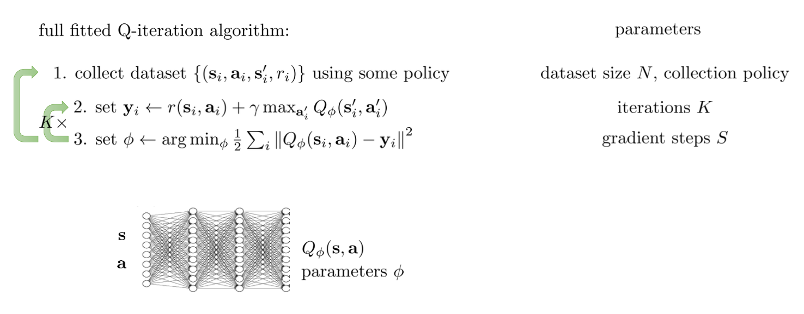

进一步，我们也考虑将Q函数使用诸如神经网络的结构来近似，得到**拟合Q函数迭代算法** (Fitted Q Iteration)：

1. $\mathbf{y}_i \leftarrow r(\mathbf{s}_i,\mathbf{a}_i)+\gamma\mathbf{E}[V_\phi(\mathbf{s}_i')]$，其中我们使用$\max_{\mathbf{a}'}Q_\phi(\mathbf{s}_i',\mathbf{a}')$来近似$\mathbf{E}[V_\phi(\mathbf{s}_i')]$。
2. $\phi \leftarrow \arg\min_\phi\frac{1}{2}\sum_i\left\Vert Q_\phi(\mathbf{s}_i,\mathbf{a}_i)-\mathbf{y}_i\right\Vert^2$

**注：在这里我们不再需要知道状态转移概率$p(\mathbf{s}'|\mathbf{s},\mathbf{a})$，所以此时我们只需要使用动态规划的策略迭代算法中的假设2，而不再需要假设1和3。（具体解释见下文的离线性质）**

可以发现，**第一步中的$\max$不需要我们基于动态模型尝试所有的动作，我们无需在真实环境中尝试各种不同行动后复位，它仅需要我们将每个可能的动作安插进Q函数估计器中，逐个计算不同动作的Q值，就可以得到最大的Q值和其对应的动作$\mathbf{a}$了。**

拟合Q函数迭代算法算法有很大的优点：

1. 第一，算法中只需要用到很多$(\mathbf{s},\mathbf{a},r,\mathbf{s}')$的一步转移样本，而这些样本是可以离线策略(off-policy)的；这个在演员-评论家算法中是不通用的。
2. 第二，这个算法只用到一个网络，没有用到策略梯度，因此也没有策略梯度算法中的高方差问题。

但是，这个算法的致命缺点是：用神经网络替代Q函数状态表时网络不一定会收敛，而且不但理论上不一定收敛，实际应用时也常常不收敛（而不进行拟合的大表格Q函数迭代算法在一定条件下是有收敛性的）。

**总结**

一个完整的拟合Q函数迭代算法的框架总结如下，所有的Q迭代和Q-learning算法本质上都是其某个特殊个例：

1. 基于某些策略收集转移状态，收集容量为$N$的数据集$\{(\mathbf{s}_i,\mathbf{a}_i,\mathbf{s}'_i,r_i)\}$。
2. $\mathbf{y}_i \leftarrow r(\mathbf{s}_i,\mathbf{a}_i)+\gamma\max_{\mathbf{a}_i'}Q_\phi(\mathbf{s}_i',\mathbf{a}_i')$
3. $\phi \leftarrow \arg\min_\phi\frac{1}{2}\sum_i\left\Vert Q_\phi(\mathbf{s}_i,\mathbf{a}_i)-\mathbf{y}_i\right\Vert^2$。反复执行$K$次2-3步骤后跳回第一步继续收集数据。

第一步的策略其实是任意的，因为Q函数迭代算法只关注每个转移状态，它不对数据集的策略做出任何假设，因此不需要收集一条连续的状态转移轨迹，这意味着并不是一定要用当前的新策略来收集数据，可以把新旧策略收集的数据集中在一起。根据收集数据数量的不同，可以变成收集一堆数据的批量算法，也可以变成只收集一个数据的在线策略算法。第三步可以选择怎么去训练神经网络，比如走多少个梯度步，算得精确一点还是简单走几步就停了。

至于为什么要每隔K次2-3步骤的循环后执行第1步重新收集数据，主要原因是如果初始的策略不够好，那么它能探索到的状态转移情况将会非常有限，比如说对于一个通关游戏，如果当前策略不足以通过所有关卡，就无法探索到后面关卡的状态转移数据，拟合的Q函数自然也学不到后面的情况，所以为了让拟合的Q函数可以学习到尽可能多的状态转移情况，需要不断补充使用更优策略生成的数据。

### 拟合Q函数迭代算法的离线性质

**离线策略**(off-policy)意味着在第一步收集数据的时候，算法对使用哪个策略来收集数据不做任何限制与假设。因为算法中唯一对策略的限制是$\max_{\mathbf{a}_i'}Q_\phi(\mathbf{s}_i',\mathbf{a}_i')$，它假设你的策略是使Q值最大的那个策略，$Q_\phi(\mathbf{s}_i',\mathbf{a}_i')$本质上是估计在新状态$\mathbf{s}_i'$基于更新后的策略$\phi'$得到的不同动作对应的Q值，它并不会计算你的策略会让你转移到什么新状态(即不会得到$\mathbf{s}_i''$是什么)，而$r(\mathbf{s}_i,\mathbf{a}_i)$由于给定了状态和行动，也是与策略无关的(策略是用于选取合适的动作的规则)，而且由于已经知道了其转移到的新状态是$\mathbf{s}_i'$，也不再需要知道系统内部的转移概率了。某种意义上可以说Q函数是对策略的一个解耦合。因此，我们可以收集一大堆转移数据$(\mathbf{s}_i,\mathbf{a}_i,\mathbf{s}'_i,r_i)$放进一个大桶里，我们的算法从大桶中抽取数据，这些数据基本上可以视作系统的一个无参数模型。

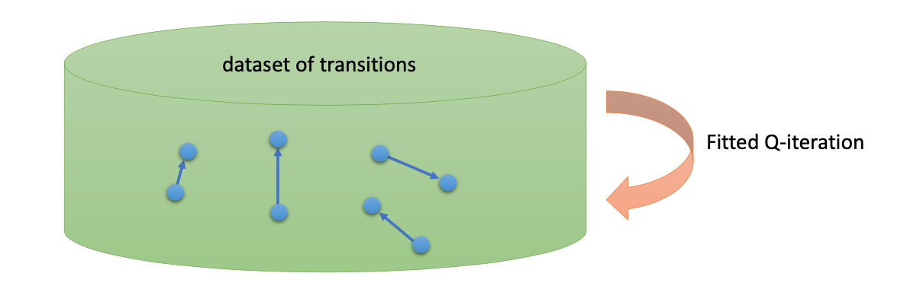

### 拟合Q函数迭代算法的优化目标

在第二步中，如果我们用Q函数表格迭代的话，max就是在改进策略。第三步中，我们在最小化一个期望误差，即bellman error：

$$\mathcal{E}=\frac{1}{2}\mathbf{E}_{(\mathbf{s},\mathbf{a})\sim\beta}\left[Q_\phi(\mathbf{s},\mathbf{a})-\left[r(\mathbf{s},\mathbf{a})+\gamma\max_{\mathbf{a}'}Q_\phi(\mathbf{s}',\mathbf{a}')\right]\right]$$

可以发现，在理想情况下，如果这个误差为0，那么我们所求得的Q函数将满足$Q^*(\mathbf{s},\mathbf{a})=r(\mathbf{s},\mathbf{a})+\gamma\max_{\mathbf{a}'}Q^*(\mathbf{s}',\mathbf{a}')$，这也意味着最大化的策略已经收敛，即你的策略已经是最好的了。

所以如果bellman error为0，将会得到一个关联着**最优策略**$\pi^*$的**最优Q函数**$Q_\phi^*$，最优策略可以通过$\pi^*(\mathbf{a}_t|\mathbf{s}_t)=I\left(\mathbf{a}_t=\arg\max_{\mathbf{a}_t}Q^*(\mathbf{s}_t,\mathbf{a}_t)\right)*$得到。但如果只是让bellman error变小，不一定会得到更好的结果。

不过，**即便算法是离线策略的，收集数据的分布还是有很大关系的**。一个极端情况，我们假设$\beta$只是一个单点分布，除了一个状态外概率都为0：这样我们就成为只知道一个状态的井底之蛙了，不能对其他状态的好坏做出正确评价。因此，尽管算法是离线策略的，但请尽可能确保我们收集的数据中包含了真正运行时会访问到的那些状态和行动。此外，如果我们使用诸如神经网络的东西去拟合Q函数表，那么之前所说的最优保证(most guarantees)将丧失。

## 在线Q-learning算法

就像上一节课中的在线演员-评论家算法一样，**在线Q-learning算法** (online Q-learning algorithm) 只是拟合Q函数迭代算法的一个特殊情况，我们只需要把每次收集的样本数设为1，然后把K设为1，并且设置只走一个梯度步，即循环以下三步：

1. 执行某个行动$\mathbf{a}_i$，收集观察数据$(\mathbf{s}_i,\mathbf{a}_i,\mathbf{s}'_i,r_i)$。
2. $\mathbf{y}_i \leftarrow r(\mathbf{s}_i,\mathbf{a}_i)+\gamma\max_{\mathbf{a}_i'}Q_\phi(\mathbf{s}_i',\mathbf{a}_i')$，这一步是离线策略的，。
3. $\phi \leftarrow \phi-\alpha\frac{\mathrm{d} Q_\phi(\mathbf{s}_i,\mathbf{a}_i)}{\mathrm{d}\phi}(Q_\phi(\mathbf{s}_i,\mathbf{a}_i)-\mathbf{y}_i)$。

该算法每轮执行一个行动，得到一个转移观察，算出目标值，做一步的随机梯度下降，这是标准的Q-learning算法。这里的第一步是离线策略的，对于演员-评论家算法，这一步需要使用当前策略来执行，而在Q-learning算法中可以采取任何策略。虽然是离线策略的，但还是和刚才所说的一样，第一步的数据采集范围最好足够大。

### 探索Q-learning算法

虽然在Q-learning算法中的第一步可以选择任意策略，但具体应该采取哪个策略呢？我们可以采取最终的策略，这样我们就可以使用最新的Q函数，然后从中提取出策略$\pi(\mathbf{a}_t|\mathbf{s}_t)=I\left(\mathbf{a}_t=\arg\max_{\mathbf{a}_t}Q_\phi(\mathbf{s}_t,\mathbf{a}_t)\right)$，即采取$\argmax$动作的概率是1，这是一个确定性策略。然而一开始选择一个高度随机性策略却是非常重要的，因为高度随机性策略会尝试不同的可能，会使结果随机地发现高回报区域，如果使用确定性策略，就意味着如果初始的Q函数不好，那确定性策略每次都会做相同的事情，会得到一些不可取的动作，也就根本探索不到高回报区域，自然无法让神经网络学会如何到达高回报区域。

事实上，这是在线学习中的一个很纠结的问题：探索 (exploration) 和开发 (exploitation)。学习就是一个探索的过程，如果我们还没进行足够的探索，在Q函数还不够准确的时候，我们根本无法分别出到底哪个是真正好的，会忽略掉真正优秀的方案。

所以我们希望在第一步中使用一个比确定性策略更随机一点的策略。在在线学习中，有多种启发式方法可以选择：

1. 一种策略称为$\epsilon$-贪心，也就是分给$\argmax$动作$\mathbf{a}_t=\arg\max_{\mathbf{a}_t}Q_\phi(\mathbf{s}_t,\mathbf{a}_t)$的概率为$1-\epsilon$的大概率的同时，也保留$\epsilon$概率平均分给其他所有的$|\mathcal{A}|-1$种行动。

$$\pi(\mathbf{a}_t|\mathbf{s}_t)=\left\{  \begin{array}{ll} 1-\epsilon & if \ \mathbf{a}_t=\arg\max_{\mathbf{a}_t}Q_\phi(\mathbf{s}_t,\mathbf{a}_t) \\ \epsilon/(|\mathcal{A}|-1) & otherwise \end{array} \right.$$

2. 另一种常用的设定是Boltzmann探索，概率分布为$\pi(\mathbf{a}_t|\mathbf{s}_t)\propto\exp(Q_\phi(\mathbf{s}_t,\mathbf{a}_t))$。它假定Q函数多多少少知道一些哪个行动好，但是有噪音。这样Q比较大的行动有显著较高的概率被选到，同时保持了其他选项的可能性。

## 值函数学习理论

### 值函数迭代的收敛性

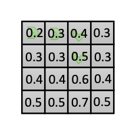

回顾值函数迭代算法，步骤如下：

1. 更新Q函数：$Q(\mathbf{s},\mathbf{a}) \leftarrow r(\mathbf{s},\mathbf{a})+\gamma\mathbf{E}[V(\mathbf{s}')]$
2. 更新值函数：$V(\mathbf{s}) \leftarrow \max_\mathbf{a}Q(\mathbf{s},\mathbf{a})$

如右图所示，它需要假设我们知道转换动态 (transition dynamics) 和记录表格等，即所有状态和动作可以被记录在一个表格中。

我们要讨论的问题是：**值函数迭代算法收敛吗**？如果收敛，**将会收敛到何处**？

为了解答这个问题，首先要定义一些符号：

- **贝尔曼倒推运算符** (bellman backup operator) $\mathcal{B}$：$\mathcal{B}V=\max_\mathbf{a}r_\mathbf{a}+\gamma\mathcal{T}_\mathbf{a}V$，其中：
  - 特定动作的奖励$r_\mathbf{a}$是一个向量，表示每个状态下执行动作$\mathbf{a}$的奖励。
  - 值函数$V$也是一个向量，代表每个状态对应的值函数的数值。
  - $\mathcal{T}_\mathbf{a}$表示动作的转移矩阵，$\mathcal{T}_{\mathbf{a},i,j}=p(\mathbf{s}'=i|\mathbf{s}=j,\mathbf{a})$，每一项代表在$\mathbf{s}_j$状态采取动作$\mathbf{a}$后落在特定状态$\mathbf{s}_i$的概率。

bellman backup 运算是一个构造良好的线性代数表达式。可以证明的是，最优值函数$V^*$是运算$\mathcal{B}$的一个不动点(对这个向量进行运算后，得到的结果仍是同一个向量)，即**该运算收敛时的位置**为$V^*$，因为$V^*(\mathbf{s})=\max_\mathbf{a}[r(\mathbf{s},\mathbf{a})+\gamma\mathbf{E}[V^*(\mathbf{s}')]]$，根据定义可得$V^*=\mathcal{B}V^*$。而且同样可证，该运算一定存在一个唯一的最优值函数。

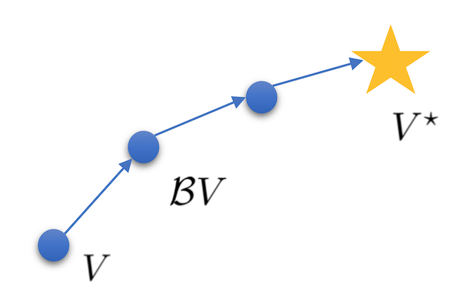

所以接下里要证明的是，运算$\mathcal{B}$是否一定会收敛。我们可以**通过证明$\mathcal{B}$是一个收缩映射 (contraction mapping) 的方式来证明值函数迭代法一定会收敛到一个不动点**。事实上，因为对任何的两个值函数$V$和$\bar{V}$，我们可以证明$\Vert\mathcal{B}V-\mathcal{B}\bar{V}\Vert_\infty\leq\gamma\Vert V-\bar{V}\Vert_\infty$，即两者的距离差值每次都会小于等于原来的$\gamma$倍，需要注意的是，这里的距离差值是用无穷范数来量化的，也就是向量中所有距离差值的最大值。所以当$\gamma$小于1时，向量之间就会越来越接近，如果我们选择$\bar{V}=V^*$的话，那么因为$V^*=\mathcal{B}V^*$，有$\Vert\mathcal{B}V-V^*\Vert_\infty\leq\gamma\Vert V-V^*\Vert_\infty$。因此每做一次迭代，我们都能让新向量向最优值函数靠近，并最终收敛于$V^*$，如右图所示。

### 拟合值函数迭代的收敛性

上一节中用bellman backup运算$\mathcal{B}$证明了用表格记录的值函数迭代算法的收敛性，本节将要证明无表格的拟合值函数迭代算法的收敛性。

在实际操作中，由于状态数量可能非常大，我们并不希望将所有状态都存储在一个表格中，所以我们希望用一个函数逼近器(神经网络)来代替它。回顾拟合值函数迭代算法，步骤如下：

1. 假设我们依然可以遍历所有状态，那么首先计算它们的Q值，然后对所有动作取最大Q值，并把这个Q值当做训练拟合值函数$V_\phi$的标签$\mathbf{y}$：$\mathbf{y}_i \leftarrow \max_{\mathbf{a}_i}(r(\mathbf{s}_i,\mathbf{a}_i)+\gamma\mathbf{E}[V_\phi(\mathbf{s}_i')])$
2. 进行监督学习，将$V_\phi$回归到$\mathbf{y}$：$\phi \leftarrow \arg\min_\phi\frac{1}{2}\sum_i\left\Vert V_\phi(\mathbf{s}_i)-\mathbf{y}_i\right\Vert^2$

这与之前不同之处只在于第二步中的$\argmin_\phi$操作，那么它的作用是什么呢？我们可以将其视作一种运算符，它负责在值函数的某个集合$\Omega$中找到一个新的值函数$V'$，使其与旧的值函数经过贝尔曼倒推运算后的值$\mathcal{B}V$的距离差值最小化，即$V' \leftarrow \arg\min_{V'\in\Omega}\frac{1}{2}\sum\Vert V'(\mathbf{s})-(\mathcal{B}V)(\mathbf{s})\Vert^2$。虽然在理论上，一个无限大的深度神经网络可以拟合任意函数，但是在实际使用中，我们一般只能使用一个有限大小的神经网络，因此它能表示的只是所有函数的一个子集。如下图所示，蓝色的线代表该神经网络能代表的值函数的全集，我们从一个值函数出发，进行一次倒推操作，然后使用最小二乘回归来投影到这个函数集合，得到距离最小的新的值函数。至于为什么使用L1或L2范数而不使用无穷范数，因为无穷范数需要计算最偏离的项是非常复杂的，而L2范数是最简单的，所以这里用L2范数计算距离。

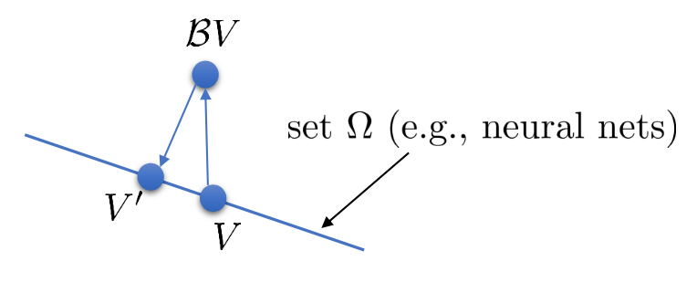

在这里我们需要再引入一个符号：

- **投影运算符** (projection operator) $\Pi$：$\Pi V=\arg\min_{V'\in\Omega}\frac{1}{2}\sum\Vert V'(\mathbf{s})-V(\mathbf{s})\Vert^2$。
  - 由于在集合$\Omega$中计算与$\mathcal{B}V$的距离的最容易的方式是使用L2范数，且使用无穷范数计算很复杂，因此投影运算符使用最小化L2范数，即欧几里得距离的方式来得到新的值函数。可以证明的是，**投影运算在L2范数下是一个收缩映射**。

通过引入的两个新符号，我们的拟合值函数迭代算法可以写成$V \leftarrow \Pi\mathcal{B}V$这样的复合映射。其中$\mathcal{B}$是一个无穷范数下的收缩映射，$\Vert\mathcal{B}V-\mathcal{B}\bar{V}\Vert_\infty\leq\gamma\Vert V-\bar{V}\Vert_\infty$；$\Pi$是一个L2范数下的收缩映射，$\Vert\Pi V-\Pi\bar{V}\Vert_2\leq\Vert V-\bar{V}\Vert_2$。但问题在于如果我们将这两个映射进行复合，那么$\Pi\mathcal{B}$并不是一个收缩映射，因为它们不是在同一个范数下收缩的。

下图是一个该算法发散的例子。假设最优解$V^*$在那个五角星处，然后我们从$V$开始一脚走到了$\mathcal{B}V$，然后被投影回归扯回了$V'$。从图上看，我们的解到最优解的距离越来越远了。注意到，不用无穷范数的原因是当状态空间很大或者无限的情况下，无穷范数下的投影问题极其难解。我们只能寻求找到最优解的一个投影（同样对于策略梯度法我们也只能期望找到最优策略的一个投影），但是事与愿违的是，反复进行拟合值函数迭代算法，可能使你从较好的解开始越来越差。因此我们的结论是，值函数迭代法在表格中是收敛的，但是拟合值函数迭代法在一般意义下是不收敛的，在实践中也通常不收敛，但是有一些方法来缓解这些问题。

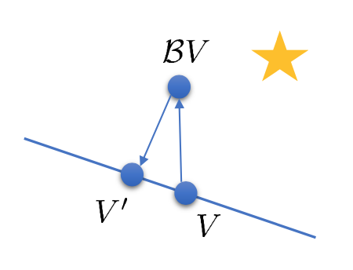

### 拟合Q函数迭代的收敛性

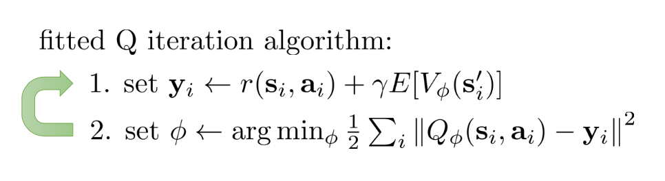

拟合Q函数迭代算法与拟合值函数迭代算法差不多，$\mathcal{B}Q=r+\gamma\mathcal{T}\max_\mathbf{a}Q$，只是把max放到里面去了；同样投影算子$\Pi Q=\arg\min_{Q'\in\Omega}\frac{1}{2}\sum\Vert Q'(\mathbf{s},\mathbf{a})-Q(\mathbf{s},\mathbf{a})\Vert^2$，因此$Q \leftarrow \Pi\mathcal{B}Q$。它的收敛结果与之前也别无二致，同样一般意义下不收敛。

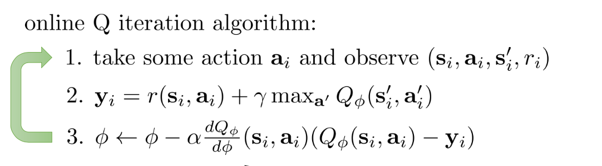

对于在线Q函数迭代算法来说，它的第三步$\phi\leftarrow\phi-\alpha\frac{\mathrm{d} Q_\phi(\mathbf{s}_i,\mathbf{a}_i)}{\mathrm{d}\phi}(Q_\phi(\mathbf{s}_i,\mathbf{a}_i)-\mathbf{y}_i)$看起来在走一个梯度步，我们看似抓住了一个救命稻草：梯度下降法应该是可以收敛的？但是，Q函数方法的梯度并不是强化学习目标函数的梯度，因此与策略梯度法并不同，它并不是梯度下降法。

这个不收敛结论同样也适用于演员-评论家算法。如引导估计法$y_{i,t} \approx r(\mathbf{s}_{i,t},\mathbf{a}_{i,t})+\gamma\hat{V}^\pi_\phi(\mathbf{s}_{i,t+1})$关于无穷范数收缩，而拟合函数 $\mathcal{L}(\phi)=\frac{1}{2}\sum_i\left\Vert\hat{V}^\pi_\phi(\mathbf{s}_i)-y_i\right\Vert^2$关于L2范数收缩，因此拟合下的引导估计法做的策略评估同样不具有收敛性。顺便说一下，在演员-评论家算法中用的$V^\pi$，指的是关于策略$\pi$的值函数，是评论家用的函数；而在值函数迭代中用的$V^*$，则是最优策略$\pi^*$所代表的值函数，也是最优的值函数。