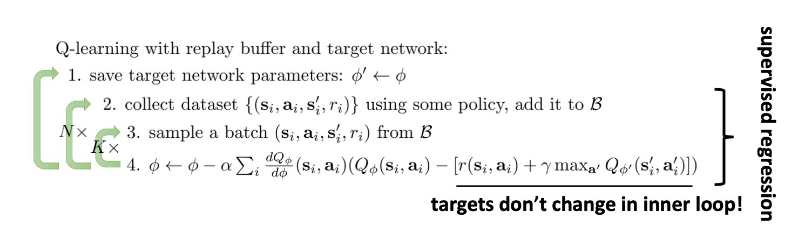
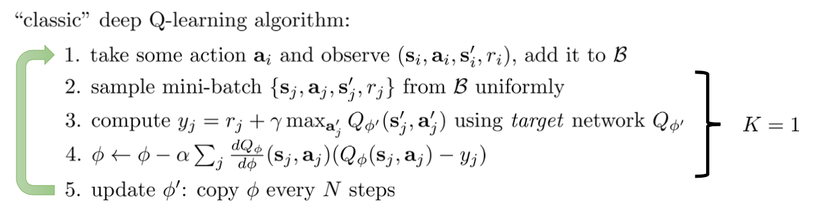
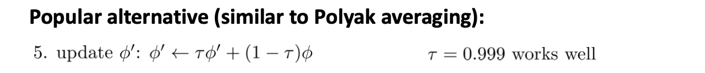
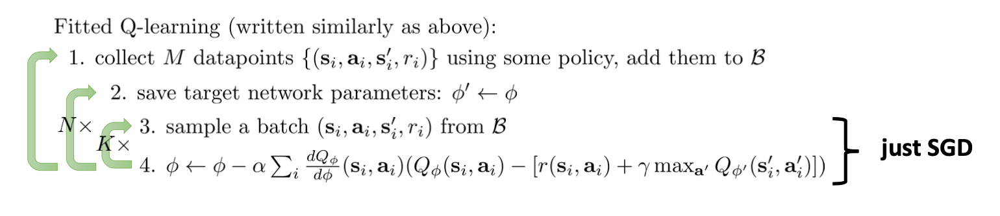
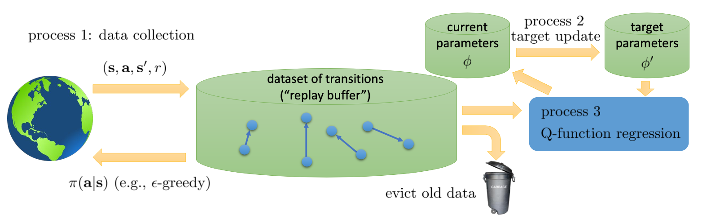
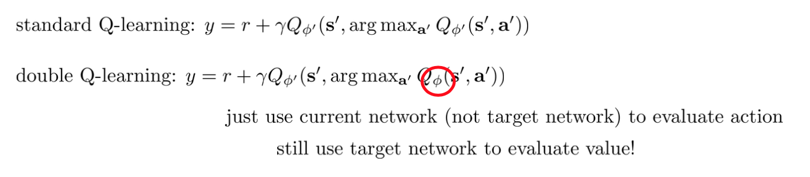
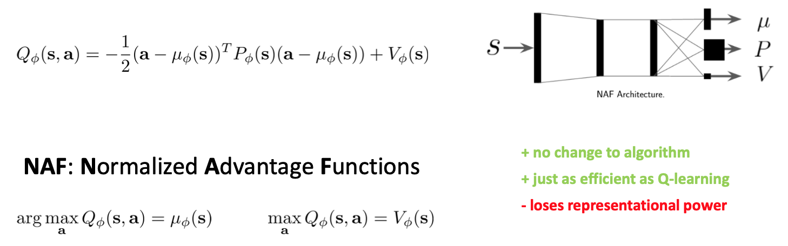
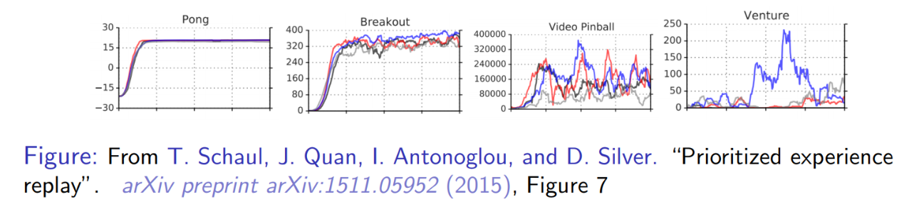

# Lecture8: Advanced Q-Learning Algorithms with Deep RL

**课程内容**

1. How we can make Q-learning work with deep networks
2. A generalized view of Q-learning algorithms
3. Tricks for improving Q-learning in practice
4. Continuous Q-learning methods

**课程目标**

- Understand how to implement Q-learning so that it can be used with complex function approximators
- Understand how to extend Q-learning to continuous actions
- Understand how to make Q-learning work

## Deep Q-learning算法

### Q-Learning with replay buffer and target networks

为了解决数据不相关、奖励会发生改变的问题，提出了Q-Learning with replay buffer and target networks：

### DQN

经典的Deep Q-learning算法--**DQN**，是上一节中改进的Q-Learning的一个特例，表示如下：

### 拟合Q函数迭代算法的通用表示

如果将经典的拟合Q函数迭代算法用上一节中改进的Q-Learning的方式表示，有：

可以看出，它与改进的Q-Learning算法的区别只在于步骤1和步骤2的内外循环顺序，如果用更通用的方式表示以上所有拟合Q函数迭代算法，则可以得到广义的拟合Q函数迭代算法：

如上图所示，广义的拟合Q函数迭代算法可以分为三个过程，process 1是使用目标网络收集数据，process 2是更新目标网络的权重，process 3是回归Q函数，更新Q函数的参数。

- 对于经典的**拟合Q函数迭代算法**：process 3在 process 2的内层循环中，而process 2在 process 1的内层循环中。
- 对于**改进的Q-learning算法**：process 3在 process 1的内层循环中，而process 1在 process 2的内层循环中。
- 对于经典的**在线Q-learning算法**：buffer会立即清除，即数据集缓冲区里面每次只有一个数据，且process 1, 2, 3 都以同样的速度运行。
- 对于**DQN**：buffer的容量大于1且不会清除历史数据，process 1和3 以相同的速度运行，即每收集一个mini-batch的转移数据就执行一个梯度步，而process 2非常缓慢。

## Deep Q-learning算法的问题

由于DQN在拟合Q函数的时候存在噪声，且在计算Q值时用到了max操作，DQN的估计值通常会比实际的Q值大很多，导致Q值估计不准确，所以针对这个问题，可以使用以下两种方法进行改进。

### Double Q-learning

DQN的噪声主要是因为计算最优动作的网络与计算Q值的网络是同一个，如果将其解耦成两个网络，就可以大大降低Q值的噪声，一种最简单的方式是利用目标函数，将更新目标Q值的方程变为下图所示。

### 多步回报 (multi-step returns)

我们使用Q学习，在回归中会设置一个目标值$y_{j,t}=r_{j,t}+\gamma\max_{\mathbf{a}_{j,t+1}}Q_{\phi'}(\mathbf{s}_{j,t+1},\mathbf{a}_{j,t+1})$。这个目标值信号来自于两块，一块是当前的收益，一块是Q值代表的未来期望收益。如果训练还是在早期，通常Q就比较小（初始化为小的随机数），那么当前收益就会成为主要成分，Q值只是噪音。对于时间较长的问题，如果Q已经训练到比较后期了，从数值的量级上考虑，可能当前收益所占比就很小，Q值所占比较大。在演员-评论家算法中，我们已经提到了这样的bootstrap方法存在最低方差的好处，但是如果Q值不准确就会带来最大的偏差；而如果我们不使用bootstrap方法而直接使用一条轨迹的期望，那么将是无偏的，但是方差巨大。从而，我们介绍了一个折中的方法，就是使用$N$步收益后再把未来的bootstrap项加进去。转化到我们当前的问题中就是$y_{j,t}=\sum_{t'=t}^{t+N-1}\gamma^{t'-t}r_{j,t'}+\gamma^N\max_{\mathbf{a}_{j,t+N}}Q_{\phi'}(\mathbf{s}_{j,t+N},\mathbf{a}_{j,t+N})$。

## 连续动作的Q-learning

在我们之前的问题中，通常假设策略很容易得到：$\pi(\mathbf{a}_t|\mathbf{s}_t)=I\left(\mathbf{a}_t=\arg\max_{\mathbf{a}_t}Q_\phi(\mathbf{s}_t,\mathbf{a}_t)\right)$，求max只需要遍历行动空间就行了；目标值$y_j=r_j+\gamma\max_{\mathbf{a}_j'}Q_{\phi'}(\mathbf{s}_j',\mathbf{a}_j')$的max也是这样。但是如行动空间是连续的时候，这个max就不容易做了。这个问题在后者中尤其严重，因为它是训练过程中最内层循环要做的事情，频率比前者要高多了。那么如何做max呢？

### 1. 随机抽样

第一种想法是直接做优化。在最内层循环做基于梯度的优化算法（如SGD）相对来说是比较慢的。注意到我们的行动空间通常都是比较低维的（相对整个系统而言），不使用梯度信息的随机优化也许能有用武之地。最简单的方法是使用离散随机踩点：

$$\max_\mathbf{a}Q(\mathbf{s},\mathbf{a})\approx\max\{Q(\mathbf{s},\mathbf{a}_1),\ldots,Q(\mathbf{s},\mathbf{a}_N)\}$$

其中行动是从某些分布（如均匀分布）中得到的。这个方法是最简单的，而且还比较容易并行，但是这样得到的结果是不准确的，尤其是在维度增加的情况下看起来就不像是能找到一个效果很好的解；不过有些时候，我们也不真正在乎优化求解的精度。此外，还有一些更好的方法，譬如交叉熵方法 (Cross-entropy Methods) 这样的迭代随机优化算法（在[Lecture10](../Lecture10/最优控制与规划_笔记.md)中有介绍），或者如CMA-ES (Covariance Matrix Adaptation Evolutionary Strategies) 这样的进化算法。这些通常在不超过40维的决策问题中有效。

### 2. 解析优化

第二种方法是，我们选取一个比较容易优化的函数簇来拟合我们的Q函数。在此之前，我们都是使用通用的神经网络来拟合Q，但神经网络需要通过梯度下降的方式来优化，是非常困难的。如果设置Q函数是关于动作的二元函数，那优化起来就非常容易了，比如令$Q_\phi(\mathbf{s},\mathbf{a})=-\frac{1}{2}(\mathbf{a}-\mu_\phi(\mathbf{s}))^\top P_\phi(\mathbf{s})(\mathbf{a}-\mu_\phi(\mathbf{s}))+V_\phi(\mathbf{s})$，它的天然特性就是$\mu_\phi(\mathbf{s})=\arg\max_\mathbf{a}Q_\phi(\mathbf{s},\mathbf{a})$和$V_\phi(\mathbf{s})=\max_\mathbf{a}Q_\phi(\mathbf{s},\mathbf{a})$。我们可以通过训练一个神经网络或者其他结构，如下图所示，输入状态$\mathbf{s}$，输出$(\mu,P,V)$，其中$\mu$和$V$都是向量，$P$是矩阵（可以用如低秩形式表示），这样的方法称为NAF (Normalized Advantage Functions)。

这个方法很容易和高斯分布建立起联系；当然，这样的Q函数中行动是没有界限的。我们这么做的话，算法上不需要做任何改变，非常容易，而且和原来的Q学习一样高效。但是缺点就在于Q函数只能是固定的形式（如这里的二次函数），非常受限，Q函数的建模泛化能力将大大降低。

### 3. 建立第二个动作网络

第三种方法比第二种方法更为广泛，是去新学习一个最大化器，也就是DDPG (Deep Deterministic Policy Gradient) 算法 (Lillicrap et al, ICLR 2016)。考虑到$\max_\mathbf{a}Q_\phi(\mathbf{s},\mathbf{a})=Q_\phi\left(\mathbf{s},\arg\max_\mathbf{a}Q_\phi(\mathbf{s},\mathbf{a})\right)$，可以另外训练一个最大化器，让其输出最大化的动作，即令$\mu_\theta(\mathbf{s})\approx\arg\max_\mathbf{a}Q_\phi(\mathbf{s},\mathbf{a})$。训练的方法是，让$\theta\leftarrow\arg\max_\theta Q_\phi(\mathbf{s},\mu_\theta(\mathbf{s}))$，这个可以用梯度上升法，梯度可以遵循链式法则：$\frac{\mathrm{d}Q_\phi}{\mathrm{d}\theta}=\frac{\mathrm{d}Q_\phi}{\mathrm{d}\mathbf{a}}\frac{\mathrm{d}\mathbf{a}}{\mathrm{d}\theta}$。从而，我们的目标值变为$y_j=r_j+\gamma\max_{\mathbf{a}_j'}Q_{\phi'}(\mathbf{s}_j',\mu_\theta(\mathbf{s}_j'))$。

DDPG算法迭代执行以下步骤：

1. 在环境中执行某个操作$\mathbf{a}_i$，观察到$(\mathbf{s}_i,\mathbf{a}_i,\mathbf{s}'_i,r_i)$，并加入到回放缓冲池$\mathcal{B}$中。
2. 均匀地从回放缓冲池$\mathcal{B}$中抽取一个小批量样本$\{(\mathbf{s}_j,\mathbf{a}_j,r_j,\mathbf{s}'_j)\}$。
3. 使用目标网络$Q_{\phi'}$和最大化器$\mu_{\theta'}$，计算出目标值$y_j=r_j+\gamma\max_{\mathbf{a}_j'}Q_{\phi'}(\mathbf{s}_j',\mu_{\theta'}(\mathbf{s}_j'))$。
4. 当前网络走一个梯度步，$\phi\leftarrow\phi-\alpha\sum_j\frac{\mathrm{d} Q_\phi(\mathbf{s}_j,\mathbf{a}_j)}{\mathrm{d}\phi}\left(Q_\phi(\mathbf{s}_j,\mathbf{a}_j)-y_j\right)$。
5. 最大化器走一个梯度步，$\theta\leftarrow\theta+\beta\sum_j\frac{\mathrm{d}\mu(\mathbf{s}_j)}{\mathrm{d}\theta}\frac{\mathrm{d}Q(\mathbf{s}_j,\mathbf{a})}{\mathrm{d}\mathbf{a}}$。
6. 使用Polyak Averaging更新$\phi'$和$\theta'$。

这本质上仍是之前介绍的Deep Q-learning，相较于DQN，只是增加了一个最大化器，用其替换掉argmax进行修正，第三步使用最大化器，第五步更新最大化器，同时最大化器的更新也是用Polyak Averaging。

## Q-learning的一些实用建议

1. 上图显示了几个问题的几种不同Q学习的效果。发现对于不同的问题，Q学习在有些问题上很可靠，在有些问题上波动很大，需要花很多力气来让Q学习稳定下来。因此发现几个能让Q学习比较可靠的问题来试验程序，譬如Pong和Breakout。如果这些例子上表现不好，那就说明程序有问题。
2. 回放缓冲池的大小越大，Q学习的稳定性越好。我们往往会用到上百万个回放样本，那么内存上怎么处理是决定性的。建议图像使用uint8 (1字节无符号整型) 存储，然后在存储$(\mathbf{s},\mathbf{a},\mathbf{s}',r)$的时候不要重复存储同样的数据。
3. 训练的时候要耐心。DQN的收敛速度很慢，对于Atari游戏经常需要1000-4000万帧，训练GPU也得几个小时到一天的时间，这样才能看出能显著地比随机策略要来的好。
4. 在使用$\epsilon$贪心等策略的时候，一开始把探索率调高一些，然后逐渐下降。
5. Bellman误差可能会非常大，因此可以对梯度进行裁剪（clipping，也就是设一个上下限），或者使用Huber损失$L(x)=\left\{\begin{array}{ll}x^2/2,&|x|\leq\delta\\\delta|x|-\delta^2/2,&\text{otherwise}\end{array}\right.$进行光滑。
6. 在实践中，使用双重Q学习很有帮助，改程序也很简单，而且几乎没有任何坏处。
7. 使用$N$步收益也很有帮助，但是可能会带来一些问题。
8. 除了探索率外，学习率 (Learning Rate, 也就是步长) 也很重要，可以在一开始的时候把步长调大一点，然后逐渐降低，也可以使用诸如ADAM的自适应步长方案。
9. 多用几个随机种子试一试，有时候表现差异会很大。